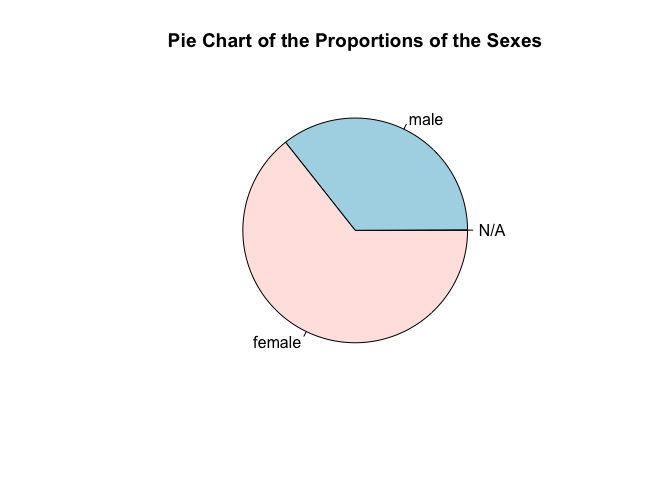

# Homework 5: Gapminder Exploration

## Introduction 

My goal is to explore the Titanic data set, which may be obtained as an .xls form from [here](https://www.google.com/url?sa=t&rct=j&q=&esrc=s&source=web&cd=2&cad=rja&uact=8&ved=2ahUKEwiT44i4hcrdAhWPKXwKHb-NCbYQFjABegQICRAC&url=http%3A%2F%2Fbiostat.mc.vanderbilt.edu%2Fwiki%2Fpub%2FMain%2FDataSets%2Ftitanic3.xls&usg=AOvVaw1j63KEb1daRf8kqotv9b7B). This data set has info. from 1406 passengers that were on the Titanic.

First, I will try to test the data by examining its class, dimensions and its variables. Then, I will look at various plots. I will use dplyr and ggplot2 for data description and visualization. Finally, I will demonstrate that I have mastered filter(), select() and %>%.

## Smell test the data

Load tidyverse.


```r
library(tidyverse)
```

```
## ── Attaching packages ────────────────────────────────── tidyverse 1.2.1 ──
```

```
## ✔ ggplot2 3.0.0     ✔ purrr   0.2.5
## ✔ tibble  1.4.2     ✔ dplyr   0.7.6
## ✔ tidyr   0.8.1     ✔ stringr 1.3.1
## ✔ readr   1.1.1     ✔ forcats 0.3.0
```

```
## ── Conflicts ───────────────────────────────────── tidyverse_conflicts() ──
## ✖ dplyr::filter() masks stats::filter()
## ✖ dplyr::lag()    masks stats::lag()
```

Next, I will load the Titanic data set from the csv that I downloaded from Github (link is above in the intro.)


```r
titanic <- read.csv("titanic3.csv")
```

To see that our data set got loaded properly into R (ie. so that the structure is what we expect), I will peak at the head of the data set.

```r
head(titanic) # To see the top of the Titanic data set
```

```
##   pclass survived                                            name    sex
## 1      1        1                   Allen, Miss. Elisabeth Walton female
## 2      1        1                  Allison, Master. Hudson Trevor   male
## 3      1        0                    Allison, Miss. Helen Loraine female
## 4      1        0            Allison, Mr. Hudson Joshua Creighton   male
## 5      1        0 Allison, Mrs. Hudson J C (Bessie Waldo Daniels) female
## 6      1        1                             Anderson, Mr. Harry   male
##       age sibsp parch ticket     fare   cabin embarked boat body
## 1 29.0000     0     0  24160 211.3375      B5        S    2   NA
## 2  0.9167     1     2 113781 151.5500 C22 C26        S   11   NA
## 3  2.0000     1     2 113781 151.5500 C22 C26        S        NA
## 4 30.0000     1     2 113781 151.5500 C22 C26        S       135
## 5 25.0000     1     2 113781 151.5500 C22 C26        S        NA
## 6 48.0000     0     0  19952  26.5500     E12        S    3   NA
##                         home.dest
## 1                    St Louis, MO
## 2 Montreal, PQ / Chesterville, ON
## 3 Montreal, PQ / Chesterville, ON
## 4 Montreal, PQ / Chesterville, ON
## 5 Montreal, PQ / Chesterville, ON
## 6                    New York, NY
```


```r
inherits(titanic, "list")     # Is Titanic data in a list? Output is FALSE. So, Titanic data is not a list. 
```

```
## [1] FALSE
```

```r
inherits(titanic, "vector") # Is Titanic data in a data frame? Output is FALSE. So, it is not a vector.
```

```
## [1] FALSE
```

```r
inherits(titanic, "matrix") # Is Titanic data in a data frame? Output is TRUE. So, it is not a matrix.
```

```
## [1] FALSE
```

```r
inherits(titanic, "data.frame") # Is Titanic data in a data frame? Output is TRUE. So, it is a data frame.
```

```
## [1] TRUE
```

```r
class(titanic) # class of Titanic is data.frame, which makes sense given our above conclusion that gapminder data is in a data frame.
```

```
## [1] "data.frame"
```


```r
ncol(titanic) # number of variables/columns is 14
```

```
## [1] 14
```

```r
nrow(titanic) # number of rows/observations is 1310
```

```
## [1] 1310
```


```r
dim(titanic) # gives the dimensions of Titanic data frame which is 1310 x 14 (rows x columns).
```

```
## [1] 1310   14
```

I think that ncol() and nrow() functions may be more broadly applied than the dim() function  because they simply return the number of columns, for ncol(), and number of rows, for nrow(). Thus, the ncol() and nrow() functions could be applied to vectors, data frames, arrays, etc.

On the other hand, the dim function, as it states in its documentation, returns **all** dimensions. So, the dim() function would be useful if we have a matrix, data frame or array, because those are instances where knowing the dimensions would be useful and may be applied to other mathematical operations (for example, matrix multiplication).


```r
structure(titanic) # Output: 1,310 x 14 data frame
```

```
##      pclass survived
## 1         1        1
## 2         1        1
## 3         1        0
## 4         1        0
## 5         1        0
## 6         1        1
## 7         1        1
## 8         1        0
## 9         1        1
## 10        1        0
## 11        1        0
## 12        1        1
## 13        1        1
## 14        1        1
## 15        1        1
## 16        1        0
## 17        1        0
## 18        1        1
## 19        1        1
## 20        1        0
## 21        1        1
## 22        1        1
## 23        1        1
## 24        1        1
## 25        1        1
## 26        1        0
## 27        1        1
## 28        1        1
## 29        1        1
## 30        1        1
## 31        1        0
## 32        1        1
## 33        1        1
## 34        1        1
## 35        1        0
## 36        1        1
## 37        1        1
## 38        1        1
## 39        1        0
## 40        1        0
## 41        1        0
## 42        1        1
## 43        1        1
## 44        1        1
## 45        1        1
## 46        1        0
## 47        1        0
## 48        1        1
## 49        1        1
## 50        1        1
## 51        1        1
## 52        1        0
## 53        1        0
## 54        1        0
## 55        1        1
## 56        1        1
## 57        1        1
## 58        1        1
## 59        1        0
## 60        1        1
## 61        1        0
## 62        1        1
## 63        1        0
## 64        1        1
## 65        1        1
## 66        1        1
## 67        1        1
## 68        1        1
## 69        1        1
## 70        1        1
## 71        1        0
## 72        1        0
## 73        1        1
## 74        1        1
## 75        1        0
## 76        1        0
## 77        1        1
## 78        1        0
## 79        1        1
## 80        1        1
## 81        1        0
## 82        1        0
## 83        1        1
## 84        1        1
## 85        1        0
## 86        1        1
## 87        1        1
## 88        1        1
## 89        1        1
## 90        1        0
## 91        1        1
## 92        1        1
## 93        1        1
## 94        1        1
## 95        1        1
## 96        1        1
## 97        1        0
## 98        1        1
## 99        1        1
## 100       1        1
## 101       1        1
## 102       1        0
## 103       1        1
## 104       1        1
## 105       1        1
## 106       1        0
## 107       1        0
## 108       1        1
## 109       1        1
## 110       1        1
## 111       1        0
## 112       1        1
## 113       1        1
## 114       1        1
## 115       1        0
## 116       1        0
## 117       1        1
## 118       1        1
## 119       1        0
## 120       1        1
## 121       1        1
## 122       1        1
## 123       1        1
## 124       1        1
## 125       1        1
## 126       1        0
## 127       1        0
## 128       1        1
## 129       1        0
## 130       1        1
## 131       1        1
## 132       1        1
## 133       1        0
## 134       1        1
## 135       1        1
## 136       1        0
## 137       1        1
## 138       1        1
## 139       1        0
## 140       1        1
## 141       1        1
## 142       1        1
## 143       1        0
## 144       1        1
## 145       1        1
## 146       1        1
## 147       1        1
## 148       1        0
## 149       1        0
## 150       1        1
## 151       1        0
## 152       1        1
## 153       1        1
## 154       1        1
## 155       1        0
## 156       1        1
## 157       1        0
## 158       1        0
## 159       1        0
## 160       1        1
## 161       1        1
## 162       1        1
## 163       1        0
## 164       1        1
## 165       1        1
## 166       1        1
## 167       1        0
## 168       1        1
## 169       1        1
## 170       1        0
## 171       1        1
## 172       1        0
## 173       1        0
## 174       1        0
## 175       1        0
## 176       1        0
## 177       1        1
## 178       1        1
## 179       1        1
## 180       1        0
## 181       1        1
## 182       1        1
## 183       1        1
## 184       1        1
## 185       1        0
## 186       1        0
## 187       1        1
## 188       1        1
## 189       1        1
## 190       1        0
## 191       1        1
## 192       1        0
## 193       1        1
## 194       1        1
## 195       1        0
## 196       1        1
## 197       1        1
## 198       1        0
## 199       1        1
## 200       1        1
## 201       1        0
## 202       1        0
## 203       1        1
## 204       1        0
## 205       1        1
## 206       1        0
## 207       1        0
## 208       1        1
## 209       1        1
## 210       1        1
## 211       1        0
## 212       1        0
## 213       1        0
## 214       1        1
## 215       1        1
## 216       1        0
## 217       1        1
## 218       1        0
## 219       1        1
## 220       1        1
## 221       1        1
## 222       1        0
## 223       1        0
## 224       1        0
## 225       1        0
## 226       1        0
## 227       1        0
## 228       1        1
## 229       1        0
## 230       1        1
## 231       1        1
## 232       1        1
## 233       1        0
## 234       1        1
## 235       1        0
## 236       1        1
## 237       1        0
## 238       1        0
## 239       1        1
## 240       1        0
## 241       1        1
## 242       1        0
## 243       1        1
## 244       1        0
## 245       1        0
## 246       1        1
## 247       1        0
## 248       1        1
## 249       1        0
## 250       1        1
## 251       1        1
## 252       1        1
## 253       1        0
## 254       1        1
## 255       1        1
## 256       1        1
## 257       1        1
## 258       1        1
## 259       1        1
## 260       1        1
## 261       1        1
## 262       1        1
## 263       1        0
## 264       1        1
## 265       1        1
## 266       1        1
## 267       1        0
## 268       1        0
## 269       1        0
## 270       1        0
## 271       1        1
## 272       1        1
## 273       1        1
## 274       1        1
## 275       1        1
## 276       1        1
## 277       1        0
## 278       1        1
## 279       1        1
## 280       1        0
## 281       1        1
## 282       1        1
## 283       1        1
## 284       1        0
## 285       1        1
## 286       1        0
## 287       1        0
## 288       1        0
## 289       1        1
## 290       1        1
## 291       1        0
## 292       1        1
## 293       1        1
## 294       1        1
## 295       1        0
## 296       1        1
## 297       1        1
## 298       1        1
## 299       1        1
## 300       1        0
## 301       1        0
## 302       1        0
## 303       1        1
## 304       1        0
## 305       1        1
## 306       1        0
## 307       1        0
## 308       1        0
## 309       1        1
## 310       1        1
## 311       1        0
## 312       1        1
## 313       1        0
## 314       1        0
## 315       1        1
## 316       1        1
## 317       1        0
## 318       1        1
## 319       1        0
## 320       1        1
## 321       1        1
## 322       1        0
## 323       1        1
## 324       2        0
## 325       2        1
## 326       2        0
## 327       2        0
## 328       2        0
## 329       2        0
## 330       2        1
## 331       2        0
## 332       2        0
## 333       2        0
## 334       2        1
## 335       2        0
## 336       2        0
## 337       2        1
## 338       2        1
## 339       2        0
## 340       2        1
## 341       2        1
## 342       2        1
## 343       2        1
## 344       2        1
## 345       2        1
## 346       2        0
## 347       2        0
## 348       2        0
## 349       2        0
## 350       2        1
## 351       2        1
## 352       2        0
## 353       2        1
## 354       2        1
## 355       2        0
## 356       2        1
## 357       2        0
## 358       2        0
## 359       2        1
## 360       2        1
## 361       2        1
## 362       2        1
## 363       2        1
## 364       2        0
## 365       2        0
## 366       2        0
## 367       2        0
## 368       2        0
## 369       2        0
## 370       2        0
## 371       2        1
## 372       2        1
## 373       2        0
## 374       2        1
## 375       2        0
## 376       2        0
## 377       2        1
## 378       2        1
## 379       2        0
## 380       2        1
## 381       2        1
## 382       2        0
## 383       2        0
## 384       2        0
## 385       2        0
## 386       2        1
## 387       2        0
## 388       2        1
## 389       2        1
## 390       2        0
## 391       2        0
## 392       2        0
## 393       2        1
## 394       2        0
## 395       2        0
## 396       2        1
## 397       2        1
## 398       2        0
## 399       2        1
## 400       2        0
## 401       2        1
## 402       2        1
## 403       2        1
## 404       2        0
## 405       2        0
## 406       2        0
## 407       2        0
## 408       2        1
## 409       2        0
## 410       2        0
## 411       2        0
## 412       2        0
## 413       2        0
## 414       2        0
## 415       2        0
## 416       2        1
## 417       2        0
## 418       2        0
## 419       2        0
## 420       2        0
## 421       2        0
## 422       2        0
## 423       2        0
## 424       2        0
## 425       2        0
## 426       2        0
## 427       2        0
## 428       2        1
## 429       2        1
## 430       2        0
## 431       2        1
## 432       2        0
## 433       2        1
## 434       2        0
## 435       2        1
## 436       2        0
## 437       2        1
## 438       2        1
## 439       2        1
## 440       2        0
## 441       2        1
## 442       2        1
## 443       2        0
## 444       2        0
## 445       2        0
## 446       2        0
## 447       2        1
## 448       2        0
## 449       2        0
## 450       2        1
## 451       2        0
## 452       2        0
## 453       2        1
## 454       2        0
## 455       2        1
## 456       2        0
## 457       2        0
## 458       2        0
## 459       2        1
## 460       2        0
## 461       2        1
## 462       2        0
## 463       2        0
## 464       2        0
## 465       2        0
## 466       2        1
## 467       2        0
## 468       2        1
## 469       2        0
## 470       2        1
## 471       2        0
## 472       2        1
## 473       2        0
## 474       2        0
## 475       2        0
## 476       2        0
## 477       2        0
## 478       2        0
## 479       2        1
## 480       2        1
## 481       2        0
## 482       2        1
## 483       2        1
## 484       2        1
## 485       2        1
## 486       2        0
## 487       2        0
## 488       2        0
## 489       2        0
## 490       2        1
## 491       2        0
## 492       2        0
## 493       2        1
## 494       2        0
## 495       2        1
## 496       2        0
## 497       2        0
## 498       2        0
## 499       2        0
## 500       2        0
## 501       2        0
## 502       2        1
## 503       2        1
## 504       2        1
## 505       2        0
## 506       2        0
## 507       2        0
## 508       2        0
## 509       2        0
## 510       2        0
## 511       2        0
## 512       2        0
## 513       2        0
## 514       2        1
## 515       2        1
## 516       2        1
## 517       2        0
## 518       2        0
## 519       2        0
## 520       2        0
## 521       2        1
## 522       2        1
## 523       2        0
## 524       2        1
## 525       2        1
## 526       2        0
## 527       2        1
## 528       2        0
## 529       2        0
## 530       2        1
## 531       2        0
## 532       2        0
## 533       2        0
## 534       2        1
## 535       2        1
## 536       2        0
## 537       2        1
## 538       2        0
## 539       2        1
## 540       2        0
## 541       2        1
## 542       2        1
## 543       2        1
## 544       2        0
## 545       2        0
## 546       2        1
## 547       2        1
## 548       2        0
## 549       2        1
## 550       2        1
## 551       2        1
## 552       2        1
## 553       2        0
## 554       2        1
## 555       2        0
## 556       2        0
## 557       2        0
## 558       2        1
## 559       2        1
## 560       2        1
## 561       2        1
## 562       2        0
## 563       2        1
## 564       2        0
## 565       2        1
## 566       2        0
## 567       2        0
## 568       2        0
## 569       2        0
## 570       2        0
## 571       2        1
## 572       2        0
## 573       2        1
## 574       2        1
## 575       2        0
## 576       2        0
## 577       2        0
## 578       2        1
## 579       2        0
## 580       2        0
## 581       2        1
## 582       2        0
## 583       2        1
## 584       2        1
## 585       2        1
## 586       2        0
## 587       2        1
## 588       2        1
## 589       2        1
## 590       2        1
## 591       2        1
## 592       2        1
## 593       2        0
## 594       2        1
## 595       2        0
## 596       2        0
## 597       2        1
## 598       2        1
## 599       2        1
## 600       2        0
## 601       3        0
## 602       3        0
## 603       3        0
## 604       3        1
## 605       3        1
## 606       3        1
## 607       3        1
## 608       3        1
## 609       3        0
## 610       3        0
## 611       3        0
## 612       3        1
## 613       3        1
## 614       3        1
## 615       3        0
## 616       3        0
## 617       3        0
## 618       3        0
## 619       3        0
## 620       3        0
## 621       3        0
## 622       3        1
## 623       3        0
## 624       3        0
## 625       3        0
## 626       3        1
## 627       3        0
## 628       3        0
## 629       3        0
## 630       3        0
## 631       3        1
## 632       3        0
## 633       3        0
## 634       3        0
## 635       3        0
## 636       3        0
## 637       3        0
## 638       3        0
## 639       3        0
## 640       3        0
## 641       3        0
## 642       3        1
## 643       3        0
## 644       3        1
## 645       3        0
## 646       3        1
## 647       3        1
## 648       3        1
## 649       3        0
## 650       3        0
## 651       3        0
## 652       3        0
## 653       3        0
## 654       3        1
## 655       3        0
## 656       3        0
## 657       3        1
## 658       3        1
## 659       3        1
## 660       3        1
## 661       3        1
## 662       3        1
## 663       3        0
## 664       3        0
## 665       3        1
## 666       3        0
## 667       3        0
## 668       3        0
## 669       3        0
## 670       3        0
## 671       3        0
## 672       3        0
## 673       3        0
## 674       3        0
## 675       3        1
## 676       3        0
## 677       3        0
## 678       3        0
## 679       3        0
## 680       3        0
## 681       3        0
## 682       3        0
## 683       3        0
## 684       3        0
## 685       3        0
## 686       3        0
## 687       3        1
## 688       3        0
## 689       3        0
## 690       3        0
## 691       3        0
## 692       3        0
## 693       3        0
## 694       3        1
## 695       3        0
## 696       3        0
## 697       3        0
## 698       3        0
## 699       3        0
## 700       3        0
## 701       3        0
## 702       3        0
## 703       3        0
## 704       3        0
## 705       3        0
## 706       3        0
## 707       3        0
## 708       3        0
## 709       3        0
## 710       3        1
## 711       3        0
## 712       3        0
## 713       3        0
## 714       3        0
## 715       3        1
## 716       3        0
## 717       3        0
## 718       3        0
## 719       3        0
## 720       3        1
## 721       3        0
## 722       3        0
## 723       3        0
## 724       3        0
## 725       3        0
## 726       3        1
## 727       3        0
## 728       3        0
## 729       3        0
## 730       3        0
## 731       3        0
## 732       3        0
## 733       3        0
## 734       3        1
## 735       3        1
## 736       3        1
## 737       3        0
## 738       3        0
## 739       3        1
## 740       3        0
## 741       3        0
## 742       3        0
## 743       3        1
## 744       3        0
## 745       3        0
## 746       3        1
## 747       3        1
## 748       3        0
## 749       3        0
## 750       3        0
## 751       3        0
## 752       3        0
## 753       3        0
## 754       3        0
## 755       3        0
## 756       3        0
## 757       3        0
## 758       3        1
## 759       3        1
## 760       3        1
## 761       3        1
## 762       3        0
## 763       3        1
## 764       3        1
## 765       3        0
## 766       3        1
## 767       3        0
## 768       3        0
## 769       3        0
## 770       3        0
## 771       3        0
## 772       3        1
## 773       3        0
## 774       3        0
## 775       3        0
## 776       3        0
## 777       3        0
## 778       3        1
## 779       3        1
## 780       3        0
## 781       3        1
## 782       3        0
## 783       3        0
## 784       3        1
## 785       3        0
## 786       3        1
## 787       3        0
## 788       3        0
## 789       3        0
## 790       3        0
## 791       3        0
## 792       3        0
## 793       3        0
## 794       3        0
## 795       3        1
## 796       3        0
## 797       3        0
## 798       3        0
## 799       3        1
## 800       3        0
## 801       3        0
## 802       3        0
## 803       3        0
## 804       3        0
## 805       3        0
## 806       3        1
## 807       3        0
## 808       3        0
## 809       3        0
## 810       3        0
## 811       3        0
## 812       3        0
## 813       3        0
## 814       3        0
## 815       3        0
## 816       3        0
## 817       3        0
## 818       3        0
## 819       3        1
## 820       3        1
## 821       3        1
## 822       3        0
## 823       3        0
## 824       3        1
## 825       3        0
## 826       3        0
## 827       3        0
## 828       3        0
## 829       3        0
## 830       3        0
## 831       3        0
## 832       3        0
## 833       3        0
## 834       3        0
## 835       3        0
## 836       3        0
## 837       3        0
## 838       3        0
## 839       3        0
## 840       3        0
## 841       3        0
## 842       3        0
## 843       3        0
## 844       3        0
## 845       3        0
## 846       3        1
## 847       3        0
## 848       3        0
## 849       3        0
## 850       3        0
## 851       3        0
## 852       3        1
## 853       3        0
## 854       3        0
## 855       3        0
## 856       3        0
## 857       3        1
## 858       3        1
## 859       3        1
## 860       3        0
## 861       3        1
## 862       3        0
## 863       3        1
## 864       3        0
## 865       3        0
## 866       3        0
## 867       3        1
## 868       3        1
## 869       3        0
## 870       3        0
## 871       3        1
## 872       3        0
## 873       3        1
## 874       3        0
## 875       3        1
## 876       3        0
## 877       3        0
## 878       3        0
## 879       3        0
## 880       3        0
## 881       3        1
## 882       3        1
## 883       3        0
## 884       3        0
## 885       3        0
## 886       3        0
## 887       3        1
## 888       3        1
## 889       3        0
## 890       3        1
## 891       3        0
## 892       3        0
## 893       3        0
## 894       3        0
## 895       3        1
## 896       3        1
## 897       3        0
## 898       3        0
## 899       3        0
## 900       3        1
## 901       3        0
## 902       3        0
## 903       3        0
## 904       3        0
## 905       3        0
## 906       3        1
## 907       3        0
## 908       3        0
## 909       3        0
## 910       3        1
## 911       3        0
## 912       3        0
## 913       3        0
## 914       3        1
## 915       3        0
## 916       3        0
## 917       3        1
## 918       3        1
## 919       3        0
## 920       3        0
## 921       3        0
## 922       3        0
## 923       3        1
## 924       3        1
## 925       3        0
## 926       3        0
## 927       3        1
## 928       3        0
## 929       3        0
## 930       3        0
## 931       3        0
## 932       3        0
## 933       3        0
## 934       3        0
## 935       3        1
## 936       3        1
## 937       3        1
## 938       3        0
## 939       3        0
## 940       3        0
## 941       3        0
## 942       3        1
## 943       3        0
## 944       3        0
## 945       3        0
## 946       3        1
## 947       3        0
## 948       3        1
## 949       3        0
## 950       3        1
## 951       3        0
## 952       3        0
## 953       3        0
## 954       3        1
## 955       3        0
## 956       3        0
## 957       3        0
## 958       3        0
## 959       3        0
## 960       3        0
## 961       3        0
## 962       3        0
## 963       3        0
## 964       3        0
## 965       3        0
## 966       3        0
## 967       3        0
## 968       3        0
## 969       3        0
## 970       3        0
## 971       3        1
## 972       3        0
## 973       3        0
## 974       3        0
## 975       3        0
## 976       3        0
## 977       3        0
## 978       3        0
## 979       3        1
## 980       3        0
## 981       3        1
## 982       3        1
## 983       3        0
## 984       3        0
## 985       3        1
## 986       3        1
## 987       3        0
## 988       3        0
## 989       3        0
## 990       3        0
## 991       3        0
## 992       3        1
## 993       3        0
## 994       3        1
## 995       3        0
## 996       3        0
## 997       3        0
## 998       3        1
## 999       3        0
## 1000      3        1
## 1001      3        1
## 1002      3        1
## 1003      3        1
## 1004      3        1
## 1005      3        1
## 1006      3        0
## 1007      3        1
## 1008      3        1
## 1009      3        0
## 1010      3        0
## 1011      3        0
## 1012      3        0
## 1013      3        0
## 1014      3        0
## 1015      3        0
## 1016      3        0
## 1017      3        0
## 1018      3        1
## 1019      3        0
## 1020      3        0
## 1021      3        0
## 1022      3        0
## 1023      3        0
## 1024      3        1
## 1025      3        0
## 1026      3        1
## 1027      3        1
## 1028      3        0
## 1029      3        1
## 1030      3        0
## 1031      3        0
## 1032      3        0
## 1033      3        0
## 1034      3        1
## 1035      3        1
## 1036      3        1
## 1037      3        1
## 1038      3        1
## 1039      3        0
## 1040      3        1
## 1041      3        1
## 1042      3        0
## 1043      3        1
## 1044      3        1
## 1045      3        1
## 1046      3        0
## 1047      3        0
## 1048      3        1
## 1049      3        1
## 1050      3        1
## 1051      3        1
## 1052      3        0
## 1053      3        0
## 1054      3        0
## 1055      3        0
## 1056      3        0
## 1057      3        1
## 1058      3        1
## 1059      3        0
## 1060      3        0
## 1061      3        1
## 1062      3        1
## 1063      3        0
## 1064      3        0
## 1065      3        1
## 1066      3        0
## 1067      3        0
## 1068      3        1
## 1069      3        0
## 1070      3        0
## 1071      3        0
## 1072      3        1
## 1073      3        0
## 1074      3        0
## 1075      3        0
## 1076      3        0
## 1077      3        0
## 1078      3        1
## 1079      3        1
## 1080      3        1
## 1081      3        1
## 1082      3        1
## 1083      3        1
## 1084      3        0
## 1085      3        0
## 1086      3        0
## 1087      3        0
## 1088      3        0
## 1089      3        1
## 1090      3        0
## 1091      3        0
## 1092      3        0
## 1093      3        0
## 1094      3        0
## 1095      3        1
## 1096      3        0
## 1097      3        0
## 1098      3        0
## 1099      3        0
## 1100      3        0
## 1101      3        0
## 1102      3        0
## 1103      3        0
## 1104      3        0
## 1105      3        0
## 1106      3        0
## 1107      3        0
## 1108      3        0
## 1109      3        0
## 1110      3        0
## 1111      3        0
## 1112      3        0
## 1113      3        0
## 1114      3        0
## 1115      3        0
## 1116      3        0
## 1117      3        0
## 1118      3        0
## 1119      3        0
## 1120      3        0
## 1121      3        1
## 1122      3        1
## 1123      3        1
## 1124      3        1
## 1125      3        0
## 1126      3        0
## 1127      3        0
## 1128      3        0
## 1129      3        0
## 1130      3        0
## 1131      3        0
## 1132      3        1
## 1133      3        0
## 1134      3        0
## 1135      3        0
## 1136      3        0
## 1137      3        0
## 1138      3        0
## 1139      3        0
## 1140      3        0
## 1141      3        0
## 1142      3        0
## 1143      3        0
## 1144      3        0
## 1145      3        0
## 1146      3        0
## 1147      3        0
## 1148      3        0
## 1149      3        0
## 1150      3        1
## 1151      3        0
## 1152      3        0
## 1153      3        0
## 1154      3        0
## 1155      3        0
## 1156      3        0
## 1157      3        0
## 1158      3        0
## 1159      3        0
## 1160      3        1
## 1161      3        0
## 1162      3        0
## 1163      3        1
## 1164      3        0
## 1165      3        0
## 1166      3        0
## 1167      3        0
## 1168      3        0
## 1169      3        0
## 1170      3        0
## 1171      3        0
## 1172      3        0
## 1173      3        0
## 1174      3        0
## 1175      3        0
## 1176      3        0
## 1177      3        0
## 1178      3        0
## 1179      3        0
## 1180      3        0
## 1181      3        0
## 1182      3        0
## 1183      3        1
## 1184      3        0
## 1185      3        0
## 1186      3        0
## 1187      3        0
## 1188      3        1
## 1189      3        1
## 1190      3        1
## 1191      3        1
## 1192      3        0
## 1193      3        0
## 1194      3        0
## 1195      3        0
## 1196      3        0
## 1197      3        1
## 1198      3        0
## 1199      3        1
## 1200      3        0
## 1201      3        0
## 1202      3        0
## 1203      3        0
## 1204      3        0
## 1205      3        0
## 1206      3        1
## 1207      3        0
## 1208      3        0
## 1209      3        0
## 1210      3        0
## 1211      3        0
## 1212      3        0
## 1213      3        0
## 1214      3        0
## 1215      3        0
## 1216      3        0
## 1217      3        1
## 1218      3        0
## 1219      3        0
## 1220      3        0
## 1221      3        0
## 1222      3        0
## 1223      3        0
## 1224      3        1
## 1225      3        0
## 1226      3        0
## 1227      3        0
## 1228      3        0
## 1229      3        1
## 1230      3        0
## 1231      3        0
## 1232      3        0
## 1233      3        1
## 1234      3        1
## 1235      3        0
## 1236      3        0
## 1237      3        1
## 1238      3        0
## 1239      3        1
## 1240      3        0
## 1241      3        1
## 1242      3        0
## 1243      3        0
## 1244      3        0
## 1245      3        1
## 1246      3        0
## 1247      3        0
## 1248      3        1
## 1249      3        0
## 1250      3        0
## 1251      3        0
## 1252      3        0
## 1253      3        0
## 1254      3        0
## 1255      3        1
## 1256      3        0
## 1257      3        1
## 1258      3        1
## 1259      3        1
## 1260      3        0
## 1261      3        1
## 1262      3        1
## 1263      3        0
## 1264      3        0
## 1265      3        0
## 1266      3        0
## 1267      3        0
## 1268      3        0
## 1269      3        0
## 1270      3        0
## 1271      3        0
## 1272      3        0
## 1273      3        0
## 1274      3        0
## 1275      3        0
## 1276      3        0
## 1277      3        0
## 1278      3        1
## 1279      3        0
## 1280      3        0
## 1281      3        0
## 1282      3        0
## 1283      3        0
## 1284      3        0
## 1285      3        0
## 1286      3        0
## 1287      3        1
## 1288      3        0
## 1289      3        0
## 1290      3        0
## 1291      3        1
## 1292      3        0
## 1293      3        0
## 1294      3        0
## 1295      3        0
## 1296      3        0
## 1297      3        0
## 1298      3        0
## 1299      3        0
## 1300      3        0
## 1301      3        1
## 1302      3        0
## 1303      3        0
## 1304      3        0
## 1305      3        0
## 1306      3        0
## 1307      3        0
## 1308      3        0
## 1309      3        0
## 1310     NA       NA
##                                                                                    name
## 1                                                         Allen, Miss. Elisabeth Walton
## 2                                                        Allison, Master. Hudson Trevor
## 3                                                          Allison, Miss. Helen Loraine
## 4                                                  Allison, Mr. Hudson Joshua Creighton
## 5                                       Allison, Mrs. Hudson J C (Bessie Waldo Daniels)
## 6                                                                   Anderson, Mr. Harry
## 7                                                     Andrews, Miss. Kornelia Theodosia
## 8                                                                Andrews, Mr. Thomas Jr
## 9                                         Appleton, Mrs. Edward Dale (Charlotte Lamson)
## 10                                                              Artagaveytia, Mr. Ramon
## 11                                                               Astor, Col. John Jacob
## 12                                    Astor, Mrs. John Jacob (Madeleine Talmadge Force)
## 13                                                        Aubart, Mme. Leontine Pauline
## 14                                                         Barber, Miss. Ellen "Nellie"
## 15                                                 Barkworth, Mr. Algernon Henry Wilson
## 16                                                                  Baumann, Mr. John D
## 17                                                             Baxter, Mr. Quigg Edmond
## 18                                      Baxter, Mrs. James (Helene DeLaudeniere Chaput)
## 19                                                                Bazzani, Miss. Albina
## 20                                                                 Beattie, Mr. Thomson
## 21                                                        Beckwith, Mr. Richard Leonard
## 22                                     Beckwith, Mrs. Richard Leonard (Sallie Monypeny)
## 23                                                                Behr, Mr. Karl Howell
## 24                                                                Bidois, Miss. Rosalie
## 25                                                                    Bird, Miss. Ellen
## 26                                                                  Birnbaum, Mr. Jakob
## 27                                                              Bishop, Mr. Dickinson H
## 28                                              Bishop, Mrs. Dickinson H (Helen Walton)
## 29                                                               Bissette, Miss. Amelia
## 30                                            Bjornstrom-Steffansson, Mr. Mauritz Hakan
## 31                                                         Blackwell, Mr. Stephen Weart
## 32                                                                     Blank, Mr. Henry
## 33                                                              Bonnell, Miss. Caroline
## 34                                                             Bonnell, Miss. Elizabeth
## 35                                                             Borebank, Mr. John James
## 36                                                             Bowen, Miss. Grace Scott
## 37                                                          Bowerman, Miss. Elsie Edith
## 38                                        Bradley, Mr. George ("George Arthur Brayton")
## 39                                                              Brady, Mr. John Bertram
## 40                                                                   Brandeis, Mr. Emil
## 41                                                            Brewe, Dr. Arthur Jackson
## 42                                            Brown, Mrs. James Joseph (Margaret Tobin)
## 43                                       Brown, Mrs. John Murray (Caroline Lane Lamson)
## 44                                      Bucknell, Mrs. William Robert (Emma Eliza Ward)
## 45                                                      Burns, Miss. Elizabeth Margaret
## 46                                                    Butt, Major. Archibald Willingham
## 47                                                                Cairns, Mr. Alexander
## 48                                                    Calderhead, Mr. Edward Pennington
## 49                                     Candee, Mrs. Edward (Helen Churchill Hungerford)
## 50                                                   Cardeza, Mr. Thomas Drake Martinez
## 51                      Cardeza, Mrs. James Warburton Martinez (Charlotte Wardle Drake)
## 52                                                             Carlsson, Mr. Frans Olof
## 53                                                              Carrau, Mr. Francisco M
## 54                                                               Carrau, Mr. Jose Pedro
## 55                                                  Carter, Master. William Thornton II
## 56                                                            Carter, Miss. Lucile Polk
## 57                                                           Carter, Mr. William Ernest
## 58                                            Carter, Mrs. William Ernest (Lucile Polk)
## 59                                                               Case, Mr. Howard Brown
## 60                          Cassebeer, Mrs. Henry Arthur Jr (Eleanor Genevieve Fosdick)
## 61                                                        Cavendish, Mr. Tyrell William
## 62                               Cavendish, Mrs. Tyrell William (Julia Florence Siegel)
## 63                                                          Chaffee, Mr. Herbert Fuller
## 64                              Chaffee, Mrs. Herbert Fuller (Carrie Constance Toogood)
## 65                                                        Chambers, Mr. Norman Campbell
## 66                                       Chambers, Mrs. Norman Campbell (Bertha Griggs)
## 67                                                          Chaudanson, Miss. Victorine
## 68                                                                 Cherry, Miss. Gladys
## 69                                                             Chevre, Mr. Paul Romaine
## 70                                               Chibnall, Mrs. (Edith Martha Bowerman)
## 71                                                Chisholm, Mr. Roderick Robert Crispin
## 72                                                             Clark, Mr. Walter Miller
## 73                                        Clark, Mrs. Walter Miller (Virginia McDowell)
## 74                                                                 Cleaver, Miss. Alice
## 75                                                          Clifford, Mr. George Quincy
## 76                                                           Colley, Mr. Edward Pomeroy
## 77                                                          Compton, Miss. Sara Rebecca
## 78                                                     Compton, Mr. Alexander Taylor Jr
## 79                                Compton, Mrs. Alexander Taylor (Mary Eliza Ingersoll)
## 80                                 Cornell, Mrs. Robert Clifford (Malvina Helen Lamson)
## 81                                                            Crafton, Mr. John Bertram
## 82                                                         Crosby, Capt. Edward Gifford
## 83                                                              Crosby, Miss. Harriet R
## 84                           Crosby, Mrs. Edward Gifford (Catherine Elizabeth Halstead)
## 85                                                            Cumings, Mr. John Bradley
## 86                                  Cumings, Mrs. John Bradley (Florence Briggs Thayer)
## 87                                                               Daly, Mr. Peter Denis 
## 88                                                          Daniel, Mr. Robert Williams
## 89                                                                 Daniels, Miss. Sarah
## 90                                                               Davidson, Mr. Thornton
## 91                                                 Davidson, Mrs. Thornton (Orian Hays)
## 92                                                              Dick, Mr. Albert Adrian
## 93                                            Dick, Mrs. Albert Adrian (Vera Gillespie)
## 94                                                                Dodge, Dr. Washington
## 95                                                            Dodge, Master. Washington
## 96                                                Dodge, Mrs. Washington (Ruth Vidaver)
## 97                                                           Douglas, Mr. Walter Donald
## 98                                 Douglas, Mrs. Frederick Charles (Mary Helene Baxter)
## 99                                          Douglas, Mrs. Walter Donald (Mahala Dutton)
## 100                   Duff Gordon, Lady. (Lucille Christiana Sutherland) ("Mrs Morgan")
## 101                                        Duff Gordon, Sir. Cosmo Edmund ("Mr Morgan")
## 102                                                        Dulles, Mr. William Crothers
## 103                                               Earnshaw, Mrs. Boulton (Olive Potter)
## 104                                                       Endres, Miss. Caroline Louise
## 105                                                      Eustis, Miss. Elizabeth Mussey
## 106                                                            Evans, Miss. Edith Corse
## 107                                                                  Farthing, Mr. John
## 108                                                Flegenheim, Mrs. Alfred (Antoinette)
## 109                                                             Fleming, Miss. Margaret
## 110                                                    Flynn, Mr. John Irwin ("Irving")
## 111                                                     Foreman, Mr. Benjamin Laventall
## 112                                                      Fortune, Miss. Alice Elizabeth
## 113                                                          Fortune, Miss. Ethel Flora
## 114                                                          Fortune, Miss. Mabel Helen
## 115                                                      Fortune, Mr. Charles Alexander
## 116                                                                   Fortune, Mr. Mark
## 117                                                 Fortune, Mrs. Mark (Mary McDougald)
## 118                                                      Francatelli, Miss. Laura Mabel
## 119                                                         Franklin, Mr. Thomas Parham
## 120                                                       Frauenthal, Dr. Henry William
## 121                                                        Frauenthal, Mr. Isaac Gerald
## 122                                  Frauenthal, Mrs. Henry William (Clara Heinsheimer)
## 123                                                  Frolicher, Miss. Hedwig Margaritha
## 124                                                    Frolicher-Stehli, Mr. Maxmillian
## 125                     Frolicher-Stehli, Mrs. Maxmillian (Margaretha Emerentia Stehli)
## 126                                                                    Fry, Mr. Richard
## 127                                                         Futrelle, Mr. Jacques Heath
## 128                                        Futrelle, Mrs. Jacques Heath (Lily May Peel)
## 129                                                                   Gee, Mr. Arthur H
## 130                                                                Geiger, Miss. Amalie
## 131                                                      Gibson, Miss. Dorothy Winifred
## 132                                             Gibson, Mrs. Leonard (Pauline C Boeson)
## 133                                                                  Giglio, Mr. Victor
## 134                                                            Goldenberg, Mr. Samuel L
## 135                                        Goldenberg, Mrs. Samuel L (Edwiga Grabowska)
## 136                                                           Goldschmidt, Mr. George B
## 137                                                           Gracie, Col. Archibald IV
## 138                                                        Graham, Miss. Margaret Edith
## 139                                                           Graham, Mr. George Edward
## 140                                       Graham, Mrs. William Thompson (Edith Junkins)
## 141                                                     Greenfield, Mr. William Bertram
## 142                                        Greenfield, Mrs. Leo David (Blanche Strouse)
## 143                                                            Guggenheim, Mr. Benjamin
## 144                                                         Harder, Mr. George Achilles
## 145                                        Harder, Mrs. George Achilles (Dorothy Annan)
## 146                                                           Harper, Mr. Henry Sleeper
## 147                                            Harper, Mrs. Henry Sleeper (Myna Haxtun)
## 148                                                           Harrington, Mr. Charles H
## 149                                                         Harris, Mr. Henry Birkhardt
## 150                                        Harris, Mrs. Henry Birkhardt (Irene Wallach)
## 151                                                               Harrison, Mr. William
## 152                                                                  Hassab, Mr. Hammad
## 153                                                         Hawksford, Mr. Walter James
## 154                                                      Hays, Miss. Margaret Bechstein
## 155                                                          Hays, Mr. Charles Melville
## 156                                  Hays, Mrs. Charles Melville (Clara Jennings Gregg)
## 157                                                               Head, Mr. Christopher
## 158                                                         Hilliard, Mr. Herbert Henry
## 159                                                         Hipkins, Mr. William Edward
## 160                                                        Hippach, Miss. Jean Gertrude
## 161                                     Hippach, Mrs. Louis Albert (Ida Sophia Fischer)
## 162                                                Hogeboom, Mrs. John C (Anna Andrews)
## 163                                                      Holverson, Mr. Alexander Oskar
## 164                                 Holverson, Mrs. Alexander Oskar (Mary Aline Towner)
## 165                                                     Homer, Mr. Harry ("Mr E Haven")
## 166                                                        Hoyt, Mr. Frederick Maxfield
## 167                                                            Hoyt, Mr. William Fisher
## 168                                     Hoyt, Mrs. Frederick Maxfield (Jane Anne Forby)
## 169                                                                 Icard, Miss. Amelie
## 170                                                          Isham, Miss. Ann Elizabeth
## 171                                                             Ismay, Mr. Joseph Bruce
## 172                                                          Jones, Mr. Charles Cresson
## 173                                                            Julian, Mr. Henry Forbes
## 174                                                                  Keeping, Mr. Edwin
## 175                                                             Kent, Mr. Edward Austin
## 176                                                             Kenyon, Mr. Frederick R
## 177                                                   Kenyon, Mrs. Frederick R (Marion)
## 178                                                        Kimball, Mr. Edwin Nelson Jr
## 179                                    Kimball, Mrs. Edwin Nelson Jr (Gertrude Parsons)
## 180                                                                  Klaber, Mr. Herman
## 181                                                              Kreuchen, Miss. Emilie
## 182                                                         Leader, Dr. Alice (Farnham)
## 183                                                                 LeRoy, Miss. Bertha
## 184                                                              Lesurer, Mr. Gustave J
## 185                                                                   Lewy, Mr. Ervin G
## 186                               Lindeberg-Lind, Mr. Erik Gustaf ("Mr Edward Lingrey")
## 187                                           Lindstrom, Mrs. Carl Johan (Sigrid Posse)
## 188                                                           Lines, Miss. Mary Conover
## 189                                      Lines, Mrs. Ernest H (Elizabeth Lindsey James)
## 190                                                              Long, Mr. Milton Clyde
## 191                                                       Longley, Miss. Gretchen Fiske
## 192                                                          Loring, Mr. Joseph Holland
## 193                                                                Lurette, Miss. Elise
## 194                                                   Madill, Miss. Georgette Alexandra
## 195                                                            Maguire, Mr. John Edward
## 196                                                               Maioni, Miss. Roberta
## 197                                                                Marechal, Mr. Pierre
## 198                                                           Marvin, Mr. Daniel Warner
## 199                      Marvin, Mrs. Daniel Warner (Mary Graham Carmichael Farquarson)
## 200                                    Mayne, Mlle. Berthe Antonine ("Mrs de Villiers")
## 201                                                        McCaffry, Mr. Thomas Francis
## 202                                                             McCarthy, Mr. Timothy J
## 203                                                           McGough, Mr. James Robert
## 204                                                             Meyer, Mr. Edgar Joseph
## 205                                               Meyer, Mrs. Edgar Joseph (Leila Saks)
## 206                                                           Millet, Mr. Francis Davis
## 207                                                         Minahan, Dr. William Edward
## 208                                                              Minahan, Miss. Daisy E
## 209                                     Minahan, Mrs. William Edward (Lillian E Thorpe)
## 210                                                            Mock, Mr. Philipp Edmund
## 211                                                          Molson, Mr. Harry Markland
## 212                                                      Moore, Mr. Clarence Bloomfield
## 213                                                               Natsch, Mr. Charles H
## 214                                                             Newell, Miss. Madeleine
## 215                                                              Newell, Miss. Marjorie
## 216                                                          Newell, Mr. Arthur Webster
## 217                                                        Newsom, Miss. Helen Monypeny
## 218                                                        Nicholson, Mr. Arthur Ernest
## 219                                                        Oliva y Ocana, Dona. Fermina
## 220                                                           Omont, Mr. Alfred Fernand
## 221                                                        Ostby, Miss. Helene Ragnhild
## 222                                                      Ostby, Mr. Engelhart Cornelius
## 223                                                     Ovies y Rodriguez, Mr. Servando
## 224                                                       Parr, Mr. William Henry Marsh
## 225                                                                 Partner, Mr. Austen
## 226                                                          Payne, Mr. Vivian Ponsonby
## 227                                                           Pears, Mr. Thomas Clinton
## 228                                                   Pears, Mrs. Thomas (Edith Wearne)
## 229                                          Penasco y Castellana, Mr. Victor de Satode
## 230  Penasco y Castellana, Mrs. Victor de Satode (Maria Josefa Perez de Soto y Vallejo)
## 231                                                               Perreault, Miss. Anne
## 232                                                      Peuchen, Major. Arthur Godfrey
## 233                                                      Porter, Mr. Walter Chamberlain
## 234                                       Potter, Mrs. Thomas Jr (Lily Alexenia Wilson)
## 235                                                     Reuchlin, Jonkheer. John George
## 236                                                 Rheims, Mr. George Alexander Lucien
## 237                                                                 Ringhini, Mr. Sante
## 238                                                                 Robbins, Mr. Victor
## 239                               Robert, Mrs. Edward Scott (Elisabeth Walton McMillan)
## 240                                                Roebling, Mr. Washington Augustus II
## 241                                       Romaine, Mr. Charles Hallace ("Mr C Rolmane")
## 242                                                               Rood, Mr. Hugh Roscoe
## 243                                                       Rosenbaum, Miss. Edith Louise
## 244                                         Rosenshine, Mr. George ("Mr George Thorne")
## 245                                                                 Ross, Mr. John Hugo
## 246                            Rothes, the Countess. of (Lucy Noel Martha Dyer-Edwards)
## 247                                                              Rothschild, Mr. Martin
## 248                                      Rothschild, Mrs. Martin (Elizabeth L. Barrett)
## 249                                                                  Rowe, Mr. Alfred G
## 250                                                         Ryerson, Master. John Borie
## 251                                                          Ryerson, Miss. Emily Borie
## 252                                               Ryerson, Miss. Susan Parker "Suzette"
## 253                                                          Ryerson, Mr. Arthur Larned
## 254                                     Ryerson, Mrs. Arthur Larned (Emily Maria Borie)
## 255                                                               Saalfeld, Mr. Adolphe
## 256                                                                Sagesser, Mlle. Emma
## 257                                                              Salomon, Mr. Abraham L
## 258                                                     Schabert, Mrs. Paul (Emma Mock)
## 259                                                             Serepeca, Miss. Augusta
## 260                                                         Seward, Mr. Frederic Kimber
## 261                                                           Shutes, Miss. Elizabeth W
## 262                                                    Silverthorne, Mr. Spencer Victor
## 263                                                           Silvey, Mr. William Baird
## 264                                           Silvey, Mrs. William Baird (Alice Munger)
## 265                                                 Simonius-Blumer, Col. Oberst Alfons
## 266                                                        Sloper, Mr. William Thompson
## 267                                                          Smart, Mr. John Montgomery
## 268                                                             Smith, Mr. James Clinch
## 269                                                            Smith, Mr. Lucien Philip
## 270                                                          Smith, Mr. Richard William
## 271                                      Smith, Mrs. Lucien Philip (Mary Eloise Hughes)
## 272                                                          Snyder, Mr. John Pillsbury
## 273                                       Snyder, Mrs. John Pillsbury (Nelle Stevenson)
## 274                                                     Spedden, Master. Robert Douglas
## 275                                                        Spedden, Mr. Frederic Oakley
## 276                            Spedden, Mrs. Frederic Oakley (Margaretta Corning Stone)
## 277                                                       Spencer, Mr. William Augustus
## 278                                      Spencer, Mrs. William Augustus (Marie Eugenie)
## 279                                                           Stahelin-Maeglin, Dr. Max
## 280                                                           Stead, Mr. William Thomas
## 281                                                     Stengel, Mr. Charles Emil Henry
## 282                                 Stengel, Mrs. Charles Emil Henry (Annie May Morris)
## 283                                     Stephenson, Mrs. Walter Bertram (Martha Eustis)
## 284                                                               Stewart, Mr. Albert A
## 285                                           Stone, Mrs. George Nelson (Martha Evelyn)
## 286                                                                  Straus, Mr. Isidor
## 287                                              Straus, Mrs. Isidor (Rosalie Ida Blun)
## 288                                                               Sutton, Mr. Frederick
## 289                                 Swift, Mrs. Frederick Joel (Margaret Welles Barron)
## 290                                                                 Taussig, Miss. Ruth
## 291                                                                   Taussig, Mr. Emil
## 292                                              Taussig, Mrs. Emil (Tillie Mandelbaum)
## 293                                                            Taylor, Mr. Elmer Zebley
## 294                                   Taylor, Mrs. Elmer Zebley (Juliet Cummins Wright)
## 295                                                            Thayer, Mr. John Borland
## 296                                                         Thayer, Mr. John Borland Jr
## 297                                Thayer, Mrs. John Borland (Marian Longstreth Morris)
## 298                                                      Thorne, Mrs. Gertrude Maybelle
## 299                                                     Tucker, Mr. Gilbert Milligan Jr
## 300                                                            Uruchurtu, Don. Manuel E
## 301                                                           Van der hoef, Mr. Wyckoff
## 302                                                        Walker, Mr. William Anderson
## 303                                                                    Ward, Miss. Anna
## 304                                                            Warren, Mr. Frank Manley
## 305                                    Warren, Mrs. Frank Manley (Anna Sophia Atkinson)
## 306                                                                     Weir, Col. John
## 307                                                         White, Mr. Percival Wayland
## 308                                                           White, Mr. Richard Frasar
## 309                                               White, Mrs. John Stuart (Ella Holmes)
## 310                                                            Wick, Miss. Mary Natalie
## 311                                                            Wick, Mr. George Dennick
## 312                                          Wick, Mrs. George Dennick (Mary Hitchcock)
## 313                                                          Widener, Mr. George Dunton
## 314                                                           Widener, Mr. Harry Elkins
## 315                                        Widener, Mrs. George Dunton (Eleanor Elkins)
## 316                                                            Willard, Miss. Constance
## 317                                                         Williams, Mr. Charles Duane
## 318                                                     Williams, Mr. Richard Norris II
## 319                                              Williams-Lambert, Mr. Fletcher Fellows
## 320                                                           Wilson, Miss. Helen Alice
## 321                                                                   Woolner, Mr. Hugh
## 322                                                                  Wright, Mr. George
## 323                                                            Young, Miss. Marie Grice
## 324                                                                 Abelson, Mr. Samuel
## 325                                               Abelson, Mrs. Samuel (Hannah Wizosky)
## 326                                                      Aldworth, Mr. Charles Augustus
## 327                                                          Andrew, Mr. Edgardo Samuel
## 328                                                            Andrew, Mr. Frank Thomas
## 329                                                                Angle, Mr. William A
## 330                                Angle, Mrs. William A (Florence "Mary" Agnes Hughes)
## 331                                                                     Ashby, Mr. John
## 332                                                            Bailey, Mr. Percy Andrew
## 333                                                      Baimbrigge, Mr. Charles Robert
## 334                                                             Ball, Mrs. (Ada E Hall)
## 335                                                       Banfield, Mr. Frederick James
## 336                                                          Bateman, Rev. Robert James
## 337                                                                   Beane, Mr. Edward
## 338                                                   Beane, Mrs. Edward (Ethel Clarke)
## 339                                                          Beauchamp, Mr. Henry James
## 340                                                           Becker, Master. Richard F
## 341                                                         Becker, Miss. Marion Louise
## 342                                                        Becker, Miss. Ruth Elizabeth
## 343                                    Becker, Mrs. Allen Oliver (Nellie E Baumgardner)
## 344                                                               Beesley, Mr. Lawrence
## 345                                                             Bentham, Miss. Lilian W
## 346                                                          Berriman, Mr. William John
## 347                                                          Botsford, Mr. William Hull
## 348                                                                Bowenur, Mr. Solomon
## 349                                                                Bracken, Mr. James H
## 350                                                       Brown, Miss. Amelia "Mildred"
## 351                                                           Brown, Miss. Edith Eileen
## 352                                                   Brown, Mr. Thomas William Solomon
## 353                       Brown, Mrs. Thomas William Solomon (Elizabeth Catherine Ford)
## 354                                                 Bryhl, Miss. Dagmar Jenny Ingeborg 
## 355                                                     Bryhl, Mr. Kurt Arnold Gottfrid
## 356                                                                    Buss, Miss. Kate
## 357                                                         Butler, Mr. Reginald Fenton
## 358                                                   Byles, Rev. Thomas Roussel Davids
## 359                                                            Bystrom, Mrs. (Karolina)
## 360                                                       Caldwell, Master. Alden Gates
## 361                                                        Caldwell, Mr. Albert Francis
## 362                                 Caldwell, Mrs. Albert Francis (Sylvia Mae Harbaugh)
## 363                                                          Cameron, Miss. Clear Annie
## 364                                                               Campbell, Mr. William
## 365                                                               Carbines, Mr. William
## 366                                       Carter, Mrs. Ernest Courtenay (Lilian Hughes)
## 367                                                       Carter, Rev. Ernest Courtenay
## 368                                                          Chapman, Mr. Charles Henry
## 369                                                             Chapman, Mr. John Henry
## 370                                     Chapman, Mrs. John Henry (Sara Elizabeth Lawry)
## 371                                                         Christy, Miss. Julie Rachel
## 372                                                       Christy, Mrs. (Alice Frances)
## 373                                                       Clarke, Mr. Charles Valentine
## 374                                         Clarke, Mrs. Charles V (Ada Maria Winfield)
## 375                                                     Coleridge, Mr. Reginald Charles
## 376                                                          Collander, Mr. Erik Gustaf
## 377                                                        Collett, Mr. Sidney C Stuart
## 378                                                    Collyer, Miss. Marjorie "Lottie"
## 379                                                                 Collyer, Mr. Harvey
## 380                                         Collyer, Mrs. Harvey (Charlotte Annie Tate)
## 381                                                          Cook, Mrs. (Selena Rogers)
## 382                                               Corbett, Mrs. Walter H (Irene Colvin)
## 383                                 Corey, Mrs. Percy C (Mary Phyllis Elizabeth Miller)
## 384                                                        Cotterill, Mr. Henry "Harry"
## 385                                                      Cunningham, Mr. Alfred Fleming
## 386                                                      Davies, Master. John Morgan Jr
## 387                                                           Davies, Mr. Charles Henry
## 388                              Davies, Mrs. John Morgan (Elizabeth Agnes Mary White) 
## 389                                                                   Davis, Miss. Mary
## 390                                                          de Brito, Mr. Jose Joaquim
## 391                                                           Deacon, Mr. Percy William
## 392                                                           del Carlo, Mr. Sebastiano
## 393                                       del Carlo, Mrs. Sebastiano (Argenia Genovesi)
## 394                                                                Denbury, Mr. Herbert
## 395                                                                 Dibden, Mr. William
## 396                                                                 Doling, Miss. Elsie
## 397                                                Doling, Mrs. John T (Ada Julia Bone)
## 398                                                          Downton, Mr. William James
## 399                                                       Drew, Master. Marshall Brines
## 400                                                              Drew, Mr. James Vivian
## 401                                     Drew, Mrs. James Vivian (Lulu Thorne Christian)
## 402                                                        Duran y More, Miss. Asuncion
## 403                                                      Duran y More, Miss. Florentina
## 404                                                        Eitemiller, Mr. George Floyd
## 405                                                                 Enander, Mr. Ingvar
## 406                                                           Fahlstrom, Mr. Arne Jonas
## 407                                                               Faunthorpe, Mr. Harry
## 408                                  Faunthorpe, Mrs. Lizzie (Elizabeth Anne Wilkinson)
## 409                                                       Fillbrook, Mr. Joseph Charles
## 410                                                             Fox, Mr. Stanley Hubert
## 411                                                    Frost, Mr. Anthony Wood "Archie"
## 412                                                           Funk, Miss. Annie Clemmer
## 413                                                                Fynney, Mr. Joseph J
## 414                                                                     Gale, Mr. Harry
## 415                                                                  Gale, Mr. Shadrach
## 416                                                                Garside, Miss. Ethel
## 417                                                                 Gaskell, Mr. Alfred
## 418                                                                 Gavey, Mr. Lawrence
## 419                                                                Gilbert, Mr. William
## 420                                                                    Giles, Mr. Edgar
## 421                                                         Giles, Mr. Frederick Edward
## 422                                                                    Giles, Mr. Ralph
## 423                                                              Gill, Mr. John William
## 424                                                        Gillespie, Mr. William Henry
## 425                                                         Givard, Mr. Hans Kristensen
## 426                                                               Greenberg, Mr. Samuel
## 427                                                                  Hale, Mr. Reginald
## 428                                                           Hamalainen, Master. Viljo
## 429                                                     Hamalainen, Mrs. William (Anna)
## 430                                                              Harbeck, Mr. William H
## 431                                                   Harper, Miss. Annie Jessie "Nina"
## 432                                                                   Harper, Rev. John
## 433                                                                  Harris, Mr. George
## 434                                                                  Harris, Mr. Walter
## 435                                                              Hart, Miss. Eva Miriam
## 436                                                                  Hart, Mr. Benjamin
## 437                                         Hart, Mrs. Benjamin (Esther Ada Bloomfield)
## 438                                                                 Herman, Miss. Alice
## 439                                                                  Herman, Miss. Kate
## 440                                                                  Herman, Mr. Samuel
## 441                                                    Herman, Mrs. Samuel (Jane Laver)
## 442                                                    Hewlett, Mrs. (Mary D Kingcome) 
## 443                                                           Hickman, Mr. Leonard Mark
## 444                                                                  Hickman, Mr. Lewis
## 445                                                         Hickman, Mr. Stanley George
## 446                                                               Hiltunen, Miss. Marta
## 447                                                       Hocking, Miss. Ellen "Nellie"
## 448                                                         Hocking, Mr. Richard George
## 449                                                  Hocking, Mr. Samuel James Metcalfe
## 450                                               Hocking, Mrs. Elizabeth (Eliza Needs)
## 451                                                             Hodges, Mr. Henry Price
## 452                                                                   Hold, Mr. Stephen
## 453                                            Hold, Mrs. Stephen (Annie Margaret Hill)
## 454                                                                Hood, Mr. Ambrose Jr
## 455                                                                Hosono, Mr. Masabumi
## 456                                                                Howard, Mr. Benjamin
## 457                                        Howard, Mrs. Benjamin (Ellen Truelove Arman)
## 458                                                              Hunt, Mr. George Henry
## 459                                                                 Ilett, Miss. Bertha
## 460                                                        Jacobsohn, Mr. Sidney Samuel
## 461                                 Jacobsohn, Mrs. Sidney Samuel (Amy Frances Christy)
## 462                                                             Jarvis, Mr. John Denzil
## 463                                                       Jefferys, Mr. Clifford Thomas
## 464                                                        Jefferys, Mr. Ernest Wilfred
## 465                                                          Jenkin, Mr. Stephen Curnow
## 466                                        Jerwan, Mrs. Amin S (Marie Marthe Thuillard)
## 467                                                                   Kantor, Mr. Sinai
## 468                                                 Kantor, Mrs. Sinai (Miriam Sternin)
## 469                                               Karnes, Mrs. J Frank (Claire Bennett)
## 470                                                                 Keane, Miss. Nora A
## 471                                                                   Keane, Mr. Daniel
## 472                                                       Kelly, Mrs. Florence "Fannie"
## 473                                                      Kirkland, Rev. Charles Leonard
## 474                                                                Knight, Mr. Robert J
## 475                                              Kvillner, Mr. Johan Henrik Johannesson
## 476                                               Lahtinen, Mrs. William (Anna Sylfven)
## 477                                                              Lahtinen, Rev. William
## 478                                                               Lamb, Mr. John Joseph
## 479                                                               Laroche, Miss. Louise
## 480                                            Laroche, Miss. Simonne Marie Anne Andree
## 481                                              Laroche, Mr. Joseph Philippe Lemercier
## 482                               Laroche, Mrs. Joseph (Juliette Marie Louise Lafargue)
## 483                                                               Lehmann, Miss. Bertha
## 484                                                          Leitch, Miss. Jessie Wills
## 485                                                        Lemore, Mrs. (Amelia Milley)
## 486                                                              Levy, Mr. Rene Jacques
## 487                                                   Leyson, Mr. Robert William Norman
## 488                                                                   Lingane, Mr. John
## 489                                                        Louch, Mr. Charles Alexander
## 490                                 Louch, Mrs. Charles Alexander (Alice Adelaide Slow)
## 491                                                                   Mack, Mrs. (Mary)
## 492                                                                 Malachard, Mr. Noel
## 493                                                               Mallet, Master. Andre
## 494                                                                  Mallet, Mr. Albert
## 495                                             Mallet, Mrs. Albert (Antoinette Magnin)
## 496                                                   Mangiavacchi, Mr. Serafino Emilio
## 497                                                          Matthews, Mr. William John
## 498                                                           Maybery, Mr. Frank Hubert
## 499                                                           McCrae, Mr. Arthur Gordon
## 500                                                           McCrie, Mr. James Matthew
## 501                                                             McKane, Mr. Peter David
## 502                                                   Mellinger, Miss. Madeleine Violet
## 503                                           Mellinger, Mrs. (Elizabeth Anne Maidment)
## 504                                                           Mellors, Mr. William John
## 505                                                                   Meyer, Mr. August
## 506                                                        Milling, Mr. Jacob Christian
## 507                                                         Mitchell, Mr. Henry Michael
## 508                                                               Montvila, Rev. Juozas
## 509                                                                Moraweck, Dr. Ernest
## 510                                      Morley, Mr. Henry Samuel ("Mr Henry Marshall")
## 511                                                            Mudd, Mr. Thomas Charles
## 512                                                           Myles, Mr. Thomas Francis
## 513                                                                Nasser, Mr. Nicholas
## 514                                                 Nasser, Mrs. Nicholas (Adele Achem)
## 515                                                      Navratil, Master. Edmond Roger
## 516                                                          Navratil, Master. Michel M
## 517                                            Navratil, Mr. Michel ("Louis M Hoffman")
## 518                                                                  Nesson, Mr. Israel
## 519                                                        Nicholls, Mr. Joseph Charles
## 520                                                          Norman, Mr. Robert Douglas
## 521                                        Nourney, Mr. Alfred ("Baron von Drachstedt")
## 522                                                        Nye, Mrs. (Elizabeth Ramell)
## 523                                                                  Otter, Mr. Richard
## 524                                                           Oxenham, Mr. Percy Thomas
## 525                                                          Padro y Manent, Mr. Julian
## 526                                                                    Pain, Dr. Alfred
## 527                                                       Pallas y Castello, Mr. Emilio
## 528                                                        Parker, Mr. Clifford Richard
## 529                                                         Parkes, Mr. Francis "Frank"
## 530                                                         Parrish, Mrs. (Lutie Davis)
## 531                                                     Pengelly, Mr. Frederick William
## 532                                                                    Pernot, Mr. Rene
## 533                                                       Peruschitz, Rev. Joseph Maria
## 534                                                Phillips, Miss. Alice Frances Louisa
## 535                 Phillips, Miss. Kate Florence ("Mrs Kate Louise Phillips Marshall")
## 536                                                         Phillips, Mr. Escott Robert
## 537                                                                 Pinsky, Mrs. (Rosa)
## 538                                                                Ponesell, Mr. Martin
## 539                                              Portaluppi, Mr. Emilio Ilario Giuseppe
## 540                                                                  Pulbaum, Mr. Franz
## 541                                                            Quick, Miss. Phyllis May
## 542                                                          Quick, Miss. Winifred Vera
## 543                                       Quick, Mrs. Frederick Charles (Jane Richards)
## 544                                                                   Reeves, Mr. David
## 545                                                             Renouf, Mr. Peter Henry
## 546                                         Renouf, Mrs. Peter Henry (Lillian Jefferys)
## 547                                                           Reynaldo, Ms. Encarnacion
## 548                                                                  Richard, Mr. Emile
## 549                                                     Richards, Master. George Sibley
## 550                                                      Richards, Master. William Rowe
## 551                                               Richards, Mrs. Sidney (Emily Hocking)
## 552                                                                Ridsdale, Miss. Lucy
## 553                                                          Rogers, Mr. Reginald Harry
## 554                                                                   Rugg, Miss. Emily
## 555                                                                 Schmidt, Mr. August
## 556                                          Sedgwick, Mr. Charles Frederick Waddington
## 557                                                         Sharp, Mr. Percival James R
## 558                                        Shelley, Mrs. William (Imanita Parrish Hall)
## 559                                                       Silven, Miss. Lyyli Karoliina
## 560                                                                Sincock, Miss. Maude
## 561                                                               Sinkkonen, Miss. Anna
## 562                                                           Sjostedt, Mr. Ernst Adolf
## 563                                                           Slayter, Miss. Hilda Mary
## 564                                                           Slemen, Mr. Richard James
## 565                                                           Smith, Miss. Marion Elsie
## 566                                                      Sobey, Mr. Samuel James Hayden
## 567                                                            Stanton, Mr. Samuel Ward
## 568                                                           Stokes, Mr. Philip Joseph
## 569                                                                   Swane, Mr. George
## 570                                                         Sweet, Mr. George Frederick
## 571                                                                 Toomey, Miss. Ellen
## 572                                                        Troupiansky, Mr. Moses Aaron
## 573                                                    Trout, Mrs. William H (Jessie L)
## 574                                                 Troutt, Miss. Edwina Celia "Winnie"
## 575                                                     Turpin, Mr. William John Robert
## 576                            Turpin, Mrs. William John Robert (Dorothy Ann Wonnacott)
## 577                                                                     Veal, Mr. James
## 578                                                              Walcroft, Miss. Nellie
## 579                                                                Ware, Mr. John James
## 580                                                           Ware, Mr. William Jeffery
## 581                                        Ware, Mrs. John James (Florence Louise Long)
## 582                                                          Watson, Mr. Ennis Hastings
## 583                                                                Watt, Miss. Bertha J
## 584                                  Watt, Mrs. James (Elizabeth "Bessie" Inglis Milne)
## 585                                                                 Webber, Miss. Susan
## 586                                                                  Weisz, Mr. Leopold
## 587                                       Weisz, Mrs. Leopold (Mathilde Francoise Pede)
## 588                                                         Wells, Master. Ralph Lester
## 589                                                                   Wells, Miss. Joan
## 590                                   Wells, Mrs. Arthur Henry ("Addie" Dart Trevaskis)
## 591                                                               West, Miss. Barbara J
## 592                                                        West, Miss. Constance Mirium
## 593                                                               West, Mr. Edwy Arthur
## 594                                             West, Mrs. Edwy Arthur (Ada Mary Worth)
## 595                                                               Wheadon, Mr. Edward H
## 596                                                      Wheeler, Mr. Edwin "Frederick"
## 597                                                               Wilhelms, Mr. Charles
## 598                                                        Williams, Mr. Charles Eugene
## 599                                                                Wright, Miss. Marion
## 600                                              Yrois, Miss. Henriette ("Mrs Harbeck")
## 601                                                                 Abbing, Mr. Anthony
## 602                                                       Abbott, Master. Eugene Joseph
## 603                                                         Abbott, Mr. Rossmore Edward
## 604                                                    Abbott, Mrs. Stanton (Rosa Hunt)
## 605                                                         Abelseth, Miss. Karen Marie
## 606                                                       Abelseth, Mr. Olaus Jorgensen
## 607                                            Abrahamsson, Mr. Abraham August Johannes
## 608                                           Abrahim, Mrs. Joseph (Sophie Halaut Easu)
## 609                                                      Adahl, Mr. Mauritz Nils Martin
## 610                                                                     Adams, Mr. John
## 611                                      Ahlin, Mrs. Johan (Johanna Persdotter Larsson)
## 612                                                           Aks, Master. Philip Frank
## 613                                                          Aks, Mrs. Sam (Leah Rosen)
## 614                                                         Albimona, Mr. Nassef Cassem
## 615                                                              Alexander, Mr. William
## 616                                                         Alhomaki, Mr. Ilmari Rudolf
## 617                                                                      Ali, Mr. Ahmed
## 618                                                                    Ali, Mr. William
## 619                                                            Allen, Mr. William Henry
## 620                                                              Allum, Mr. Owen George
## 621                                                         Andersen, Mr. Albert Karvin
## 622                                     Andersen-Jensen, Miss. Carla Christine Nielsine
## 623                                             Andersson, Master. Sigvard Harald Elias
## 624                                                  Andersson, Miss. Ebba Iris Alfrida
## 625                                                   Andersson, Miss. Ellis Anna Maria
## 626                                                     Andersson, Miss. Erna Alexandra
## 627                                              Andersson, Miss. Ida Augusta Margareta
## 628                                                Andersson, Miss. Ingeborg Constanzia
## 629                                                   Andersson, Miss. Sigrid Elisabeth
## 630                                                         Andersson, Mr. Anders Johan
## 631                                        Andersson, Mr. August Edvard ("Wennerstrom")
## 632                                                         Andersson, Mr. Johan Samuel
## 633                           Andersson, Mrs. Anders Johan (Alfrida Konstantia Brogren)
## 634                                                          Andreasson, Mr. Paul Edvin
## 635                                                                Angheloff, Mr. Minko
## 636                                                           Arnold-Franchi, Mr. Josef
## 637                                       Arnold-Franchi, Mrs. Josef (Josefine Franchi)
## 638                                                      Aronsson, Mr. Ernst Axel Algot
## 639                                                                     Asim, Mr. Adola
## 640                                                         Asplund, Master. Carl Edgar
## 641                                               Asplund, Master. Clarence Gustaf Hugo
## 642                                                   Asplund, Master. Edvin Rojj Felix
## 643                                                        Asplund, Master. Filip Oscar
## 644                                                      Asplund, Miss. Lillian Gertrud
## 645                                          Asplund, Mr. Carl Oscar Vilhelm Gustafsson
## 646                                                          Asplund, Mr. Johan Charles
## 647                           Asplund, Mrs. Carl Oscar (Selma Augusta Emilia Johansson)
## 648                                               Assaf Khalil, Mrs. Mariana ("Miriam")
## 649                                                                   Assaf, Mr. Gerios
## 650                                                                      Assam, Mr. Ali
## 651                                                               Attalah, Miss. Malake
## 652                                                                Attalah, Mr. Sleiman
## 653                                                              Augustsson, Mr. Albert
## 654                                                                Ayoub, Miss. Banoura
## 655                                                                 Baccos, Mr. Raffull
## 656                                                          Backstrom, Mr. Karl Alfred
## 657                             Backstrom, Mrs. Karl Alfred (Maria Mathilda Gustafsson)
## 658                                                              Baclini, Miss. Eugenie
## 659                                                       Baclini, Miss. Helene Barbara
## 660                                                      Baclini, Miss. Marie Catherine
## 661                                               Baclini, Mrs. Solomon (Latifa Qurban)
## 662                                                          Badman, Miss. Emily Louisa
## 663                                                                   Badt, Mr. Mohamed
## 664                                                                   Balkic, Mr. Cerin
## 665                                                               Barah, Mr. Hanna Assi
## 666                                                               Barbara, Miss. Saiide
## 667                                                     Barbara, Mrs. (Catherine David)
## 668                                                                  Barry, Miss. Julia
## 669                                                              Barton, Mr. David John
## 670                                                          Beavan, Mr. William Thomas
## 671                                                          Bengtsson, Mr. John Viktor
## 672                                                        Berglund, Mr. Karl Ivar Sven
## 673                                                               Betros, Master. Seman
## 674                                                                 Betros, Mr. Tannous
## 675                                                                       Bing, Mr. Lee
## 676                                                   Birkeland, Mr. Hans Martin Monsen
## 677                                                        Bjorklund, Mr. Ernst Herbert
## 678                                                           Bostandyeff, Mr. Guentcho
## 679                                                                Boulos, Master. Akar
## 680                                                             Boulos, Miss. Nourelain
## 681                                                                   Boulos, Mr. Hanna
## 682                                                       Boulos, Mrs. Joseph (Sultana)
## 683                                                                  Bourke, Miss. Mary
## 684                                                                    Bourke, Mr. John
## 685                                                       Bourke, Mrs. John (Catherine)
## 686                                                         Bowen, Mr. David John "Dai"
## 687                                                        Bradley, Miss. Bridget Delia
## 688                                                        Braf, Miss. Elin Ester Maria
## 689                                                           Braund, Mr. Lewis Richard
## 690                                                             Braund, Mr. Owen Harris
## 691                                                            Brobeck, Mr. Karl Rudolf
## 692                                                     Brocklebank, Mr. William Alfred
## 693                                                            Buckley, Miss. Katherine
## 694                                                                 Buckley, Mr. Daniel
## 695                                                                 Burke, Mr. Jeremiah
## 696                                                             Burns, Miss. Mary Delia
## 697                                                                  Cacic, Miss. Manda
## 698                                                                 Cacic, Miss. Marija
## 699                                                                Cacic, Mr. Jego Grga
## 700                                                                     Cacic, Mr. Luka
## 701                                                                     Calic, Mr. Jovo
## 702                                                                    Calic, Mr. Petar
## 703                                                                 Canavan, Miss. Mary
## 704                                                                Canavan, Mr. Patrick
## 705                                                            Cann, Mr. Ernest Charles
## 706                                                                   Caram, Mr. Joseph
## 707                                                    Caram, Mrs. Joseph (Maria Elias)
## 708                                                        Carlsson, Mr. August Sigfrid
## 709                                                           Carlsson, Mr. Carl Robert
## 710                                                           Carr, Miss. Helen "Ellen"
## 711                                                                 Carr, Miss. Jeannie
## 712                                                             Carver, Mr. Alfred John
## 713                                                              Celotti, Mr. Francesco
## 714                                                                 Charters, Mr. David
## 715                                                                     Chip, Mr. Chang
## 716                                                                Christmann, Mr. Emil
## 717                                                         Chronopoulos, Mr. Apostolos
## 718                                                         Chronopoulos, Mr. Demetrios
## 719                                                      Coelho, Mr. Domingos Fernandeo
## 720                                                            Cohen, Mr. Gurshon "Gus"
## 721                                                                Colbert, Mr. Patrick
## 722                                                                    Coleff, Mr. Peju
## 723                                                                   Coleff, Mr. Satio
## 724                                                            Conlon, Mr. Thomas Henry
## 725                                                             Connaghton, Mr. Michael
## 726                                                                Connolly, Miss. Kate
## 727                                                                Connolly, Miss. Kate
## 728                                                                Connors, Mr. Patrick
## 729                                                                     Cook, Mr. Jacob
## 730                                                                     Cor, Mr. Bartol
## 731                                                                       Cor, Mr. Ivan
## 732                                                                   Cor, Mr. Liudevit
## 733                                                                     Corn, Mr. Harry
## 734                                               Coutts, Master. Eden Leslie "Neville"
## 735                                              Coutts, Master. William Loch "William"
## 736                                      Coutts, Mrs. William (Winnie "Minnie" Treanor)
## 737                                                                   Coxon, Mr. Daniel
## 738                                                            Crease, Mr. Ernest James
## 739                                                            Cribb, Miss. Laura Alice
## 740                                                            Cribb, Mr. John Hatfield
## 741                                                                 Culumovic, Mr. Jeso
## 742                                                                   Daher, Mr. Shedid
## 743                                                               Dahl, Mr. Karl Edwart
## 744                                                        Dahlberg, Miss. Gerda Ulrika
## 745                                                                   Dakic, Mr. Branko
## 746                                              Daly, Miss. Margaret Marcella "Maggie"
## 747                                                            Daly, Mr. Eugene Patrick
## 748                                             Danbom, Master. Gilbert Sigvard Emanuel
## 749                                                           Danbom, Mr. Ernst Gilbert
## 750                              Danbom, Mrs. Ernst Gilbert (Anna Sigrid Maria Brogren)
## 751                                                                    Danoff, Mr. Yoto
## 752                                                               Dantcheff, Mr. Ristiu
## 753                                                                Davies, Mr. Alfred J
## 754                                                                    Davies, Mr. Evan
## 755                                                             Davies, Mr. John Samuel
## 756                                                                  Davies, Mr. Joseph
## 757                                                           Davison, Mr. Thomas Henry
## 758                                           Davison, Mrs. Thomas Henry (Mary E Finck)
## 759                                                de Messemaeker, Mr. Guillaume Joseph
## 760                                        de Messemaeker, Mrs. Guillaume Joseph (Emma)
## 761                                                             de Mulder, Mr. Theodore
## 762                                                           de Pelsmaeker, Mr. Alfons
## 763                                                          Dean, Master. Bertram Vere
## 764                                             Dean, Miss. Elizabeth Gladys "Millvina"
## 765                                                             Dean, Mr. Bertram Frank
## 766                                            Dean, Mrs. Bertram (Eva Georgetta Light)
## 767                                                                  Delalic, Mr. Redjo
## 768                                                                Demetri, Mr. Marinko
## 769                                                                  Denkoff, Mr. Mitto
## 770                                                                  Dennis, Mr. Samuel
## 771                                                                 Dennis, Mr. William
## 772                                                       Devaney, Miss. Margaret Delia
## 773                                                                     Dika, Mr. Mirko
## 774                                                                    Dimic, Mr. Jovan
## 775                                                              Dintcheff, Mr. Valtcho
## 776                                                                 Doharr, Mr. Tannous
## 777                                                                 Dooley, Mr. Patrick
## 778                                                          Dorking, Mr. Edward Arthur
## 779                                                            Dowdell, Miss. Elizabeth
## 780                                                              Doyle, Miss. Elizabeth
## 781                                                               Drapkin, Miss. Jennie
## 782                                                                Drazenoic, Mr. Jozef
## 783                                                                    Duane, Mr. Frank
## 784                                                                Duquemin, Mr. Joseph
## 785                                                            Dyker, Mr. Adolf Fredrik
## 786                         Dyker, Mrs. Adolf Fredrik (Anna Elisabeth Judith Andersson)
## 787                                                      Edvardsson, Mr. Gustaf Hjalmar
## 788                                                              Eklund, Mr. Hans Linus
## 789                                                                  Ekstrom, Mr. Johan
## 790                                                                     Elias, Mr. Dibo
## 791                                                                   Elias, Mr. Joseph
## 792                                                                Elias, Mr. Joseph Jr
## 793                                                                  Elias, Mr. Tannous
## 794                                                          Elsbury, Mr. William James
## 795                                                       Emanuel, Miss. Virginia Ethel
## 796                                                             Emir, Mr. Farred Chehab
## 797                                                           Everett, Mr. Thomas James
## 798                                                                  Farrell, Mr. James
## 799                                                                   Finoli, Mr. Luigi
## 800                                                     Fischer, Mr. Eberhard Thelander
## 801                                                               Fleming, Miss. Honora
## 802                                                                    Flynn, Mr. James
## 803                                                                     Flynn, Mr. John
## 804                                                                   Foley, Mr. Joseph
## 805                                                                  Foley, Mr. William
## 806                                                                     Foo, Mr. Choong
## 807                                                Ford, Miss. Doolina Margaret "Daisy"
## 808                                                    Ford, Miss. Robina Maggie "Ruby"
## 809                                                                    Ford, Mr. Arthur
## 810                                                             Ford, Mr. Edward Watson
## 811                                                              Ford, Mr. William Neal
## 812                                             Ford, Mrs. Edward (Margaret Ann Watson)
## 813                                                                    Fox, Mr. Patrick
## 814                                              Franklin, Mr. Charles (Charles Fardon)
## 815                                                               Gallagher, Mr. Martin
## 816                                                                  Garfirth, Mr. John
## 817                                                              Gheorgheff, Mr. Stanio
## 818                                                               Gilinski, Mr. Eliezer
## 819                                                    Gilnagh, Miss. Katherine "Katie"
## 820                                                            Glynn, Miss. Mary Agatha
## 821                                     Goldsmith, Master. Frank John William "Frankie"
## 822                                                           Goldsmith, Mr. Frank John
## 823                                                               Goldsmith, Mr. Nathan
## 824                                      Goldsmith, Mrs. Frank John (Emily Alice Brown)
## 825                                                     Goncalves, Mr. Manuel Estanslas
## 826                                                      Goodwin, Master. Harold Victor
## 827                                                     Goodwin, Master. Sidney Leonard
## 828                                                  Goodwin, Master. William Frederick
## 829                                                         Goodwin, Miss. Jessie Allis
## 830                                                          Goodwin, Miss. Lillian Amy
## 831                                                         Goodwin, Mr. Charles Edward
## 832                                                      Goodwin, Mr. Charles Frederick
## 833                                             Goodwin, Mrs. Frederick (Augusta Tyler)
## 834                                                             Green, Mr. George Henry
## 835                                                    Gronnestad, Mr. Daniel Danielsen
## 836                                                                   Guest, Mr. Robert
## 837                                                       Gustafsson, Mr. Alfred Ossian
## 838                                                      Gustafsson, Mr. Anders Vilhelm
## 839                                                        Gustafsson, Mr. Johan Birger
## 840                                                         Gustafsson, Mr. Karl Gideon
## 841                                                                 Haas, Miss. Aloisia
## 842                                                                Hagardon, Miss. Kate
## 843                                                     Hagland, Mr. Ingvald Olai Olsen
## 844                                                Hagland, Mr. Konrad Mathias Reiersen
## 845                                                      Hakkarainen, Mr. Pekka Pietari
## 846                                Hakkarainen, Mrs. Pekka Pietari (Elin Matilda Dolck)
## 847                                                                     Hampe, Mr. Leon
## 848                                                                  Hanna, Mr. Mansour
## 849                                                             Hansen, Mr. Claus Peter
## 850                                                             Hansen, Mr. Henrik Juul
## 851                                                         Hansen, Mr. Henry Damsgaard
## 852                                          Hansen, Mrs. Claus Peter (Jennie L Howard)
## 853                                                        Harknett, Miss. Alice Phoebe
## 854                                                  Harmer, Mr. Abraham (David Lishin)
## 855                                                                     Hart, Mr. Henry
## 856                                                            Hassan, Mr. Houssein G N
## 857                                                          Healy, Miss. Hanora "Nora"
## 858                                                             Hedman, Mr. Oskar Arvid
## 859                                                                       Hee, Mr. Ling
## 860                                                        Hegarty, Miss. Hanora "Nora"
## 861                                                              Heikkinen, Miss. Laina
## 862                                                        Heininen, Miss. Wendla Maria
## 863                                                        Hellstrom, Miss. Hilda Maria
## 864                                                              Hendekovic, Mr. Ignjac
## 865                                                      Henriksson, Miss. Jenny Lovisa
## 866                                                                  Henry, Miss. Delia
## 867                                                            Hirvonen, Miss. Hildur E
## 868                                        Hirvonen, Mrs. Alexander (Helga E Lindqvist)
## 869                                                    Holm, Mr. John Fredrik Alexander
## 870                                                           Holthen, Mr. Johan Martin
## 871                                                              Honkanen, Miss. Eliina
## 872                                                                    Horgan, Mr. John
## 873                                                         Howard, Miss. May Elizabeth
## 874                                            Humblen, Mr. Adolf Mathias Nicolai Olsen
## 875                                                                  Hyman, Mr. Abraham
## 876                                                        Ibrahim Shawah, Mr. Yousseff
## 877                                                                    Ilieff, Mr. Ylio
## 878                                                        Ilmakangas, Miss. Ida Livija
## 879                                                       Ilmakangas, Miss. Pieta Sofia
## 880                                                                  Ivanoff, Mr. Kanio
## 881                                                                  Jalsevac, Mr. Ivan
## 882                                                              Jansson, Mr. Carl Olof
## 883                                                               Jardin, Mr. Jose Neto
## 884                                                              Jensen, Mr. Hans Peder
## 885                                                             Jensen, Mr. Niels Peder
## 886                                                           Jensen, Mr. Svend Lauritz
## 887                                                                 Jermyn, Miss. Annie
## 888                                                   Johannesen-Bratthammer, Mr. Bernt
## 889                                                          Johanson, Mr. Jakob Alfred
## 890                                              Johansson Palmquist, Mr. Oskar Leander
## 891                                                                 Johansson, Mr. Erik
## 892                                                          Johansson, Mr. Gustaf Joel
## 893                                                           Johansson, Mr. Karl Johan
## 894                                                                 Johansson, Mr. Nils
## 895                                                     Johnson, Master. Harold Theodor
## 896                                                        Johnson, Miss. Eleanor Ileen
## 897                                                                 Johnson, Mr. Alfred
## 898                                                        Johnson, Mr. Malkolm Joackim
## 899                                                     Johnson, Mr. William Cahoone Jr
## 900                                   Johnson, Mrs. Oscar W (Elisabeth Vilhelmina Berg)
## 901                                           Johnston, Master. William Arthur "Willie"
## 902                                            Johnston, Miss. Catherine Helen "Carrie"
## 903                                                              Johnston, Mr. Andrew G
## 904                                   Johnston, Mrs. Andrew G (Elizabeth "Lily" Watson)
## 905                                                                  Jonkoff, Mr. Lalio
## 906                                                                   Jonsson, Mr. Carl
## 907                                                           Jonsson, Mr. Nils Hilding
## 908                                                             Jussila, Miss. Katriina
## 909                                                            Jussila, Miss. Mari Aina
## 910                                                                 Jussila, Mr. Eiriik
## 911                                                          Kallio, Mr. Nikolai Erland
## 912                                                      Kalvik, Mr. Johannes Halvorsen
## 913                                                                   Karaic, Mr. Milan
## 914                                                       Karlsson, Mr. Einar Gervasius
## 915                                                   Karlsson, Mr. Julius Konrad Eugen
## 916                                                           Karlsson, Mr. Nils August
## 917                                                                  Karun, Miss. Manca
## 918                                                                    Karun, Mr. Franz
## 919                                                                   Kassem, Mr. Fared
## 920                                    Katavelas, Mr. Vassilios ("Catavelas Vassilios")
## 921                                                            Keane, Mr. Andrew "Andy"
## 922                                                                   Keefe, Mr. Arthur
## 923                                            Kelly, Miss. Anna Katherine "Annie Kate"
## 924                                                                   Kelly, Miss. Mary
## 925                                                                    Kelly, Mr. James
## 926                                                                    Kelly, Mr. James
## 927                                                                   Kennedy, Mr. John
## 928                                                                  Khalil, Mr. Betros
## 929                                           Khalil, Mrs. Betros (Zahie "Maria" Elias)
## 930                                                                   Kiernan, Mr. John
## 931                                                                 Kiernan, Mr. Philip
## 932                                                             Kilgannon, Mr. Thomas J
## 933                                                                   Kink, Miss. Maria
## 934                                                                   Kink, Mr. Vincenz
## 935                                                 Kink-Heilmann, Miss. Luise Gretchen
## 936                                                            Kink-Heilmann, Mr. Anton
## 937                                          Kink-Heilmann, Mrs. Anton (Luise Heilmann)
## 938                                                        Klasen, Miss. Gertrud Emilia
## 939                                                              Klasen, Mr. Klas Albin
## 940                                      Klasen, Mrs. (Hulda Kristina Eugenia Lofqvist)
## 941                                                                 Kraeff, Mr. Theodor
## 942                                                               Krekorian, Mr. Neshan
## 943                                                                  Lahoud, Mr. Sarkis
## 944                                                      Laitinen, Miss. Kristina Sofia
## 945                                                                  Laleff, Mr. Kristo
## 946                                                                        Lam, Mr. Ali
## 947                                                                        Lam, Mr. Len
## 948                                                     Landergren, Miss. Aurora Adelia
## 949                                                                   Lane, Mr. Patrick
## 950                                                                      Lang, Mr. Fang
## 951                                                          Larsson, Mr. August Viktor
## 952                                                            Larsson, Mr. Bengt Edvin
## 953                                                      Larsson-Rondberg, Mr. Edvard A
## 954                                                   Leeni, Mr. Fahim ("Philip Zenni")
## 955                                                       Lefebre, Master. Henry Forbes
## 956                                                                  Lefebre, Miss. Ida
## 957                                                              Lefebre, Miss. Jeannie
## 958                                                             Lefebre, Miss. Mathilde
## 959                                                       Lefebre, Mrs. Frank (Frances)
## 960                                                          Leinonen, Mr. Antti Gustaf
## 961                                                          Lemberopolous, Mr. Peter L
## 962                                                                  Lennon, Miss. Mary
## 963                                                                   Lennon, Mr. Denis
## 964                                                                 Leonard, Mr. Lionel
## 965                                                                   Lester, Mr. James
## 966                                                              Lievens, Mr. Rene Aime
## 967                                               Lindahl, Miss. Agda Thorilda Viktoria
## 968                                                   Lindblom, Miss. Augusta Charlotta
## 969                                                       Lindell, Mr. Edvard Bengtsson
## 970                                 Lindell, Mrs. Edvard Bengtsson (Elin Gerda Persson)
## 971                                                         Lindqvist, Mr. Eino William
## 972                                                                Linehan, Mr. Michael
## 973                                                                       Ling, Mr. Lee
## 974                                                                  Lithman, Mr. Simon
## 975                                                            Lobb, Mr. William Arthur
## 976                                     Lobb, Mrs. William Arthur (Cordelia K Stanlick)
## 977                                                                 Lockyer, Mr. Edward
## 978                                                     Lovell, Mr. John Hall ("Henry")
## 979                                                                   Lulic, Mr. Nikola
## 980                                                         Lundahl, Mr. Johan Svensson
## 981                                                            Lundin, Miss. Olga Elida
## 982                                                          Lundstrom, Mr. Thure Edvin
## 983                                                               Lyntakoff, Mr. Stanko
## 984                                                          MacKay, Mr. George William
## 985                                                    Madigan, Miss. Margaret "Maggie"
## 986                                                           Madsen, Mr. Fridtjof Arne
## 987                                                       Maenpaa, Mr. Matti Alexanteri
## 988                                                          Mahon, Miss. Bridget Delia
## 989                                                                     Mahon, Mr. John
## 990                                                                  Maisner, Mr. Simon
## 991                                                           Makinen, Mr. Kalle Edvard
## 992                                                                    Mamee, Mr. Hanna
## 993                                                                  Mangan, Miss. Mary
## 994                                                            Mannion, Miss. Margareth
## 995                                                             Mardirosian, Mr. Sarkis
## 996                                                                  Markoff, Mr. Marin
## 997                                                                  Markun, Mr. Johann
## 998                                                             Masselmani, Mrs. Fatima
## 999                                                                Matinoff, Mr. Nicola
## 1000                                                  McCarthy, Miss. Catherine "Katie"
## 1001                                                       McCormack, Mr. Thomas Joseph
## 1002                                                                 McCoy, Miss. Agnes
## 1003                                                                McCoy, Miss. Alicia
## 1004                                                                 McCoy, Mr. Bernard
## 1005                                                     McDermott, Miss. Brigdet Delia
## 1006                                                                McEvoy, Mr. Michael
## 1007                                                               McGovern, Miss. Mary
## 1008                                                        McGowan, Miss. Anna "Annie"
## 1009                                                           McGowan, Miss. Katherine
## 1010                                                                McMahon, Mr. Martin
## 1011                                                                  McNamee, Mr. Neal
## 1012                                                McNamee, Mrs. Neal (Eileen O'Leary)
## 1013                                                             McNeill, Miss. Bridget
## 1014                                                     Meanwell, Miss. (Marion Ogden)
## 1015                                            Meek, Mrs. Thomas (Annie Louise Rowley)
## 1016                                                                   Meo, Mr. Alfonzo
## 1017                                                                Mernagh, Mr. Robert
## 1018                                                           Midtsjo, Mr. Karl Albert
## 1019                                                                   Miles, Mr. Frank
## 1020                                                                   Mineff, Mr. Ivan
## 1021                                                                 Minkoff, Mr. Lazar
## 1022                                                              Mionoff, Mr. Stoytcho
## 1023                                                                  Mitkoff, Mr. Mito
## 1024                                                  Mockler, Miss. Helen Mary "Ellie"
## 1025                                                            Moen, Mr. Sigurd Hansen
## 1026                                                                Moor, Master. Meier
## 1027                                                                 Moor, Mrs. (Beila)
## 1028                                                         Moore, Mr. Leonard Charles
## 1029                                                                Moran, Miss. Bertha
## 1030                                                                Moran, Mr. Daniel J
## 1031                                                                   Moran, Mr. James
## 1032                                                                Morley, Mr. William
## 1033                                                           Morrow, Mr. Thomas Rowan
## 1034                                                             Moss, Mr. Albert Johan
## 1035                                                           Moubarek, Master. Gerios
## 1036                                  Moubarek, Master. Halim Gonios ("William George")
## 1037                                   Moubarek, Mrs. George (Omine "Amenia" Alexander)
## 1038                                                     Moussa, Mrs. (Mantoura Boulos)
## 1039                                                           Moutal, Mr. Rahamin Haim
## 1040                                                   Mullens, Miss. Katherine "Katie"
## 1041                                                          Mulvihill, Miss. Bertha E
## 1042                                                                Murdlin, Mr. Joseph
## 1043                                                     Murphy, Miss. Katherine "Kate"
## 1044                                                        Murphy, Miss. Margaret Jane
## 1045                                                                 Murphy, Miss. Nora
## 1046                                            Myhrman, Mr. Pehr Fabian Oliver Malkolm
## 1047                                                               Naidenoff, Mr. Penko
## 1048                                                   Najib, Miss. Adele Kiamie "Jane"
## 1049                                                        Nakid, Miss. Maria ("Mary")
## 1050                                                                   Nakid, Mr. Sahid
## 1051                                              Nakid, Mrs. Said (Waika "Mary" Mowad)
## 1052                                                       Nancarrow, Mr. William Henry
## 1053                                                                 Nankoff, Mr. Minko
## 1054                                                                  Nasr, Mr. Mustafa
## 1055                                                             Naughton, Miss. Hannah
## 1056                                                               Nenkoff, Mr. Christo
## 1057                                                       Nicola-Yarred, Master. Elias
## 1058                                                        Nicola-Yarred, Miss. Jamila
## 1059                                                     Nieminen, Miss. Manta Josefina
## 1060                                                              Niklasson, Mr. Samuel
## 1061                                                        Nilsson, Miss. Berta Olivia
## 1062                                                    Nilsson, Miss. Helmina Josefina
## 1063                                                      Nilsson, Mr. August Ferdinand
## 1064                                                     Nirva, Mr. Iisakki Antino Aijo
## 1065                                                                 Niskanen, Mr. Juha
## 1066                                                       Nosworthy, Mr. Richard Cater
## 1067                                                                Novel, Mr. Mansouer
## 1068                                                           Nysten, Miss. Anna Sofia
## 1069                                                          Nysveen, Mr. Johan Hansen
## 1070                                                                O'Brien, Mr. Thomas
## 1071                                                               O'Brien, Mr. Timothy
## 1072                                    O'Brien, Mrs. Thomas (Johanna "Hannah" Godfrey)
## 1073                                                           O'Connell, Mr. Patrick D
## 1074                                                              O'Connor, Mr. Maurice
## 1075                                                              O'Connor, Mr. Patrick
## 1076                                                             Odahl, Mr. Nils Martin
## 1077                                                            O'Donoghue, Ms. Bridget
## 1078                                                          O'Driscoll, Miss. Bridget
## 1079                                                      O'Dwyer, Miss. Ellen "Nellie"
## 1080                                                                 Ohman, Miss. Velin
## 1081                                                               O'Keefe, Mr. Patrick
## 1082                                                      O'Leary, Miss. Hanora "Norah"
## 1083                                                          Olsen, Master. Artur Karl
## 1084                                                           Olsen, Mr. Henry Margido
## 1085                                                   Olsen, Mr. Karl Siegwart Andreas
## 1086                                                              Olsen, Mr. Ole Martin
## 1087                                                                Olsson, Miss. Elina
## 1088                                                   Olsson, Mr. Nils Johan Goransson
## 1089                                                          Olsson, Mr. Oscar Wilhelm
## 1090                                                        Olsvigen, Mr. Thor Anderson
## 1091                                                             Oreskovic, Miss. Jelka
## 1092                                                            Oreskovic, Miss. Marija
## 1093                                                                Oreskovic, Mr. Luka
## 1094                                                                Osen, Mr. Olaf Elon
## 1095                                                                   Osman, Mrs. Mara
## 1096                                                     O'Sullivan, Miss. Bridget Mary
## 1097                                                     Palsson, Master. Gosta Leonard
## 1098                                                        Palsson, Master. Paul Folke
## 1099                                                         Palsson, Miss. Stina Viola
## 1100                                                      Palsson, Miss. Torborg Danira
## 1101                                        Palsson, Mrs. Nils (Alma Cornelia Berglund)
## 1102                                                       Panula, Master. Eino Viljami
## 1103                                                         Panula, Master. Juha Niilo
## 1104                                                       Panula, Master. Urho Abraham
## 1105                                                          Panula, Mr. Ernesti Arvid
## 1106                                                           Panula, Mr. Jaako Arnold
## 1107                                             Panula, Mrs. Juha (Maria Emilia Ojala)
## 1108                                                                   Pasic, Mr. Jakob
## 1109                                                               Patchett, Mr. George
## 1110                                                                Paulner, Mr. Uscher
## 1111                                                                Pavlovic, Mr. Stefo
## 1112                                                     Peacock, Master. Alfred Edward
## 1113                                                          Peacock, Miss. Treasteall
## 1114                                                Peacock, Mrs. Benjamin (Edith Nile)
## 1115                                                                 Pearce, Mr. Ernest
## 1116                                                                 Pedersen, Mr. Olaf
## 1117                                                                Peduzzi, Mr. Joseph
## 1118                                                              Pekoniemi, Mr. Edvard
## 1119                                                    Peltomaki, Mr. Nikolai Johannes
## 1120                                                             Perkin, Mr. John Henry
## 1121                                                           Persson, Mr. Ernst Ulrik
## 1122                                                           Peter, Master. Michael J
## 1123                                                                  Peter, Miss. Anna
## 1124                                             Peter, Mrs. Catherine (Catherine Rizk)
## 1125                                                                Peters, Miss. Katie
## 1126                                                               Petersen, Mr. Marius
## 1127                                                            Petranec, Miss. Matilda
## 1128                                                               Petroff, Mr. Nedelio
## 1129                                                   Petroff, Mr. Pastcho ("Pentcho")
## 1130                                                          Petterson, Mr. Johan Emil
## 1131                                                    Pettersson, Miss. Ellen Natalia
## 1132                                                 Pickard, Mr. Berk (Berk Trembisky)
## 1133                                                             Plotcharsky, Mr. Vasil
## 1134                                                                  Pokrnic, Mr. Mate
## 1135                                                                  Pokrnic, Mr. Tome
## 1136                                                              Radeff, Mr. Alexander
## 1137                                            Rasmussen, Mrs. (Lena Jacobsen Solvang)
## 1138                                                                   Razi, Mr. Raihed
## 1139                                                             Reed, Mr. James George
## 1140                                                                    Rekic, Mr. Tido
## 1141                                                             Reynolds, Mr. Harold J
## 1142                                                               Rice, Master. Albert
## 1143                                                               Rice, Master. Arthur
## 1144                                                                 Rice, Master. Eric
## 1145                                                               Rice, Master. Eugene
## 1146                                                          Rice, Master. George Hugh
## 1147                                               Rice, Mrs. William (Margaret Norton)
## 1148                                       Riihivouri, Miss. Susanna Juhantytar "Sanni"
## 1149                                                               Rintamaki, Mr. Matti
## 1150                                                    Riordan, Miss. Johanna "Hannah"
## 1151                                                           Risien, Mr. Samuel Beard
## 1152                                                         Risien, Mrs. Samuel (Emma)
## 1153                                                            Robins, Mr. Alexander A
## 1154                                     Robins, Mrs. Alexander A (Grace Charity Laury)
## 1155                                                           Rogers, Mr. William John
## 1156                                                         Rommetvedt, Mr. Knud Paust
## 1157                                                        Rosblom, Miss. Salli Helena
## 1158                                                        Rosblom, Mr. Viktor Richard
## 1159                                           Rosblom, Mrs. Viktor (Helena Wilhelmina)
## 1160                                                                Roth, Miss. Sarah A
## 1161                                                           Rouse, Mr. Richard Henry
## 1162                                                       Rush, Mr. Alfred George John
## 1163                                                                   Ryan, Mr. Edward
## 1164                                                                  Ryan, Mr. Patrick
## 1165                                                                     Saad, Mr. Amin
## 1166                                                                   Saad, Mr. Khalil
## 1167                                                              Saade, Mr. Jean Nassr
## 1168                                                               Sadlier, Mr. Matthew
## 1169                                                                Sadowitz, Mr. Harry
## 1170                                                       Saether, Mr. Simon Sivertsen
## 1171                                                         Sage, Master. Thomas Henry
## 1172                                                        Sage, Master. William Henry
## 1173                                                                    Sage, Miss. Ada
## 1174                                                       Sage, Miss. Constance Gladys
## 1175                                                  Sage, Miss. Dorothy Edith "Dolly"
## 1176                                                            Sage, Miss. Stella Anna
## 1177                                                           Sage, Mr. Douglas Bullen
## 1178                                                                Sage, Mr. Frederick
## 1179                                                           Sage, Mr. George John Jr
## 1180                                                              Sage, Mr. John George
## 1181                                                     Sage, Mrs. John (Annie Bullen)
## 1182                                                           Salander, Mr. Karl Johan
## 1183                                                   Salkjelsvik, Miss. Anna Kristine
## 1184                                                          Salonen, Mr. Johan Werner
## 1185                                                                  Samaan, Mr. Elias
## 1186                                                                  Samaan, Mr. Hanna
## 1187                                                                Samaan, Mr. Youssef
## 1188                                                    Sandstrom, Miss. Beatrice Irene
## 1189                                Sandstrom, Mrs. Hjalmar (Agnes Charlotta Bengtsson)
## 1190                                                    Sandstrom, Miss. Marguerite Rut
## 1191                                                                    Sap, Mr. Julius
## 1192                                                     Saundercock, Mr. William Henry
## 1193                                                      Sawyer, Mr. Frederick Charles
## 1194                                                                 Scanlan, Mr. James
## 1195                                                                 Sdycoff, Mr. Todor
## 1196                                                           Shaughnessy, Mr. Patrick
## 1197                                                        Sheerlinck, Mr. Jan Baptist
## 1198                                                    Shellard, Mr. Frederick William
## 1199                                                         Shine, Miss. Ellen Natalia
## 1200                                                        Shorney, Mr. Charles Joseph
## 1201                                                                  Simmons, Mr. John
## 1202                                                              Sirayanian, Mr. Orsen
## 1203                                                                Sirota, Mr. Maurice
## 1204                                                                  Sivic, Mr. Husein
## 1205                                                          Sivola, Mr. Antti Wilhelm
## 1206                                                          Sjoblom, Miss. Anna Sofia
## 1207                                                              Skoog, Master. Harald
## 1208                                                       Skoog, Master. Karl Thorsten
## 1209                                                                 Skoog, Miss. Mabel
## 1210                                                      Skoog, Miss. Margit Elizabeth
## 1211                                                                 Skoog, Mr. Wilhelm
## 1212                                    Skoog, Mrs. William (Anna Bernhardina Karlsson)
## 1213                                                               Slabenoff, Mr. Petco
## 1214                                                      Slocovski, Mr. Selman Francis
## 1215                                                                Smiljanic, Mr. Mile
## 1216                                                                  Smith, Mr. Thomas
## 1217                                                                 Smyth, Miss. Julia
## 1218                                         Soholt, Mr. Peter Andreas Lauritz Andersen
## 1219                                                      Somerton, Mr. Francis William
## 1220                                                                 Spector, Mr. Woolf
## 1221                                                            Spinner, Mr. Henry John
## 1222                                                                  Staneff, Mr. Ivan
## 1223                                                                Stankovic, Mr. Ivan
## 1224                                                    Stanley, Miss. Amy Zillah Elsie
## 1225                                                         Stanley, Mr. Edward Roland
## 1226                                                                 Storey, Mr. Thomas
## 1227                                                               Stoytcheff, Mr. Ilia
## 1228                                                        Strandberg, Miss. Ida Sofia
## 1229                                                                 Stranden, Mr. Juho
## 1230                                                                  Strilic, Mr. Ivan
## 1231                                                         Strom, Miss. Telma Matilda
## 1232                                         Strom, Mrs. Wilhelm (Elna Matilda Persson)
## 1233                                                     Sunderland, Mr. Victor Francis
## 1234                                                          Sundman, Mr. Johan Julian
## 1235                                                             Sutehall, Mr. Henry Jr
## 1236                                                                Svensson, Mr. Johan
## 1237                                                         Svensson, Mr. Johan Cervin
## 1238                                                                 Svensson, Mr. Olof
## 1239                                                         Tenglin, Mr. Gunnar Isidor
## 1240                                                       Theobald, Mr. Thomas Leonard
## 1241                                                    Thomas, Master. Assad Alexander
## 1242                                                              Thomas, Mr. Charles P
## 1243                                                                   Thomas, Mr. John
## 1244                                                                Thomas, Mr. Tannous
## 1245                                          Thomas, Mrs. Alexander (Thamine "Thelma")
## 1246                                                    Thomson, Mr. Alexander Morrison
## 1247                                                         Thorneycroft, Mr. Percival
## 1248                                  Thorneycroft, Mrs. Percival (Florence Kate White)
## 1249                                                                 Tikkanen, Mr. Juho
## 1250                                                                   Tobin, Mr. Roger
## 1251                                                                Todoroff, Mr. Lalio
## 1252                                                         Tomlin, Mr. Ernest Portage
## 1253                                                          Torber, Mr. Ernst William
## 1254                                                                   Torfa, Mr. Assad
## 1255                                                       Tornquist, Mr. William Henry
## 1256                                                                  Toufik, Mr. Nakli
## 1257                                                     Touma, Master. Georges Youssef
## 1258                                                         Touma, Miss. Maria Youssef
## 1259                                            Touma, Mrs. Darwis (Hanne Youssef Razi)
## 1260                                                                Turcin, Mr. Stjepan
## 1261                                                            Turja, Miss. Anna Sofia
## 1262                                                             Turkula, Mrs. (Hedwig)
## 1263                                                van Billiard, Master. James William
## 1264                                                  van Billiard, Master. Walter John
## 1265                                                    van Billiard, Mr. Austin Blyler
## 1266                                                          Van Impe, Miss. Catharina
## 1267                                                        Van Impe, Mr. Jean Baptiste
## 1268                               Van Impe, Mrs. Jean Baptiste (Rosalie Paula Govaert)
## 1269                                                        van Melkebeke, Mr. Philemon
## 1270                                                   Vande Velde, Mr. Johannes Joseph
## 1271                                                     Vande Walle, Mr. Nestor Cyriel
## 1272                                                        Vanden Steen, Mr. Leo Peter
## 1273                                                        Vander Cruyssen, Mr. Victor
## 1274                                                 Vander Planke, Miss. Augusta Maria
## 1275                                                          Vander Planke, Mr. Julius
## 1276                                                    Vander Planke, Mr. Leo Edmondus
## 1277                            Vander Planke, Mrs. Julius (Emelia Maria Vandemoortele)
## 1278                                                               Vartanian, Mr. David
## 1279                                                             Vendel, Mr. Olof Edvin
## 1280                                               Vestrom, Miss. Hulda Amanda Adolfina
## 1281                                                                    Vovk, Mr. Janko
## 1282                                                               Waelens, Mr. Achille
## 1283                                                                Ware, Mr. Frederick
## 1284                                                        Warren, Mr. Charles William
## 1285                                                                  Webber, Mr. James
## 1286                                                                Wenzel, Mr. Linhart
## 1287                                    Whabee, Mrs. George Joseph (Shawneene Abi-Saab)
## 1288                                                   Widegren, Mr. Carl/Charles Peter
## 1289                                                          Wiklund, Mr. Jakob Alfred
## 1290                                                            Wiklund, Mr. Karl Johan
## 1291                                                   Wilkes, Mrs. James (Ellen Needs)
## 1292                                                   Willer, Mr. Aaron ("Abi Weller")
## 1293                                                                 Willey, Mr. Edward
## 1294                                                  Williams, Mr. Howard Hugh "Harry"
## 1295                                                               Williams, Mr. Leslie
## 1296                                                                Windelov, Mr. Einar
## 1297                                                                   Wirz, Mr. Albert
## 1298                                                             Wiseman, Mr. Phillippe
## 1299                                                          Wittevrongel, Mr. Camille
## 1300                                                                Yasbeck, Mr. Antoni
## 1301                                            Yasbeck, Mrs. Antoni (Selini Alexander)
## 1302                                                               Youseff, Mr. Gerious
## 1303                                                                  Yousif, Mr. Wazli
## 1304                                                              Yousseff, Mr. Gerious
## 1305                                                               Zabour, Miss. Hileni
## 1306                                                              Zabour, Miss. Thamine
## 1307                                                          Zakarian, Mr. Mapriededer
## 1308                                                                Zakarian, Mr. Ortin
## 1309                                                                 Zimmerman, Mr. Leo
## 1310                                                                                   
##         sex     age sibsp parch             ticket     fare
## 1    female 29.0000     0     0              24160 211.3375
## 2      male  0.9167     1     2             113781 151.5500
## 3    female  2.0000     1     2             113781 151.5500
## 4      male 30.0000     1     2             113781 151.5500
## 5    female 25.0000     1     2             113781 151.5500
## 6      male 48.0000     0     0              19952  26.5500
## 7    female 63.0000     1     0              13502  77.9583
## 8      male 39.0000     0     0             112050   0.0000
## 9    female 53.0000     2     0              11769  51.4792
## 10     male 71.0000     0     0           PC 17609  49.5042
## 11     male 47.0000     1     0           PC 17757 227.5250
## 12   female 18.0000     1     0           PC 17757 227.5250
## 13   female 24.0000     0     0           PC 17477  69.3000
## 14   female 26.0000     0     0              19877  78.8500
## 15     male 80.0000     0     0              27042  30.0000
## 16     male      NA     0     0           PC 17318  25.9250
## 17     male 24.0000     0     1           PC 17558 247.5208
## 18   female 50.0000     0     1           PC 17558 247.5208
## 19   female 32.0000     0     0              11813  76.2917
## 20     male 36.0000     0     0              13050  75.2417
## 21     male 37.0000     1     1              11751  52.5542
## 22   female 47.0000     1     1              11751  52.5542
## 23     male 26.0000     0     0             111369  30.0000
## 24   female 42.0000     0     0           PC 17757 227.5250
## 25   female 29.0000     0     0           PC 17483 221.7792
## 26     male 25.0000     0     0              13905  26.0000
## 27     male 25.0000     1     0              11967  91.0792
## 28   female 19.0000     1     0              11967  91.0792
## 29   female 35.0000     0     0           PC 17760 135.6333
## 30     male 28.0000     0     0             110564  26.5500
## 31     male 45.0000     0     0             113784  35.5000
## 32     male 40.0000     0     0             112277  31.0000
## 33   female 30.0000     0     0              36928 164.8667
## 34   female 58.0000     0     0             113783  26.5500
## 35     male 42.0000     0     0             110489  26.5500
## 36   female 45.0000     0     0           PC 17608 262.3750
## 37   female 22.0000     0     1             113505  55.0000
## 38     male      NA     0     0             111427  26.5500
## 39     male 41.0000     0     0             113054  30.5000
## 40     male 48.0000     0     0           PC 17591  50.4958
## 41     male      NA     0     0             112379  39.6000
## 42   female 44.0000     0     0           PC 17610  27.7208
## 43   female 59.0000     2     0              11769  51.4792
## 44   female 60.0000     0     0              11813  76.2917
## 45   female 41.0000     0     0              16966 134.5000
## 46     male 45.0000     0     0             113050  26.5500
## 47     male      NA     0     0             113798  31.0000
## 48     male 42.0000     0     0           PC 17476  26.2875
## 49   female 53.0000     0     0           PC 17606  27.4458
## 50     male 36.0000     0     1           PC 17755 512.3292
## 51   female 58.0000     0     1           PC 17755 512.3292
## 52     male 33.0000     0     0                695   5.0000
## 53     male 28.0000     0     0             113059  47.1000
## 54     male 17.0000     0     0             113059  47.1000
## 55     male 11.0000     1     2             113760 120.0000
## 56   female 14.0000     1     2             113760 120.0000
## 57     male 36.0000     1     2             113760 120.0000
## 58   female 36.0000     1     2             113760 120.0000
## 59     male 49.0000     0     0              19924  26.0000
## 60   female      NA     0     0              17770  27.7208
## 61     male 36.0000     1     0              19877  78.8500
## 62   female 76.0000     1     0              19877  78.8500
## 63     male 46.0000     1     0        W.E.P. 5734  61.1750
## 64   female 47.0000     1     0        W.E.P. 5734  61.1750
## 65     male 27.0000     1     0             113806  53.1000
## 66   female 33.0000     1     0             113806  53.1000
## 67   female 36.0000     0     0           PC 17608 262.3750
## 68   female 30.0000     0     0             110152  86.5000
## 69     male 45.0000     0     0           PC 17594  29.7000
## 70   female      NA     0     1             113505  55.0000
## 71     male      NA     0     0             112051   0.0000
## 72     male 27.0000     1     0              13508 136.7792
## 73   female 26.0000     1     0              13508 136.7792
## 74   female 22.0000     0     0             113781 151.5500
## 75     male      NA     0     0             110465  52.0000
## 76     male 47.0000     0     0               5727  25.5875
## 77   female 39.0000     1     1           PC 17756  83.1583
## 78     male 37.0000     1     1           PC 17756  83.1583
## 79   female 64.0000     0     2           PC 17756  83.1583
## 80   female 55.0000     2     0              11770  25.7000
## 81     male      NA     0     0             113791  26.5500
## 82     male 70.0000     1     1          WE/P 5735  71.0000
## 83   female 36.0000     0     2          WE/P 5735  71.0000
## 84   female 64.0000     1     1             112901  26.5500
## 85     male 39.0000     1     0           PC 17599  71.2833
## 86   female 38.0000     1     0           PC 17599  71.2833
## 87     male 51.0000     0     0             113055  26.5500
## 88     male 27.0000     0     0             113804  30.5000
## 89   female 33.0000     0     0             113781 151.5500
## 90     male 31.0000     1     0         F.C. 12750  52.0000
## 91   female 27.0000     1     2         F.C. 12750  52.0000
## 92     male 31.0000     1     0              17474  57.0000
## 93   female 17.0000     1     0              17474  57.0000
## 94     male 53.0000     1     1              33638  81.8583
## 95     male  4.0000     0     2              33638  81.8583
## 96   female 54.0000     1     1              33638  81.8583
## 97     male 50.0000     1     0           PC 17761 106.4250
## 98   female 27.0000     1     1           PC 17558 247.5208
## 99   female 48.0000     1     0           PC 17761 106.4250
## 100  female 48.0000     1     0              11755  39.6000
## 101    male 49.0000     1     0           PC 17485  56.9292
## 102    male 39.0000     0     0           PC 17580  29.7000
## 103  female 23.0000     0     1              11767  83.1583
## 104  female 38.0000     0     0           PC 17757 227.5250
## 105  female 54.0000     1     0              36947  78.2667
## 106  female 36.0000     0     0           PC 17531  31.6792
## 107    male      NA     0     0           PC 17483 221.7792
## 108  female      NA     0     0           PC 17598  31.6833
## 109  female      NA     0     0              17421 110.8833
## 110    male 36.0000     0     0           PC 17474  26.3875
## 111    male 30.0000     0     0             113051  27.7500
## 112  female 24.0000     3     2              19950 263.0000
## 113  female 28.0000     3     2              19950 263.0000
## 114  female 23.0000     3     2              19950 263.0000
## 115    male 19.0000     3     2              19950 263.0000
## 116    male 64.0000     1     4              19950 263.0000
## 117  female 60.0000     1     4              19950 263.0000
## 118  female 30.0000     0     0           PC 17485  56.9292
## 119    male      NA     0     0             113778  26.5500
## 120    male 50.0000     2     0           PC 17611 133.6500
## 121    male 43.0000     1     0              17765  27.7208
## 122  female      NA     1     0           PC 17611 133.6500
## 123  female 22.0000     0     2              13568  49.5000
## 124    male 60.0000     1     1              13567  79.2000
## 125  female 48.0000     1     1              13567  79.2000
## 126    male      NA     0     0             112058   0.0000
## 127    male 37.0000     1     0             113803  53.1000
## 128  female 35.0000     1     0             113803  53.1000
## 129    male 47.0000     0     0             111320  38.5000
## 130  female 35.0000     0     0             113503 211.5000
## 131  female 22.0000     0     1             112378  59.4000
## 132  female 45.0000     0     1             112378  59.4000
## 133    male 24.0000     0     0           PC 17593  79.2000
## 134    male 49.0000     1     0              17453  89.1042
## 135  female      NA     1     0              17453  89.1042
## 136    male 71.0000     0     0           PC 17754  34.6542
## 137    male 53.0000     0     0             113780  28.5000
## 138  female 19.0000     0     0             112053  30.0000
## 139    male 38.0000     0     1           PC 17582 153.4625
## 140  female 58.0000     0     1           PC 17582 153.4625
## 141    male 23.0000     0     1           PC 17759  63.3583
## 142  female 45.0000     0     1           PC 17759  63.3583
## 143    male 46.0000     0     0           PC 17593  79.2000
## 144    male 25.0000     1     0              11765  55.4417
## 145  female 25.0000     1     0              11765  55.4417
## 146    male 48.0000     1     0           PC 17572  76.7292
## 147  female 49.0000     1     0           PC 17572  76.7292
## 148    male      NA     0     0             113796  42.4000
## 149    male 45.0000     1     0              36973  83.4750
## 150  female 35.0000     1     0              36973  83.4750
## 151    male 40.0000     0     0             112059   0.0000
## 152    male 27.0000     0     0           PC 17572  76.7292
## 153    male      NA     0     0              16988  30.0000
## 154  female 24.0000     0     0              11767  83.1583
## 155    male 55.0000     1     1              12749  93.5000
## 156  female 52.0000     1     1              12749  93.5000
## 157    male 42.0000     0     0             113038  42.5000
## 158    male      NA     0     0              17463  51.8625
## 159    male 55.0000     0     0                680  50.0000
## 160  female 16.0000     0     1             111361  57.9792
## 161  female 44.0000     0     1             111361  57.9792
## 162  female 51.0000     1     0              13502  77.9583
## 163    male 42.0000     1     0             113789  52.0000
## 164  female 35.0000     1     0             113789  52.0000
## 165    male 35.0000     0     0             111426  26.5500
## 166    male 38.0000     1     0              19943  90.0000
## 167    male      NA     0     0           PC 17600  30.6958
## 168  female 35.0000     1     0              19943  90.0000
## 169  female 38.0000     0     0             113572  80.0000
## 170  female 50.0000     0     0           PC 17595  28.7125
## 171    male 49.0000     0     0             112058   0.0000
## 172    male 46.0000     0     0                694  26.0000
## 173    male 50.0000     0     0             113044  26.0000
## 174    male 32.5000     0     0             113503 211.5000
## 175    male 58.0000     0     0              11771  29.7000
## 176    male 41.0000     1     0              17464  51.8625
## 177  female      NA     1     0              17464  51.8625
## 178    male 42.0000     1     0              11753  52.5542
## 179  female 45.0000     1     0              11753  52.5542
## 180    male      NA     0     0             113028  26.5500
## 181  female 39.0000     0     0              24160 211.3375
## 182  female 49.0000     0     0              17465  25.9292
## 183  female 30.0000     0     0           PC 17761 106.4250
## 184    male 35.0000     0     0           PC 17755 512.3292
## 185    male      NA     0     0           PC 17612  27.7208
## 186    male 42.0000     0     0              17475  26.5500
## 187  female 55.0000     0     0             112377  27.7208
## 188  female 16.0000     0     1           PC 17592  39.4000
## 189  female 51.0000     0     1           PC 17592  39.4000
## 190    male 29.0000     0     0             113501  30.0000
## 191  female 21.0000     0     0              13502  77.9583
## 192    male 30.0000     0     0             113801  45.5000
## 193  female 58.0000     0     0           PC 17569 146.5208
## 194  female 15.0000     0     1              24160 211.3375
## 195    male 30.0000     0     0             110469  26.0000
## 196  female 16.0000     0     0             110152  86.5000
## 197    male      NA     0     0              11774  29.7000
## 198    male 19.0000     1     0             113773  53.1000
## 199  female 18.0000     1     0             113773  53.1000
## 200  female 24.0000     0     0           PC 17482  49.5042
## 201    male 46.0000     0     0              13050  75.2417
## 202    male 54.0000     0     0              17463  51.8625
## 203    male 36.0000     0     0           PC 17473  26.2875
## 204    male 28.0000     1     0           PC 17604  82.1708
## 205  female      NA     1     0           PC 17604  82.1708
## 206    male 65.0000     0     0              13509  26.5500
## 207    male 44.0000     2     0              19928  90.0000
## 208  female 33.0000     1     0              19928  90.0000
## 209  female 37.0000     1     0              19928  90.0000
## 210    male 30.0000     1     0              13236  57.7500
## 211    male 55.0000     0     0             113787  30.5000
## 212    male 47.0000     0     0             113796  42.4000
## 213    male 37.0000     0     1           PC 17596  29.7000
## 214  female 31.0000     1     0              35273 113.2750
## 215  female 23.0000     1     0              35273 113.2750
## 216    male 58.0000     0     2              35273 113.2750
## 217  female 19.0000     0     2              11752  26.2833
## 218    male 64.0000     0     0                693  26.0000
## 219  female 39.0000     0     0           PC 17758 108.9000
## 220    male      NA     0     0         F.C. 12998  25.7417
## 221  female 22.0000     0     1             113509  61.9792
## 222    male 65.0000     0     1             113509  61.9792
## 223    male 28.5000     0     0           PC 17562  27.7208
## 224    male      NA     0     0             112052   0.0000
## 225    male 45.5000     0     0             113043  28.5000
## 226    male 23.0000     0     0              12749  93.5000
## 227    male 29.0000     1     0             113776  66.6000
## 228  female 22.0000     1     0             113776  66.6000
## 229    male 18.0000     1     0           PC 17758 108.9000
## 230  female 17.0000     1     0           PC 17758 108.9000
## 231  female 30.0000     0     0              12749  93.5000
## 232    male 52.0000     0     0             113786  30.5000
## 233    male 47.0000     0     0             110465  52.0000
## 234  female 56.0000     0     1              11767  83.1583
## 235    male 38.0000     0     0              19972   0.0000
## 236    male      NA     0     0           PC 17607  39.6000
## 237    male 22.0000     0     0           PC 17760 135.6333
## 238    male      NA     0     0           PC 17757 227.5250
## 239  female 43.0000     0     1              24160 211.3375
## 240    male 31.0000     0     0           PC 17590  50.4958
## 241    male 45.0000     0     0             111428  26.5500
## 242    male      NA     0     0             113767  50.0000
## 243  female 33.0000     0     0           PC 17613  27.7208
## 244    male 46.0000     0     0           PC 17585  79.2000
## 245    male 36.0000     0     0              13049  40.1250
## 246  female 33.0000     0     0             110152  86.5000
## 247    male 55.0000     1     0           PC 17603  59.4000
## 248  female 54.0000     1     0           PC 17603  59.4000
## 249    male 33.0000     0     0             113790  26.5500
## 250    male 13.0000     2     2           PC 17608 262.3750
## 251  female 18.0000     2     2           PC 17608 262.3750
## 252  female 21.0000     2     2           PC 17608 262.3750
## 253    male 61.0000     1     3           PC 17608 262.3750
## 254  female 48.0000     1     3           PC 17608 262.3750
## 255    male      NA     0     0              19988  30.5000
## 256  female 24.0000     0     0           PC 17477  69.3000
## 257    male      NA     0     0             111163  26.0000
## 258  female 35.0000     1     0              13236  57.7500
## 259  female 30.0000     0     0             113798  31.0000
## 260    male 34.0000     0     0             113794  26.5500
## 261  female 40.0000     0     0           PC 17582 153.4625
## 262    male 35.0000     0     0           PC 17475  26.2875
## 263    male 50.0000     1     0              13507  55.9000
## 264  female 39.0000     1     0              13507  55.9000
## 265    male 56.0000     0     0              13213  35.5000
## 266    male 28.0000     0     0             113788  35.5000
## 267    male 56.0000     0     0             113792  26.5500
## 268    male 56.0000     0     0              17764  30.6958
## 269    male 24.0000     1     0              13695  60.0000
## 270    male      NA     0     0             113056  26.0000
## 271  female 18.0000     1     0              13695  60.0000
## 272    male 24.0000     1     0              21228  82.2667
## 273  female 23.0000     1     0              21228  82.2667
## 274    male  6.0000     0     2              16966 134.5000
## 275    male 45.0000     1     1              16966 134.5000
## 276  female 40.0000     1     1              16966 134.5000
## 277    male 57.0000     1     0           PC 17569 146.5208
## 278  female      NA     1     0           PC 17569 146.5208
## 279    male 32.0000     0     0              13214  30.5000
## 280    male 62.0000     0     0             113514  26.5500
## 281    male 54.0000     1     0              11778  55.4417
## 282  female 43.0000     1     0              11778  55.4417
## 283  female 52.0000     1     0              36947  78.2667
## 284    male      NA     0     0           PC 17605  27.7208
## 285  female 62.0000     0     0             113572  80.0000
## 286    male 67.0000     1     0           PC 17483 221.7792
## 287  female 63.0000     1     0           PC 17483 221.7792
## 288    male 61.0000     0     0              36963  32.3208
## 289  female 48.0000     0     0              17466  25.9292
## 290  female 18.0000     0     2             110413  79.6500
## 291    male 52.0000     1     1             110413  79.6500
## 292  female 39.0000     1     1             110413  79.6500
## 293    male 48.0000     1     0              19996  52.0000
## 294  female      NA     1     0              19996  52.0000
## 295    male 49.0000     1     1              17421 110.8833
## 296    male 17.0000     0     2              17421 110.8833
## 297  female 39.0000     1     1              17421 110.8833
## 298  female      NA     0     0           PC 17585  79.2000
## 299    male 31.0000     0     0               2543  28.5375
## 300    male 40.0000     0     0           PC 17601  27.7208
## 301    male 61.0000     0     0             111240  33.5000
## 302    male 47.0000     0     0              36967  34.0208
## 303  female 35.0000     0     0           PC 17755 512.3292
## 304    male 64.0000     1     0             110813  75.2500
## 305  female 60.0000     1     0             110813  75.2500
## 306    male 60.0000     0     0             113800  26.5500
## 307    male 54.0000     0     1              35281  77.2875
## 308    male 21.0000     0     1              35281  77.2875
## 309  female 55.0000     0     0           PC 17760 135.6333
## 310  female 31.0000     0     2              36928 164.8667
## 311    male 57.0000     1     1              36928 164.8667
## 312  female 45.0000     1     1              36928 164.8667
## 313    male 50.0000     1     1             113503 211.5000
## 314    male 27.0000     0     2             113503 211.5000
## 315  female 50.0000     1     1             113503 211.5000
## 316  female 21.0000     0     0             113795  26.5500
## 317    male 51.0000     0     1           PC 17597  61.3792
## 318    male 21.0000     0     1           PC 17597  61.3792
## 319    male      NA     0     0             113510  35.0000
## 320  female 31.0000     0     0              16966 134.5000
## 321    male      NA     0     0              19947  35.5000
## 322    male 62.0000     0     0             113807  26.5500
## 323  female 36.0000     0     0           PC 17760 135.6333
## 324    male 30.0000     1     0          P/PP 3381  24.0000
## 325  female 28.0000     1     0          P/PP 3381  24.0000
## 326    male 30.0000     0     0             248744  13.0000
## 327    male 18.0000     0     0             231945  11.5000
## 328    male 25.0000     0     0         C.A. 34050  10.5000
## 329    male 34.0000     1     0             226875  26.0000
## 330  female 36.0000     1     0             226875  26.0000
## 331    male 57.0000     0     0             244346  13.0000
## 332    male 18.0000     0     0              29108  11.5000
## 333    male 23.0000     0     0         C.A. 31030  10.5000
## 334  female 36.0000     0     0              28551  13.0000
## 335    male 28.0000     0     0   C.A./SOTON 34068  10.5000
## 336    male 51.0000     0     0        S.O.P. 1166  12.5250
## 337    male 32.0000     1     0               2908  26.0000
## 338  female 19.0000     1     0               2908  26.0000
## 339    male 28.0000     0     0             244358  26.0000
## 340    male  1.0000     2     1             230136  39.0000
## 341  female  4.0000     2     1             230136  39.0000
## 342  female 12.0000     2     1             230136  39.0000
## 343  female 36.0000     0     3             230136  39.0000
## 344    male 34.0000     0     0             248698  13.0000
## 345  female 19.0000     0     0              28404  13.0000
## 346    male 23.0000     0     0              28425  13.0000
## 347    male 26.0000     0     0             237670  13.0000
## 348    male 42.0000     0     0             211535  13.0000
## 349    male 27.0000     0     0             220367  13.0000
## 350  female 24.0000     0     0             248733  13.0000
## 351  female 15.0000     0     2              29750  39.0000
## 352    male 60.0000     1     1              29750  39.0000
## 353  female 40.0000     1     1              29750  39.0000
## 354  female 20.0000     1     0             236853  26.0000
## 355    male 25.0000     1     0             236853  26.0000
## 356  female 36.0000     0     0              27849  13.0000
## 357    male 25.0000     0     0             234686  13.0000
## 358    male 42.0000     0     0             244310  13.0000
## 359  female 42.0000     0     0             236852  13.0000
## 360    male  0.8333     0     2             248738  29.0000
## 361    male 26.0000     1     1             248738  29.0000
## 362  female 22.0000     1     1             248738  29.0000
## 363  female 35.0000     0     0       F.C.C. 13528  21.0000
## 364    male      NA     0     0             239853   0.0000
## 365    male 19.0000     0     0              28424  13.0000
## 366  female 44.0000     1     0             244252  26.0000
## 367    male 54.0000     1     0             244252  26.0000
## 368    male 52.0000     0     0             248731  13.5000
## 369    male 37.0000     1     0        SC/AH 29037  26.0000
## 370  female 29.0000     1     0        SC/AH 29037  26.0000
## 371  female 25.0000     1     1             237789  30.0000
## 372  female 45.0000     0     2             237789  30.0000
## 373    male 29.0000     1     0               2003  26.0000
## 374  female 28.0000     1     0               2003  26.0000
## 375    male 29.0000     0     0        W./C. 14263  10.5000
## 376    male 28.0000     0     0             248740  13.0000
## 377    male 24.0000     0     0              28034  10.5000
## 378  female  8.0000     0     2         C.A. 31921  26.2500
## 379    male 31.0000     1     1         C.A. 31921  26.2500
## 380  female 31.0000     1     1         C.A. 31921  26.2500
## 381  female 22.0000     0     0        W./C. 14266  10.5000
## 382  female 30.0000     0     0             237249  13.0000
## 383  female      NA     0     0       F.C.C. 13534  21.0000
## 384    male 21.0000     0     0              29107  11.5000
## 385    male      NA     0     0             239853   0.0000
## 386    male  8.0000     1     1         C.A. 33112  36.7500
## 387    male 18.0000     0     0       S.O.C. 14879  73.5000
## 388  female 48.0000     0     2         C.A. 33112  36.7500
## 389  female 28.0000     0     0             237668  13.0000
## 390    male 32.0000     0     0             244360  13.0000
## 391    male 17.0000     0     0       S.O.C. 14879  73.5000
## 392    male 29.0000     1     0      SC/PARIS 2167  27.7208
## 393  female 24.0000     1     0      SC/PARIS 2167  27.7208
## 394    male 25.0000     0     0         C.A. 31029  31.5000
## 395    male 18.0000     0     0       S.O.C. 14879  73.5000
## 396  female 18.0000     0     1             231919  23.0000
## 397  female 34.0000     0     1             231919  23.0000
## 398    male 54.0000     0     0              28403  26.0000
## 399    male  8.0000     0     2              28220  32.5000
## 400    male 42.0000     1     1              28220  32.5000
## 401  female 34.0000     1     1              28220  32.5000
## 402  female 27.0000     1     0      SC/PARIS 2149  13.8583
## 403  female 30.0000     1     0      SC/PARIS 2148  13.8583
## 404    male 23.0000     0     0              29751  13.0000
## 405    male 21.0000     0     0             236854  13.0000
## 406    male 18.0000     0     0             236171  13.0000
## 407    male 40.0000     1     0               2926  26.0000
## 408  female 29.0000     1     0               2926  26.0000
## 409    male 18.0000     0     0         C.A. 15185  10.5000
## 410    male 36.0000     0     0             229236  13.0000
## 411    male      NA     0     0             239854   0.0000
## 412  female 38.0000     0     0             237671  13.0000
## 413    male 35.0000     0     0             239865  26.0000
## 414    male 38.0000     1     0              28664  21.0000
## 415    male 34.0000     1     0              28664  21.0000
## 416  female 34.0000     0     0             243880  13.0000
## 417    male 16.0000     0     0             239865  26.0000
## 418    male 26.0000     0     0              31028  10.5000
## 419    male 47.0000     0     0         C.A. 30769  10.5000
## 420    male 21.0000     1     0              28133  11.5000
## 421    male 21.0000     1     0              28134  11.5000
## 422    male 24.0000     0     0             248726  13.5000
## 423    male 24.0000     0     0             233866  13.0000
## 424    male 34.0000     0     0              12233  13.0000
## 425    male 30.0000     0     0             250646  13.0000
## 426    male 52.0000     0     0             250647  13.0000
## 427    male 30.0000     0     0             250653  13.0000
## 428    male  0.6667     1     1             250649  14.5000
## 429  female 24.0000     0     2             250649  14.5000
## 430    male 44.0000     0     0             248746  13.0000
## 431  female  6.0000     0     1             248727  33.0000
## 432    male 28.0000     0     1             248727  33.0000
## 433    male 62.0000     0     0        S.W./PP 752  10.5000
## 434    male 30.0000     0     0          W/C 14208  10.5000
## 435  female  7.0000     0     2       F.C.C. 13529  26.2500
## 436    male 43.0000     1     1       F.C.C. 13529  26.2500
## 437  female 45.0000     1     1       F.C.C. 13529  26.2500
## 438  female 24.0000     1     2             220845  65.0000
## 439  female 24.0000     1     2             220845  65.0000
## 440    male 49.0000     1     2             220845  65.0000
## 441  female 48.0000     1     2             220845  65.0000
## 442  female 55.0000     0     0             248706  16.0000
## 443    male 24.0000     2     0       S.O.C. 14879  73.5000
## 444    male 32.0000     2     0       S.O.C. 14879  73.5000
## 445    male 21.0000     2     0       S.O.C. 14879  73.5000
## 446  female 18.0000     1     1             250650  13.0000
## 447  female 20.0000     2     1              29105  23.0000
## 448    male 23.0000     2     1              29104  11.5000
## 449    male 36.0000     0     0             242963  13.0000
## 450  female 54.0000     1     3              29105  23.0000
## 451    male 50.0000     0     0             250643  13.0000
## 452    male 44.0000     1     0              26707  26.0000
## 453  female 29.0000     1     0              26707  26.0000
## 454    male 21.0000     0     0       S.O.C. 14879  73.5000
## 455    male 42.0000     0     0             237798  13.0000
## 456    male 63.0000     1     0              24065  26.0000
## 457  female 60.0000     1     0              24065  26.0000
## 458    male 33.0000     0     0         SCO/W 1585  12.2750
## 459  female 17.0000     0     0         SO/C 14885  10.5000
## 460    male 42.0000     1     0             243847  27.0000
## 461  female 24.0000     2     1             243847  27.0000
## 462    male 47.0000     0     0             237565  15.0000
## 463    male 24.0000     2     0         C.A. 31029  31.5000
## 464    male 22.0000     2     0         C.A. 31029  31.5000
## 465    male 32.0000     0     0         C.A. 33111  10.5000
## 466  female 23.0000     0     0    SC/AH Basle 541  13.7917
## 467    male 34.0000     1     0             244367  26.0000
## 468  female 24.0000     1     0             244367  26.0000
## 469  female 22.0000     0     0       F.C.C. 13534  21.0000
## 470  female      NA     0     0             226593  12.3500
## 471    male 35.0000     0     0             233734  12.3500
## 472  female 45.0000     0     0             223596  13.5000
## 473    male 57.0000     0     0             219533  12.3500
## 474    male      NA     0     0             239855   0.0000
## 475    male 31.0000     0     0         C.A. 18723  10.5000
## 476  female 26.0000     1     1             250651  26.0000
## 477    male 30.0000     1     1             250651  26.0000
## 478    male      NA     0     0             240261  10.7083
## 479  female  1.0000     1     2      SC/Paris 2123  41.5792
## 480  female  3.0000     1     2      SC/Paris 2123  41.5792
## 481    male 25.0000     1     2      SC/Paris 2123  41.5792
## 482  female 22.0000     1     2      SC/Paris 2123  41.5792
## 483  female 17.0000     0     0            SC 1748  12.0000
## 484  female      NA     0     0             248727  33.0000
## 485  female 34.0000     0     0         C.A. 34260  10.5000
## 486    male 36.0000     0     0      SC/Paris 2163  12.8750
## 487    male 24.0000     0     0         C.A. 29566  10.5000
## 488    male 61.0000     0     0             235509  12.3500
## 489    male 50.0000     1     0         SC/AH 3085  26.0000
## 490  female 42.0000     1     0         SC/AH 3085  26.0000
## 491  female 57.0000     0     0        S.O./P.P. 3  10.5000
## 492    male      NA     0     0             237735  15.0458
## 493    male  1.0000     0     2    S.C./PARIS 2079  37.0042
## 494    male 31.0000     1     1    S.C./PARIS 2079  37.0042
## 495  female 24.0000     1     1    S.C./PARIS 2079  37.0042
## 496    male      NA     0     0        SC/A.3 2861  15.5792
## 497    male 30.0000     0     0              28228  13.0000
## 498    male 40.0000     0     0             239059  16.0000
## 499    male 32.0000     0     0             237216  13.5000
## 500    male 30.0000     0     0             233478  13.0000
## 501    male 46.0000     0     0              28403  26.0000
## 502  female 13.0000     0     1             250644  19.5000
## 503  female 41.0000     0     1             250644  19.5000
## 504    male 19.0000     0     0          SW/PP 751  10.5000
## 505    male 39.0000     0     0             248723  13.0000
## 506    male 48.0000     0     0             234360  13.0000
## 507    male 70.0000     0     0         C.A. 24580  10.5000
## 508    male 27.0000     0     0             211536  13.0000
## 509    male 54.0000     0     0              29011  14.0000
## 510    male 39.0000     0     0             250655  26.0000
## 511    male 16.0000     0     0        S.O./P.P. 3  10.5000
## 512    male 62.0000     0     0             240276   9.6875
## 513    male 32.5000     1     0             237736  30.0708
## 514  female 14.0000     1     0             237736  30.0708
## 515    male  2.0000     1     1             230080  26.0000
## 516    male  3.0000     1     1             230080  26.0000
## 517    male 36.5000     0     2             230080  26.0000
## 518    male 26.0000     0     0             244368  13.0000
## 519    male 19.0000     1     1         C.A. 33112  36.7500
## 520    male 28.0000     0     0             218629  13.5000
## 521    male 20.0000     0     0      SC/PARIS 2166  13.8625
## 522  female 29.0000     0     0         C.A. 29395  10.5000
## 523    male 39.0000     0     0              28213  13.0000
## 524    male 22.0000     0     0        W./C. 14260  10.5000
## 525    male      NA     0     0      SC/PARIS 2146  13.8625
## 526    male 23.0000     0     0             244278  10.5000
## 527    male 29.0000     0     0      SC/PARIS 2147  13.8583
## 528    male 28.0000     0     0           SC 14888  10.5000
## 529    male      NA     0     0             239853   0.0000
## 530  female 50.0000     0     1             230433  26.0000
## 531    male 19.0000     0     0              28665  10.5000
## 532    male      NA     0     0      SC/PARIS 2131  15.0500
## 533    male 41.0000     0     0             237393  13.0000
## 534  female 21.0000     0     1        S.O./P.P. 2  21.0000
## 535  female 19.0000     0     0             250655  26.0000
## 536    male 43.0000     0     1        S.O./P.P. 2  21.0000
## 537  female 32.0000     0     0             234604  13.0000
## 538    male 34.0000     0     0             250647  13.0000
## 539    male 30.0000     0     0         C.A. 34644  12.7375
## 540    male 27.0000     0     0      SC/PARIS 2168  15.0333
## 541  female  2.0000     1     1              26360  26.0000
## 542  female  8.0000     1     1              26360  26.0000
## 543  female 33.0000     0     2              26360  26.0000
## 544    male 36.0000     0     0         C.A. 17248  10.5000
## 545    male 34.0000     1     0              31027  21.0000
## 546  female 30.0000     3     0              31027  21.0000
## 547  female 28.0000     0     0             230434  13.0000
## 548    male 23.0000     0     0      SC/PARIS 2133  15.0458
## 549    male  0.8333     1     1              29106  18.7500
## 550    male  3.0000     1     1              29106  18.7500
## 551  female 24.0000     2     3              29106  18.7500
## 552  female 50.0000     0     0        W./C. 14258  10.5000
## 553    male 19.0000     0     0              28004  10.5000
## 554  female 21.0000     0     0         C.A. 31026  10.5000
## 555    male 26.0000     0     0             248659  13.0000
## 556    male 25.0000     0     0             244361  13.0000
## 557    male 27.0000     0     0             244358  26.0000
## 558  female 25.0000     0     1             230433  26.0000
## 559  female 18.0000     0     2             250652  13.0000
## 560  female 20.0000     0     0         C.A. 33112  36.7500
## 561  female 30.0000     0     0             250648  13.0000
## 562    male 59.0000     0     0             237442  13.5000
## 563  female 30.0000     0     0             234818  12.3500
## 564    male 35.0000     0     0              28206  10.5000
## 565  female 40.0000     0     0              31418  13.0000
## 566    male 25.0000     0     0         C.A. 29178  13.0000
## 567    male 41.0000     0     0             237734  15.0458
## 568    male 25.0000     0     0       F.C.C. 13540  10.5000
## 569    male 18.5000     0     0             248734  13.0000
## 570    male 14.0000     0     0             220845  65.0000
## 571  female 50.0000     0     0       F.C.C. 13531  10.5000
## 572    male 23.0000     0     0             233639  13.0000
## 573  female 28.0000     0     0             240929  12.6500
## 574  female 27.0000     0     0              34218  10.5000
## 575    male 29.0000     1     0              11668  21.0000
## 576  female 27.0000     1     0              11668  21.0000
## 577    male 40.0000     0     0              28221  13.0000
## 578  female 31.0000     0     0       F.C.C. 13528  21.0000
## 579    male 30.0000     1     0           CA 31352  21.0000
## 580    male 23.0000     1     0              28666  10.5000
## 581  female 31.0000     0     0           CA 31352  21.0000
## 582    male      NA     0     0             239856   0.0000
## 583  female 12.0000     0     0         C.A. 33595  15.7500
## 584  female 40.0000     0     0         C.A. 33595  15.7500
## 585  female 32.5000     0     0              27267  13.0000
## 586    male 27.0000     1     0             228414  26.0000
## 587  female 29.0000     1     0             228414  26.0000
## 588    male  2.0000     1     1              29103  23.0000
## 589  female  4.0000     1     1              29103  23.0000
## 590  female 29.0000     0     2              29103  23.0000
## 591  female  0.9167     1     2         C.A. 34651  27.7500
## 592  female  5.0000     1     2         C.A. 34651  27.7500
## 593    male 36.0000     1     2         C.A. 34651  27.7500
## 594  female 33.0000     1     2         C.A. 34651  27.7500
## 595    male 66.0000     0     0         C.A. 24579  10.5000
## 596    male      NA     0     0      SC/PARIS 2159  12.8750
## 597    male 31.0000     0     0             244270  13.0000
## 598    male      NA     0     0             244373  13.0000
## 599  female 26.0000     0     0             220844  13.5000
## 600  female 24.0000     0     0             248747  13.0000
## 601    male 42.0000     0     0          C.A. 5547   7.5500
## 602    male 13.0000     0     2          C.A. 2673  20.2500
## 603    male 16.0000     1     1          C.A. 2673  20.2500
## 604  female 35.0000     1     1          C.A. 2673  20.2500
## 605  female 16.0000     0     0             348125   7.6500
## 606    male 25.0000     0     0             348122   7.6500
## 607    male 20.0000     0     0   SOTON/O2 3101284   7.9250
## 608  female 18.0000     0     0               2657   7.2292
## 609    male 30.0000     0     0             C 7076   7.2500
## 610    male 26.0000     0     0             341826   8.0500
## 611  female 40.0000     1     0               7546   9.4750
## 612    male  0.8333     0     1             392091   9.3500
## 613  female 18.0000     0     1             392091   9.3500
## 614    male 26.0000     0     0               2699  18.7875
## 615    male 26.0000     0     0               3474   7.8875
## 616    male 20.0000     0     0   SOTON/O2 3101287   7.9250
## 617    male 24.0000     0     0 SOTON/O.Q. 3101311   7.0500
## 618    male 25.0000     0     0 SOTON/O.Q. 3101312   7.0500
## 619    male 35.0000     0     0             373450   8.0500
## 620    male 18.0000     0     0               2223   8.3000
## 621    male 32.0000     0     0             C 4001  22.5250
## 622  female 19.0000     1     0             350046   7.8542
## 623    male  4.0000     4     2             347082  31.2750
## 624  female  6.0000     4     2             347082  31.2750
## 625  female  2.0000     4     2             347082  31.2750
## 626  female 17.0000     4     2            3101281   7.9250
## 627  female 38.0000     4     2             347091   7.7750
## 628  female  9.0000     4     2             347082  31.2750
## 629  female 11.0000     4     2             347082  31.2750
## 630    male 39.0000     1     5             347082  31.2750
## 631    male 27.0000     0     0             350043   7.7958
## 632    male 26.0000     0     0             347075   7.7750
## 633  female 39.0000     1     5             347082  31.2750
## 634    male 20.0000     0     0             347466   7.8542
## 635    male 26.0000     0     0             349202   7.8958
## 636    male 25.0000     1     0             349237  17.8000
## 637  female 18.0000     1     0             349237  17.8000
## 638    male 24.0000     0     0             349911   7.7750
## 639    male 35.0000     0     0 SOTON/O.Q. 3101310   7.0500
## 640    male  5.0000     4     2             347077  31.3875
## 641    male  9.0000     4     2             347077  31.3875
## 642    male  3.0000     4     2             347077  31.3875
## 643    male 13.0000     4     2             347077  31.3875
## 644  female  5.0000     4     2             347077  31.3875
## 645    male 40.0000     1     5             347077  31.3875
## 646    male 23.0000     0     0             350054   7.7958
## 647  female 38.0000     1     5             347077  31.3875
## 648  female 45.0000     0     0               2696   7.2250
## 649    male 21.0000     0     0               2692   7.2250
## 650    male 23.0000     0     0 SOTON/O.Q. 3101309   7.0500
## 651  female 17.0000     0     0               2627  14.4583
## 652    male 30.0000     0     0               2694   7.2250
## 653    male 23.0000     0     0             347468   7.8542
## 654  female 13.0000     0     0               2687   7.2292
## 655    male 20.0000     0     0               2679   7.2250
## 656    male 32.0000     1     0            3101278  15.8500
## 657  female 33.0000     3     0            3101278  15.8500
## 658  female  0.7500     2     1               2666  19.2583
## 659  female  0.7500     2     1               2666  19.2583
## 660  female  5.0000     2     1               2666  19.2583
## 661  female 24.0000     0     3               2666  19.2583
## 662  female 18.0000     0     0          A/4 31416   8.0500
## 663    male 40.0000     0     0               2623   7.2250
## 664    male 26.0000     0     0             349248   7.8958
## 665    male 20.0000     0     0               2663   7.2292
## 666  female 18.0000     0     1               2691  14.4542
## 667  female 45.0000     0     1               2691  14.4542
## 668  female 27.0000     0     0             330844   7.8792
## 669    male 22.0000     0     0             324669   8.0500
## 670    male 19.0000     0     0             323951   8.0500
## 671    male 26.0000     0     0             347068   7.7750
## 672    male 22.0000     0     0            PP 4348   9.3500
## 673    male      NA     0     0               2622   7.2292
## 674    male 20.0000     0     0               2648   4.0125
## 675    male 32.0000     0     0               1601  56.4958
## 676    male 21.0000     0     0             312992   7.7750
## 677    male 18.0000     0     0             347090   7.7500
## 678    male 26.0000     0     0             349224   7.8958
## 679    male  6.0000     1     1               2678  15.2458
## 680  female  9.0000     1     1               2678  15.2458
## 681    male      NA     0     0               2664   7.2250
## 682  female      NA     0     2               2678  15.2458
## 683  female      NA     0     2             364848   7.7500
## 684    male 40.0000     1     1             364849  15.5000
## 685  female 32.0000     1     1             364849  15.5000
## 686    male 21.0000     0     0              54636  16.1000
## 687  female 22.0000     0     0             334914   7.7250
## 688  female 20.0000     0     0             347471   7.8542
## 689    male 29.0000     1     0               3460   7.0458
## 690    male 22.0000     1     0          A/5 21171   7.2500
## 691    male 22.0000     0     0             350045   7.7958
## 692    male 35.0000     0     0             364512   8.0500
## 693  female 18.5000     0     0             329944   7.2833
## 694    male 21.0000     0     0             330920   7.8208
## 695    male 19.0000     0     0             365222   6.7500
## 696  female 18.0000     0     0             330963   7.8792
## 697  female 21.0000     0     0             315087   8.6625
## 698  female 30.0000     0     0             315084   8.6625
## 699    male 18.0000     0     0             315091   8.6625
## 700    male 38.0000     0     0             315089   8.6625
## 701    male 17.0000     0     0             315093   8.6625
## 702    male 17.0000     0     0             315086   8.6625
## 703  female 21.0000     0     0             364846   7.7500
## 704    male 21.0000     0     0             364858   7.7500
## 705    male 21.0000     0     0         A./5. 2152   8.0500
## 706    male      NA     1     0               2689  14.4583
## 707  female      NA     1     0               2689  14.4583
## 708    male 28.0000     0     0             350042   7.7958
## 709    male 24.0000     0     0             350409   7.8542
## 710  female 16.0000     0     0             367231   7.7500
## 711  female 37.0000     0     0             368364   7.7500
## 712    male 28.0000     0     0             392095   7.2500
## 713    male 24.0000     0     0             343275   8.0500
## 714    male 21.0000     0     0         A/5. 13032   7.7333
## 715    male 32.0000     0     0               1601  56.4958
## 716    male 29.0000     0     0             343276   8.0500
## 717    male 26.0000     1     0               2680  14.4542
## 718    male 18.0000     1     0               2680  14.4542
## 719    male 20.0000     0     0 SOTON/O.Q. 3101307   7.0500
## 720    male 18.0000     0     0           A/5 3540   8.0500
## 721    male 24.0000     0     0             371109   7.2500
## 722    male 36.0000     0     0             349210   7.4958
## 723    male 24.0000     0     0             349209   7.4958
## 724    male 31.0000     0     0              21332   7.7333
## 725    male 31.0000     0     0             335097   7.7500
## 726  female 22.0000     0     0             370373   7.7500
## 727  female 30.0000     0     0             330972   7.6292
## 728    male 70.5000     0     0             370369   7.7500
## 729    male 43.0000     0     0           A/5 3536   8.0500
## 730    male 35.0000     0     0             349230   7.8958
## 731    male 27.0000     0     0             349229   7.8958
## 732    male 19.0000     0     0             349231   7.8958
## 733    male 30.0000     0     0    SOTON/OQ 392090   8.0500
## 734    male  9.0000     1     1         C.A. 37671  15.9000
## 735    male  3.0000     1     1         C.A. 37671  15.9000
## 736  female 36.0000     0     2         C.A. 37671  15.9000
## 737    male 59.0000     0     0             364500   7.2500
## 738    male 19.0000     0     0          S.P. 3464   8.1583
## 739  female 17.0000     0     1             371362  16.1000
## 740    male 44.0000     0     1             371362  16.1000
## 741    male 17.0000     0     0             315090   8.6625
## 742    male 22.5000     0     0               2698   7.2250
## 743    male 45.0000     0     0               7598   8.0500
## 744  female 22.0000     0     0               7552  10.5167
## 745    male 19.0000     0     0             349228  10.1708
## 746  female 30.0000     0     0             382650   6.9500
## 747    male 29.0000     0     0             382651   7.7500
## 748    male  0.3333     0     2             347080  14.4000
## 749    male 34.0000     1     1             347080  14.4000
## 750  female 28.0000     1     1             347080  14.4000
## 751    male 27.0000     0     0             349219   7.8958
## 752    male 25.0000     0     0             349203   7.8958
## 753    male 24.0000     2     0          A/4 48871  24.1500
## 754    male 22.0000     0     0        SC/A4 23568   8.0500
## 755    male 21.0000     2     0          A/4 48871  24.1500
## 756    male 17.0000     2     0          A/4 48873   8.0500
## 757    male      NA     1     0             386525  16.1000
## 758  female      NA     1     0             386525  16.1000
## 759    male 36.5000     1     0             345572  17.4000
## 760  female 36.0000     1     0             345572  17.4000
## 761    male 30.0000     0     0             345774   9.5000
## 762    male 16.0000     0     0             345778   9.5000
## 763    male  1.0000     1     2          C.A. 2315  20.5750
## 764  female  0.1667     1     2          C.A. 2315  20.5750
## 765    male 26.0000     1     2          C.A. 2315  20.5750
## 766  female 33.0000     1     2          C.A. 2315  20.5750
## 767    male 25.0000     0     0             349250   7.8958
## 768    male      NA     0     0             349238   7.8958
## 769    male      NA     0     0             349225   7.8958
## 770    male 22.0000     0     0          A/5 21172   7.2500
## 771    male 36.0000     0     0          A/5 21175   7.2500
## 772  female 19.0000     0     0             330958   7.8792
## 773    male 17.0000     0     0             349232   7.8958
## 774    male 42.0000     0     0             315088   8.6625
## 775    male 43.0000     0     0             349226   7.8958
## 776    male      NA     0     0               2686   7.2292
## 777    male 32.0000     0     0             370376   7.7500
## 778    male 19.0000     0     0         A/5. 10482   8.0500
## 779  female 30.0000     0     0             364516  12.4750
## 780  female 24.0000     0     0             368702   7.7500
## 781  female 23.0000     0     0    SOTON/OQ 392083   8.0500
## 782    male 33.0000     0     0             349241   7.8958
## 783    male 65.0000     0     0             336439   7.7500
## 784    male 24.0000     0     0      S.O./P.P. 752   7.5500
## 785    male 23.0000     1     0             347072  13.9000
## 786  female 22.0000     1     0             347072  13.9000
## 787    male 18.0000     0     0             349912   7.7750
## 788    male 16.0000     0     0             347074   7.7750
## 789    male 45.0000     0     0             347061   6.9750
## 790    male      NA     0     0               2674   7.2250
## 791    male 39.0000     0     2               2675   7.2292
## 792    male 17.0000     1     1               2690   7.2292
## 793    male 15.0000     1     1               2695   7.2292
## 794    male 47.0000     0     0           A/5 3902   7.2500
## 795  female  5.0000     0     0             364516  12.4750
## 796    male      NA     0     0               2631   7.2250
## 797    male 40.5000     0     0          C.A. 6212  15.1000
## 798    male 40.5000     0     0             367232   7.7500
## 799    male      NA     0     0 SOTON/O.Q. 3101308   7.0500
## 800    male 18.0000     0     0             350036   7.7958
## 801  female      NA     0     0             364859   7.7500
## 802    male      NA     0     0             364851   7.7500
## 803    male      NA     0     0             368323   6.9500
## 804    male 26.0000     0     0             330910   7.8792
## 805    male      NA     0     0             365235   7.7500
## 806    male      NA     0     0               1601  56.4958
## 807  female 21.0000     2     2         W./C. 6608  34.3750
## 808  female  9.0000     2     2         W./C. 6608  34.3750
## 809    male      NA     0     0           A/5 1478   8.0500
## 810    male 18.0000     2     2         W./C. 6608  34.3750
## 811    male 16.0000     1     3         W./C. 6608  34.3750
## 812  female 48.0000     1     3         W./C. 6608  34.3750
## 813    male      NA     0     0             368573   7.7500
## 814    male      NA     0     0 SOTON/O.Q. 3101314   7.2500
## 815    male 25.0000     0     0              36864   7.7417
## 816    male      NA     0     0             358585  14.5000
## 817    male      NA     0     0             349254   7.8958
## 818    male 22.0000     0     0              14973   8.0500
## 819  female 16.0000     0     0              35851   7.7333
## 820  female      NA     0     0             335677   7.7500
## 821    male  9.0000     0     2             363291  20.5250
## 822    male 33.0000     1     1             363291  20.5250
## 823    male 41.0000     0     0 SOTON/O.Q. 3101263   7.8500
## 824  female 31.0000     1     1             363291  20.5250
## 825    male 38.0000     0     0 SOTON/O.Q. 3101306   7.0500
## 826    male  9.0000     5     2            CA 2144  46.9000
## 827    male  1.0000     5     2            CA 2144  46.9000
## 828    male 11.0000     5     2            CA 2144  46.9000
## 829  female 10.0000     5     2            CA 2144  46.9000
## 830  female 16.0000     5     2            CA 2144  46.9000
## 831    male 14.0000     5     2            CA 2144  46.9000
## 832    male 40.0000     1     6            CA 2144  46.9000
## 833  female 43.0000     1     6            CA 2144  46.9000
## 834    male 51.0000     0     0              21440   8.0500
## 835    male 32.0000     0     0               8471   8.3625
## 836    male      NA     0     0             376563   8.0500
## 837    male 20.0000     0     0               7534   9.8458
## 838    male 37.0000     2     0            3101276   7.9250
## 839    male 28.0000     2     0            3101277   7.9250
## 840    male 19.0000     0     0             347069   7.7750
## 841  female 24.0000     0     0             349236   8.8500
## 842  female 17.0000     0     0        AQ/3. 30631   7.7333
## 843    male      NA     1     0              65303  19.9667
## 844    male      NA     1     0              65304  19.9667
## 845    male 28.0000     1     0   STON/O2. 3101279  15.8500
## 846  female 24.0000     1     0   STON/O2. 3101279  15.8500
## 847    male 20.0000     0     0             345769   9.5000
## 848    male 23.5000     0     0               2693   7.2292
## 849    male 41.0000     2     0             350026  14.1083
## 850    male 26.0000     1     0             350025   7.8542
## 851    male 21.0000     0     0             350029   7.8542
## 852  female 45.0000     1     0             350026  14.1083
## 853  female      NA     0     0         W./C. 6609   7.5500
## 854    male 25.0000     0     0             374887   7.2500
## 855    male      NA     0     0             394140   6.8583
## 856    male 11.0000     0     0               2699  18.7875
## 857  female      NA     0     0             370375   7.7500
## 858    male 27.0000     0     0             347089   6.9750
## 859    male      NA     0     0               1601  56.4958
## 860  female 18.0000     0     0             365226   6.7500
## 861  female 26.0000     0     0   STON/O2. 3101282   7.9250
## 862  female 23.0000     0     0   STON/O2. 3101290   7.9250
## 863  female 22.0000     0     0               7548   8.9625
## 864    male 28.0000     0     0             349243   7.8958
## 865  female 28.0000     0     0             347086   7.7750
## 866  female      NA     0     0             382649   7.7500
## 867  female  2.0000     0     1            3101298  12.2875
## 868  female 22.0000     1     1            3101298  12.2875
## 869    male 43.0000     0     0             C 7075   6.4500
## 870    male 28.0000     0     0             C 4001  22.5250
## 871  female 27.0000     0     0   STON/O2. 3101283   7.9250
## 872    male      NA     0     0             370377   7.7500
## 873  female      NA     0     0        A. 2. 39186   8.0500
## 874    male 42.0000     0     0             348121   7.6500
## 875    male      NA     0     0               3470   7.8875
## 876    male 30.0000     0     0               2685   7.2292
## 877    male      NA     0     0             349220   7.8958
## 878  female 27.0000     1     0   STON/O2. 3101270   7.9250
## 879  female 25.0000     1     0   STON/O2. 3101271   7.9250
## 880    male      NA     0     0             349201   7.8958
## 881    male 29.0000     0     0             349240   7.8958
## 882    male 21.0000     0     0             350034   7.7958
## 883    male      NA     0     0 SOTON/O.Q. 3101305   7.0500
## 884    male 20.0000     0     0             350050   7.8542
## 885    male 48.0000     0     0             350047   7.8542
## 886    male 17.0000     1     0             350048   7.0542
## 887  female      NA     0     0              14313   7.7500
## 888    male      NA     0     0              65306   8.1125
## 889    male 34.0000     0     0            3101264   6.4958
## 890    male 26.0000     0     0             347070   7.7750
## 891    male 22.0000     0     0             350052   7.7958
## 892    male 33.0000     0     0               7540   8.6542
## 893    male 31.0000     0     0             347063   7.7750
## 894    male 29.0000     0     0             347467   7.8542
## 895    male  4.0000     1     1             347742  11.1333
## 896  female  1.0000     1     1             347742  11.1333
## 897    male 49.0000     0     0               LINE   0.0000
## 898    male 33.0000     0     0             347062   7.7750
## 899    male 19.0000     0     0               LINE   0.0000
## 900  female 27.0000     0     2             347742  11.1333
## 901    male      NA     1     2         W./C. 6607  23.4500
## 902  female      NA     1     2         W./C. 6607  23.4500
## 903    male      NA     1     2         W./C. 6607  23.4500
## 904  female      NA     1     2         W./C. 6607  23.4500
## 905    male 23.0000     0     0             349204   7.8958
## 906    male 32.0000     0     0             350417   7.8542
## 907    male 27.0000     0     0             350408   7.8542
## 908  female 20.0000     1     0               4136   9.8250
## 909  female 21.0000     1     0               4137   9.8250
## 910    male 32.0000     0     0  STON/O 2. 3101286   7.9250
## 911    male 17.0000     0     0  STON/O 2. 3101274   7.1250
## 912    male 21.0000     0     0               8475   8.4333
## 913    male 30.0000     0     0             349246   7.8958
## 914    male 21.0000     0     0             350053   7.7958
## 915    male 33.0000     0     0             347465   7.8542
## 916    male 22.0000     0     0             350060   7.5208
## 917  female  4.0000     0     1             349256  13.4167
## 918    male 39.0000     0     1             349256  13.4167
## 919    male      NA     0     0               2700   7.2292
## 920    male 18.5000     0     0               2682   7.2292
## 921    male      NA     0     0              12460   7.7500
## 922    male      NA     0     0             323592   7.2500
## 923  female      NA     0     0               9234   7.7500
## 924  female      NA     0     0              14312   7.7500
## 925    male 34.5000     0     0             330911   7.8292
## 926    male 44.0000     0     0             363592   8.0500
## 927    male      NA     0     0             368783   7.7500
## 928    male      NA     1     0               2660  14.4542
## 929  female      NA     1     0               2660  14.4542
## 930    male      NA     1     0             367227   7.7500
## 931    male      NA     1     0             367229   7.7500
## 932    male      NA     0     0              36865   7.7375
## 933  female 22.0000     2     0             315152   8.6625
## 934    male 26.0000     2     0             315151   8.6625
## 935  female  4.0000     0     2             315153  22.0250
## 936    male 29.0000     3     1             315153  22.0250
## 937  female 26.0000     1     1             315153  22.0250
## 938  female  1.0000     1     1             350405  12.1833
## 939    male 18.0000     1     1             350404   7.8542
## 940  female 36.0000     0     2             350405  12.1833
## 941    male      NA     0     0             349253   7.8958
## 942    male 25.0000     0     0               2654   7.2292
## 943    male      NA     0     0               2624   7.2250
## 944  female 37.0000     0     0               4135   9.5875
## 945    male      NA     0     0             349217   7.8958
## 946    male      NA     0     0               1601  56.4958
## 947    male      NA     0     0               1601  56.4958
## 948  female 22.0000     0     0             C 7077   7.2500
## 949    male      NA     0     0               7935   7.7500
## 950    male 26.0000     0     0               1601  56.4958
## 951    male 29.0000     0     0               7545   9.4833
## 952    male 29.0000     0     0             347067   7.7750
## 953    male 22.0000     0     0             347065   7.7750
## 954    male 22.0000     0     0               2620   7.2250
## 955    male      NA     3     1               4133  25.4667
## 956  female      NA     3     1               4133  25.4667
## 957  female      NA     3     1               4133  25.4667
## 958  female      NA     3     1               4133  25.4667
## 959  female      NA     0     4               4133  25.4667
## 960    male 32.0000     0     0  STON/O 2. 3101292   7.9250
## 961    male 34.5000     0     0               2683   6.4375
## 962  female      NA     1     0             370371  15.5000
## 963    male      NA     1     0             370371  15.5000
## 964    male 36.0000     0     0               LINE   0.0000
## 965    male 39.0000     0     0          A/4 48871  24.1500
## 966    male 24.0000     0     0             345781   9.5000
## 967  female 25.0000     0     0             347071   7.7750
## 968  female 45.0000     0     0             347073   7.7500
## 969    male 36.0000     1     0             349910  15.5500
## 970  female 30.0000     1     0             349910  15.5500
## 971    male 20.0000     1     0  STON/O 2. 3101285   7.9250
## 972    male      NA     0     0             330971   7.8792
## 973    male 28.0000     0     0               1601  56.4958
## 974    male      NA     0     0      S.O./P.P. 251   7.5500
## 975    male 30.0000     1     0          A/5. 3336  16.1000
## 976  female 26.0000     1     0          A/5. 3336  16.1000
## 977    male      NA     0     0               1222   7.8792
## 978    male 20.5000     0     0          A/5 21173   7.2500
## 979    male 27.0000     0     0             315098   8.6625
## 980    male 51.0000     0     0             347743   7.0542
## 981  female 23.0000     0     0             347469   7.8542
## 982    male 32.0000     0     0             350403   7.5792
## 983    male      NA     0     0             349235   7.8958
## 984    male      NA     0     0         C.A. 42795   7.5500
## 985  female      NA     0     0             370370   7.7500
## 986    male 24.0000     0     0            C 17369   7.1417
## 987    male 22.0000     0     0  STON/O 2. 3101275   7.1250
## 988  female      NA     0     0             330924   7.8792
## 989    male      NA     0     0          AQ/4 3130   7.7500
## 990    male      NA     0     0           A/S 2816   8.0500
## 991    male 29.0000     0     0  STON/O 2. 3101268   7.9250
## 992    male      NA     0     0               2677   7.2292
## 993  female 30.5000     0     0             364850   7.7500
## 994  female      NA     0     0              36866   7.7375
## 995    male      NA     0     0               2655   7.2292
## 996    male 35.0000     0     0             349213   7.8958
## 997    male 33.0000     0     0             349257   7.8958
## 998  female      NA     0     0               2649   7.2250
## 999    male      NA     0     0             349255   7.8958
## 1000 female      NA     0     0             383123   7.7500
## 1001   male      NA     0     0             367228   7.7500
## 1002 female      NA     2     0             367226  23.2500
## 1003 female      NA     2     0             367226  23.2500
## 1004   male      NA     2     0             367226  23.2500
## 1005 female      NA     0     0             330932   7.7875
## 1006   male      NA     0     0              36568  15.5000
## 1007 female      NA     0     0             330931   7.8792
## 1008 female 15.0000     0     0             330923   8.0292
## 1009 female 35.0000     0     0               9232   7.7500
## 1010   male      NA     0     0             370372   7.7500
## 1011   male 24.0000     1     0             376566  16.1000
## 1012 female 19.0000     1     0             376566  16.1000
## 1013 female      NA     0     0             370368   7.7500
## 1014 female      NA     0     0  SOTON/O.Q. 392087   8.0500
## 1015 female      NA     0     0             343095   8.0500
## 1016   male 55.5000     0     0         A.5. 11206   8.0500
## 1017   male      NA     0     0             368703   7.7500
## 1018   male 21.0000     0     0             345501   7.7750
## 1019   male      NA     0     0             359306   8.0500
## 1020   male 24.0000     0     0             349233   7.8958
## 1021   male 21.0000     0     0             349211   7.8958
## 1022   male 28.0000     0     0             349207   7.8958
## 1023   male      NA     0     0             349221   7.8958
## 1024 female      NA     0     0             330980   7.8792
## 1025   male 25.0000     0     0             348123   7.6500
## 1026   male  6.0000     0     1             392096  12.4750
## 1027 female 27.0000     0     1             392096  12.4750
## 1028   male      NA     0     0          A4. 54510   8.0500
## 1029 female      NA     1     0             371110  24.1500
## 1030   male      NA     1     0             371110  24.1500
## 1031   male      NA     0     0             330877   8.4583
## 1032   male 34.0000     0     0             364506   8.0500
## 1033   male      NA     0     0             372622   7.7500
## 1034   male      NA     0     0             312991   7.7750
## 1035   male      NA     1     1               2661  15.2458
## 1036   male      NA     1     1               2661  15.2458
## 1037 female      NA     0     2               2661  15.2458
## 1038 female      NA     0     0               2626   7.2292
## 1039   male      NA     0     0             374746   8.0500
## 1040 female      NA     0     0              35852   7.7333
## 1041 female 24.0000     0     0             382653   7.7500
## 1042   male      NA     0     0         A./5. 3235   8.0500
## 1043 female      NA     1     0             367230  15.5000
## 1044 female      NA     1     0             367230  15.5000
## 1045 female      NA     0     0              36568  15.5000
## 1046   male 18.0000     0     0             347078   7.7500
## 1047   male 22.0000     0     0             349206   7.8958
## 1048 female 15.0000     0     0               2667   7.2250
## 1049 female  1.0000     0     2               2653  15.7417
## 1050   male 20.0000     1     1               2653  15.7417
## 1051 female 19.0000     1     1               2653  15.7417
## 1052   male 33.0000     0     0         A./5. 3338   8.0500
## 1053   male      NA     0     0             349218   7.8958
## 1054   male      NA     0     0               2652   7.2292
## 1055 female      NA     0     0             365237   7.7500
## 1056   male      NA     0     0             349234   7.8958
## 1057   male 12.0000     1     0               2651  11.2417
## 1058 female 14.0000     1     0               2651  11.2417
## 1059 female 29.0000     0     0            3101297   7.9250
## 1060   male 28.0000     0     0             363611   8.0500
## 1061 female 18.0000     0     0             347066   7.7750
## 1062 female 26.0000     0     0             347470   7.8542
## 1063   male 21.0000     0     0             350410   7.8542
## 1064   male 41.0000     0     0   SOTON/O2 3101272   7.1250
## 1065   male 39.0000     0     0  STON/O 2. 3101289   7.9250
## 1066   male 21.0000     0     0         A/4. 39886   7.8000
## 1067   male 28.5000     0     0               2697   7.2292
## 1068 female 22.0000     0     0             347081   7.7500
## 1069   male 61.0000     0     0             345364   6.2375
## 1070   male      NA     1     0             370365  15.5000
## 1071   male      NA     0     0             330979   7.8292
## 1072 female      NA     1     0             370365  15.5000
## 1073   male      NA     0     0             334912   7.7333
## 1074   male      NA     0     0             371060   7.7500
## 1075   male      NA     0     0             366713   7.7500
## 1076   male 23.0000     0     0               7267   9.2250
## 1077 female      NA     0     0             364856   7.7500
## 1078 female      NA     0     0              14311   7.7500
## 1079 female      NA     0     0             330959   7.8792
## 1080 female 22.0000     0     0             347085   7.7750
## 1081   male      NA     0     0             368402   7.7500
## 1082 female      NA     0     0             330919   7.8292
## 1083   male  9.0000     0     1            C 17368   3.1708
## 1084   male 28.0000     0     0             C 4001  22.5250
## 1085   male 42.0000     0     1               4579   8.4042
## 1086   male      NA     0     0          Fa 265302   7.3125
## 1087 female 31.0000     0     0             350407   7.8542
## 1088   male 28.0000     0     0             347464   7.8542
## 1089   male 32.0000     0     0             347079   7.7750
## 1090   male 20.0000     0     0               6563   9.2250
## 1091 female 23.0000     0     0             315085   8.6625
## 1092 female 20.0000     0     0             315096   8.6625
## 1093   male 20.0000     0     0             315094   8.6625
## 1094   male 16.0000     0     0               7534   9.2167
## 1095 female 31.0000     0     0             349244   8.6833
## 1096 female      NA     0     0             330909   7.6292
## 1097   male  2.0000     3     1             349909  21.0750
## 1098   male  6.0000     3     1             349909  21.0750
## 1099 female  3.0000     3     1             349909  21.0750
## 1100 female  8.0000     3     1             349909  21.0750
## 1101 female 29.0000     0     4             349909  21.0750
## 1102   male  1.0000     4     1            3101295  39.6875
## 1103   male  7.0000     4     1            3101295  39.6875
## 1104   male  2.0000     4     1            3101295  39.6875
## 1105   male 16.0000     4     1            3101295  39.6875
## 1106   male 14.0000     4     1            3101295  39.6875
## 1107 female 41.0000     0     5            3101295  39.6875
## 1108   male 21.0000     0     0             315097   8.6625
## 1109   male 19.0000     0     0             358585  14.5000
## 1110   male      NA     0     0               3411   8.7125
## 1111   male 32.0000     0     0             349242   7.8958
## 1112   male  0.7500     1     1 SOTON/O.Q. 3101315  13.7750
## 1113 female  3.0000     1     1 SOTON/O.Q. 3101315  13.7750
## 1114 female 26.0000     0     2 SOTON/O.Q. 3101315  13.7750
## 1115   male      NA     0     0             343271   7.0000
## 1116   male      NA     0     0             345498   7.7750
## 1117   male      NA     0     0           A/5 2817   8.0500
## 1118   male 21.0000     0     0  STON/O 2. 3101294   7.9250
## 1119   male 25.0000     0     0  STON/O 2. 3101291   7.9250
## 1120   male 22.0000     0     0          A/5 21174   7.2500
## 1121   male 25.0000     1     0             347083   7.7750
## 1122   male      NA     1     1               2668  22.3583
## 1123 female      NA     1     1               2668  22.3583
## 1124 female      NA     0     2               2668  22.3583
## 1125 female      NA     0     0             330935   8.1375
## 1126   male 24.0000     0     0             342441   8.0500
## 1127 female 28.0000     0     0             349245   7.8958
## 1128   male 19.0000     0     0             349212   7.8958
## 1129   male      NA     0     0             349215   7.8958
## 1130   male 25.0000     1     0             347076   7.7750
## 1131 female 18.0000     0     0             347087   7.7750
## 1132   male 32.0000     0     0  SOTON/O.Q. 392078   8.0500
## 1133   male      NA     0     0             349227   7.8958
## 1134   male 17.0000     0     0             315095   8.6625
## 1135   male 24.0000     0     0             315092   8.6625
## 1136   male      NA     0     0             349223   7.8958
## 1137 female      NA     0     0              65305   8.1125
## 1138   male      NA     0     0               2629   7.2292
## 1139   male      NA     0     0             362316   7.2500
## 1140   male 38.0000     0     0             349249   7.8958
## 1141   male 21.0000     0     0             342684   8.0500
## 1142   male 10.0000     4     1             382652  29.1250
## 1143   male  4.0000     4     1             382652  29.1250
## 1144   male  7.0000     4     1             382652  29.1250
## 1145   male  2.0000     4     1             382652  29.1250
## 1146   male  8.0000     4     1             382652  29.1250
## 1147 female 39.0000     0     5             382652  29.1250
## 1148 female 22.0000     0     0            3101295  39.6875
## 1149   male 35.0000     0     0  STON/O 2. 3101273   7.1250
## 1150 female      NA     0     0             334915   7.7208
## 1151   male      NA     0     0             364498  14.5000
## 1152 female      NA     0     0             364498  14.5000
## 1153   male 50.0000     1     0          A/5. 3337  14.5000
## 1154 female 47.0000     1     0          A/5. 3337  14.5000
## 1155   male      NA     0     0    S.C./A.4. 23567   8.0500
## 1156   male      NA     0     0             312993   7.7750
## 1157 female  2.0000     1     1             370129  20.2125
## 1158   male 18.0000     1     1             370129  20.2125
## 1159 female 41.0000     0     2             370129  20.2125
## 1160 female      NA     0     0             342712   8.0500
## 1161   male 50.0000     0     0           A/5 3594   8.0500
## 1162   male 16.0000     0     0         A/4. 20589   8.0500
## 1163   male      NA     0     0             383162   7.7500
## 1164   male      NA     0     0             371110  24.1500
## 1165   male      NA     0     0               2671   7.2292
## 1166   male 25.0000     0     0               2672   7.2250
## 1167   male      NA     0     0               2676   7.2250
## 1168   male      NA     0     0             367655   7.7292
## 1169   male      NA     0     0            LP 1588   7.5750
## 1170   male 38.5000     0     0 SOTON/O.Q. 3101262   7.2500
## 1171   male      NA     8     2           CA. 2343  69.5500
## 1172   male 14.5000     8     2           CA. 2343  69.5500
## 1173 female      NA     8     2           CA. 2343  69.5500
## 1174 female      NA     8     2           CA. 2343  69.5500
## 1175 female      NA     8     2           CA. 2343  69.5500
## 1176 female      NA     8     2           CA. 2343  69.5500
## 1177   male      NA     8     2           CA. 2343  69.5500
## 1178   male      NA     8     2           CA. 2343  69.5500
## 1179   male      NA     8     2           CA. 2343  69.5500
## 1180   male      NA     1     9           CA. 2343  69.5500
## 1181 female      NA     1     9           CA. 2343  69.5500
## 1182   male 24.0000     0     0               7266   9.3250
## 1183 female 21.0000     0     0             343120   7.6500
## 1184   male 39.0000     0     0            3101296   7.9250
## 1185   male      NA     2     0               2662  21.6792
## 1186   male      NA     2     0               2662  21.6792
## 1187   male      NA     2     0               2662  21.6792
## 1188 female  1.0000     1     1            PP 9549  16.7000
## 1189 female 24.0000     0     2            PP 9549  16.7000
## 1190 female  4.0000     1     1            PP 9549  16.7000
## 1191   male 25.0000     0     0             345768   9.5000
## 1192   male 20.0000     0     0          A/5. 2151   8.0500
## 1193   male 24.5000     0     0             342826   8.0500
## 1194   male      NA     0     0              36209   7.7250
## 1195   male      NA     0     0             349222   7.8958
## 1196   male      NA     0     0             370374   7.7500
## 1197   male 29.0000     0     0             345779   9.5000
## 1198   male      NA     0     0          C.A. 6212  15.1000
## 1199 female      NA     0     0             330968   7.7792
## 1200   male      NA     0     0             374910   8.0500
## 1201   male      NA     0     0    SOTON/OQ 392082   8.0500
## 1202   male 22.0000     0     0               2669   7.2292
## 1203   male      NA     0     0             392092   8.0500
## 1204   male 40.0000     0     0             349251   7.8958
## 1205   male 21.0000     0     0  STON/O 2. 3101280   7.9250
## 1206 female 18.0000     0     0            3101265   7.4958
## 1207   male  4.0000     3     2             347088  27.9000
## 1208   male 10.0000     3     2             347088  27.9000
## 1209 female  9.0000     3     2             347088  27.9000
## 1210 female  2.0000     3     2             347088  27.9000
## 1211   male 40.0000     1     4             347088  27.9000
## 1212 female 45.0000     1     4             347088  27.9000
## 1213   male      NA     0     0             349214   7.8958
## 1214   male      NA     0     0    SOTON/OQ 392086   8.0500
## 1215   male      NA     0     0             315037   8.6625
## 1216   male      NA     0     0             384461   7.7500
## 1217 female      NA     0     0             335432   7.7333
## 1218   male 19.0000     0     0             348124   7.6500
## 1219   male 30.0000     0     0         A.5. 18509   8.0500
## 1220   male      NA     0     0          A.5. 3236   8.0500
## 1221   male 32.0000     0     0    STON/OQ. 369943   8.0500
## 1222   male      NA     0     0             349208   7.8958
## 1223   male 33.0000     0     0             349239   8.6625
## 1224 female 23.0000     0     0           CA. 2314   7.5500
## 1225   male 21.0000     0     0          A/4 45380   8.0500
## 1226   male 60.5000     0     0               3701       NA
## 1227   male 19.0000     0     0             349205   7.8958
## 1228 female 22.0000     0     0               7553   9.8375
## 1229   male 31.0000     0     0  STON/O 2. 3101288   7.9250
## 1230   male 27.0000     0     0             315083   8.6625
## 1231 female  2.0000     0     1             347054  10.4625
## 1232 female 29.0000     1     1             347054  10.4625
## 1233   male 16.0000     0     0    SOTON/OQ 392089   8.0500
## 1234   male 44.0000     0     0  STON/O 2. 3101269   7.9250
## 1235   male 25.0000     0     0    SOTON/OQ 392076   7.0500
## 1236   male 74.0000     0     0             347060   7.7750
## 1237   male 14.0000     0     0               7538   9.2250
## 1238   male 24.0000     0     0             350035   7.7958
## 1239   male 25.0000     0     0             350033   7.7958
## 1240   male 34.0000     0     0             363294   8.0500
## 1241   male  0.4167     0     1               2625   8.5167
## 1242   male      NA     1     0               2621   6.4375
## 1243   male      NA     0     0               2681   6.4375
## 1244   male      NA     0     0               2684   7.2250
## 1245 female 16.0000     1     1               2625   8.5167
## 1246   male      NA     0     0              32302   8.0500
## 1247   male      NA     1     0             376564  16.1000
## 1248 female      NA     1     0             376564  16.1000
## 1249   male 32.0000     0     0  STON/O 2. 3101293   7.9250
## 1250   male      NA     0     0             383121   7.7500
## 1251   male      NA     0     0             349216   7.8958
## 1252   male 30.5000     0     0             364499   8.0500
## 1253   male 44.0000     0     0             364511   8.0500
## 1254   male      NA     0     0               2673   7.2292
## 1255   male 25.0000     0     0               LINE   0.0000
## 1256   male      NA     0     0               2641   7.2292
## 1257   male  7.0000     1     1               2650  15.2458
## 1258 female  9.0000     1     1               2650  15.2458
## 1259 female 29.0000     0     2               2650  15.2458
## 1260   male 36.0000     0     0             349247   7.8958
## 1261 female 18.0000     0     0               4138   9.8417
## 1262 female 63.0000     0     0               4134   9.5875
## 1263   male      NA     1     1           A/5. 851  14.5000
## 1264   male 11.5000     1     1           A/5. 851  14.5000
## 1265   male 40.5000     0     2           A/5. 851  14.5000
## 1266 female 10.0000     0     2             345773  24.1500
## 1267   male 36.0000     1     1             345773  24.1500
## 1268 female 30.0000     1     1             345773  24.1500
## 1269   male      NA     0     0             345777   9.5000
## 1270   male 33.0000     0     0             345780   9.5000
## 1271   male 28.0000     0     0             345770   9.5000
## 1272   male 28.0000     0     0             345783   9.5000
## 1273   male 47.0000     0     0             345765   9.0000
## 1274 female 18.0000     2     0             345764  18.0000
## 1275   male 31.0000     3     0             345763  18.0000
## 1276   male 16.0000     2     0             345764  18.0000
## 1277 female 31.0000     1     0             345763  18.0000
## 1278   male 22.0000     0     0               2658   7.2250
## 1279   male 20.0000     0     0             350416   7.8542
## 1280 female 14.0000     0     0             350406   7.8542
## 1281   male 22.0000     0     0             349252   7.8958
## 1282   male 22.0000     0     0             345767   9.0000
## 1283   male      NA     0     0             359309   8.0500
## 1284   male      NA     0     0         C.A. 49867   7.5500
## 1285   male      NA     0     0   SOTON/OQ 3101316   8.0500
## 1286   male 32.5000     0     0             345775   9.5000
## 1287 female 38.0000     0     0               2688   7.2292
## 1288   male 51.0000     0     0             347064   7.7500
## 1289   male 18.0000     1     0            3101267   6.4958
## 1290   male 21.0000     1     0            3101266   6.4958
## 1291 female 47.0000     1     0             363272   7.0000
## 1292   male      NA     0     0               3410   8.7125
## 1293   male      NA     0     0      S.O./P.P. 751   7.5500
## 1294   male      NA     0     0           A/5 2466   8.0500
## 1295   male 28.5000     0     0              54636  16.1000
## 1296   male 21.0000     0     0   SOTON/OQ 3101317   7.2500
## 1297   male 27.0000     0     0             315154   8.6625
## 1298   male      NA     0     0         A/4. 34244   7.2500
## 1299   male 36.0000     0     0             345771   9.5000
## 1300   male 27.0000     1     0               2659  14.4542
## 1301 female 15.0000     1     0               2659  14.4542
## 1302   male 45.5000     0     0               2628   7.2250
## 1303   male      NA     0     0               2647   7.2250
## 1304   male      NA     0     0               2627  14.4583
## 1305 female 14.5000     1     0               2665  14.4542
## 1306 female      NA     1     0               2665  14.4542
## 1307   male 26.5000     0     0               2656   7.2250
## 1308   male 27.0000     0     0               2670   7.2250
## 1309   male 29.0000     0     0             315082   7.8750
## 1310             NA    NA    NA                          NA
##                cabin embarked    boat body
## 1                 B5        S       2   NA
## 2            C22 C26        S      11   NA
## 3            C22 C26        S           NA
## 4            C22 C26        S          135
## 5            C22 C26        S           NA
## 6                E12        S       3   NA
## 7                 D7        S      10   NA
## 8                A36        S           NA
## 9               C101        S       D   NA
## 10                          C           22
## 11           C62 C64        C          124
## 12           C62 C64        C       4   NA
## 13               B35        C       9   NA
## 14                          S       6   NA
## 15               A23        S       B   NA
## 16                          S           NA
## 17           B58 B60        C           NA
## 18           B58 B60        C       6   NA
## 19               D15        C       8   NA
## 20                C6        C       A   NA
## 21               D35        S       5   NA
## 22               D35        S       5   NA
## 23              C148        C       5   NA
## 24                          C       4   NA
## 25               C97        S       8   NA
## 26                          C          148
## 27               B49        C       7   NA
## 28               B49        C       7   NA
## 29               C99        S       8   NA
## 30               C52        S       D   NA
## 31                 T        S           NA
## 32               A31        C       7   NA
## 33                C7        S       8   NA
## 34              C103        S       8   NA
## 35               D22        S           NA
## 36                          C       4   NA
## 37               E33        S       6   NA
## 38                          S       9   NA
## 39               A21        S           NA
## 40               B10        C          208
## 41                          C           NA
## 42                B4        C       6   NA
## 43              C101        S       D   NA
## 44               D15        C       8   NA
## 45               E40        C       3   NA
## 46               B38        S           NA
## 47                          S           NA
## 48               E24        S       5   NA
## 49                          C       6   NA
## 50       B51 B53 B55        C       3   NA
## 51       B51 B53 B55        C       3   NA
## 52       B51 B53 B55        S           NA
## 53                          S           NA
## 54                          S           NA
## 55           B96 B98        S       4   NA
## 56           B96 B98        S       4   NA
## 57           B96 B98        S       C   NA
## 58           B96 B98        S       4   NA
## 59                          S           NA
## 60                          C       5   NA
## 61               C46        S          172
## 62               C46        S       6   NA
## 63               E31        S           NA
## 64               E31        S       4   NA
## 65                E8        S       5   NA
## 66                E8        S       5   NA
## 67               B61        C       4   NA
## 68               B77        S       8   NA
## 69                A9        C       7   NA
## 70               E33        S       6   NA
## 71                          S           NA
## 72               C89        C           NA
## 73               C89        C       4   NA
## 74                          S      11   NA
## 75               A14        S           NA
## 76               E58        S           NA
## 77               E49        C      14   NA
## 78               E52        C           NA
## 79               E45        C      14   NA
## 80              C101        S       2   NA
## 81                          S           NA
## 82               B22        S          269
## 83               B22        S       7   NA
## 84               B26        S       7   NA
## 85               C85        C           NA
## 86               C85        C       4   NA
## 87               E17        S     5 9   NA
## 88                          S       3   NA
## 89                          S       8   NA
## 90               B71        S           NA
## 91               B71        S       3   NA
## 92               B20        S       3   NA
## 93               B20        S       3   NA
## 94               A34        S      13   NA
## 95               A34        S       5   NA
## 96               A34        S       5   NA
## 97               C86        C           62
## 98           B58 B60        C       6   NA
## 99               C86        C       2   NA
## 100              A16        C       1   NA
## 101              A20        C       1   NA
## 102              A18        C          133
## 103              C54        C       7   NA
## 104              C45        C       4   NA
## 105              D20        C       4   NA
## 106              A29        C           NA
## 107              C95        S           NA
## 108                         S       7   NA
## 109                         C       4   NA
## 110              E25        S       5   NA
## 111             C111        C           NA
## 112      C23 C25 C27        S      10   NA
## 113      C23 C25 C27        S      10   NA
## 114      C23 C25 C27        S      10   NA
## 115      C23 C25 C27        S           NA
## 116      C23 C25 C27        S           NA
## 117      C23 C25 C27        S      10   NA
## 118              E36        C       1   NA
## 119              D34        S           NA
## 120                         S       5   NA
## 121              D40        C       5   NA
## 122                         S       5   NA
## 123              B39        C       5   NA
## 124              B41        C       5   NA
## 125              B41        C       5   NA
## 126             B102        S           NA
## 127             C123        S           NA
## 128             C123        S       D   NA
## 129              E63        S          275
## 130             C130        C       4   NA
## 131                         C       7   NA
## 132                         C       7   NA
## 133              B86        C           NA
## 134              C92        C       5   NA
## 135              C92        C       5   NA
## 136               A5        C           NA
## 137              C51        C       B   NA
## 138              B42        S       3   NA
## 139              C91        S          147
## 140             C125        S       3   NA
## 141          D10 D12        C       7   NA
## 142          D10 D12        C       7   NA
## 143          B82 B84        C           NA
## 144              E50        C       5   NA
## 145              E50        C       5   NA
## 146              D33        C       3   NA
## 147              D33        C       3   NA
## 148                         S           NA
## 149              C83        S           NA
## 150              C83        S       D   NA
## 151              B94        S          110
## 152              D49        C       3   NA
## 153              D45        S       3   NA
## 154              C54        C       7   NA
## 155              B69        S          307
## 156              B69        S       3   NA
## 157              B11        S           NA
## 158              E46        S           NA
## 159              C39        S           NA
## 160              B18        C       4   NA
## 161              B18        C       4   NA
## 162              D11        S      10   NA
## 163                         S           38
## 164                         S       8   NA
## 165                         C      15   NA
## 166              C93        S       D   NA
## 167                         C      14   NA
## 168              C93        S       D   NA
## 169              B28                6   NA
## 170              C49        C           NA
## 171      B52 B54 B56        S       C   NA
## 172                         S           80
## 173              E60        S           NA
## 174             C132        C           45
## 175              B37        C          258
## 176              D21        S           NA
## 177              D21        S       8   NA
## 178              D19        S       5   NA
## 179              D19        S       5   NA
## 180             C124        S           NA
## 181                         S       2   NA
## 182              D17        S       8   NA
## 183                         C       2   NA
## 184             B101        C       3   NA
## 185                         C           NA
## 186                         S           NA
## 187                         C       6   NA
## 188              D28        S       9   NA
## 189              D28        S       9   NA
## 190               D6        S          126
## 191               D9        S      10   NA
## 192                         S           NA
## 193              B80        C           NA
## 194               B5        S       2   NA
## 195             C106        S           NA
## 196              B79        S       8   NA
## 197              C47        C       7   NA
## 198              D30        S           NA
## 199              D30        S      10   NA
## 200              C90        C       6   NA
## 201               C6        C          292
## 202              E46        S          175
## 203              E25        S       7   NA
## 204                         C           NA
## 205                         C       6   NA
## 206              E38        S          249
## 207              C78        Q          230
## 208              C78        Q      14   NA
## 209              C78        Q      14   NA
## 210              C78        C      11   NA
## 211              C30        S           NA
## 212                         S           NA
## 213             C118        C           NA
## 214              D36        C       6   NA
## 215              D36        C       6   NA
## 216              D48        C          122
## 217              D47        S       5   NA
## 218                         S          263
## 219             C105        C       8   NA
## 220                         C       7   NA
## 221              B36        C       5   NA
## 222              B30        C          234
## 223              D43        C          189
## 224                         S           NA
## 225             C124        S          166
## 226              B24        S           NA
## 227               C2        S           NA
## 228               C2        S       8   NA
## 229              C65        C           NA
## 230              C65        C       8   NA
## 231              B73        S       3   NA
## 232             C104        S       6   NA
## 233             C110        S          207
## 234              C50        C       7   NA
## 235                         S           NA
## 236                         S       A   NA
## 237                         C          232
## 238                         C           NA
## 239               B3        S       2   NA
## 240              A24        S           NA
## 241                         S       9   NA
## 242              A32        S           NA
## 243              A11        C      11   NA
## 244                         C           16
## 245              A10        C           NA
## 246              B77        S       8   NA
## 247                         C           NA
## 248                         C       6   NA
## 249                         S          109
## 250  B57 B59 B63 B66        C       4   NA
## 251  B57 B59 B63 B66        C       4   NA
## 252  B57 B59 B63 B66        C       4   NA
## 253  B57 B59 B63 B66        C           NA
## 254  B57 B59 B63 B66        C       4   NA
## 255             C106        S       3   NA
## 256              B35        C       9   NA
## 257                         S       1   NA
## 258              C28        C      11   NA
## 259                         C       4   NA
## 260                         S       7   NA
## 261             C125        S       3   NA
## 262              E24        S       5   NA
## 263              E44        S           NA
## 264              E44        S      11   NA
## 265              A26        C       3   NA
## 266               A6        S       7   NA
## 267                         S           NA
## 268               A7        C           NA
## 269              C31        S           NA
## 270              A19        S           NA
## 271              C31        S       6   NA
## 272              B45        S       7   NA
## 273              B45        S       7   NA
## 274              E34        C       3   NA
## 275              E34        C       3   NA
## 276              E34        C       3   NA
## 277              B78        C           NA
## 278              B78        C       6   NA
## 279              B50        C       3   NA
## 280              C87        S           NA
## 281             C116        C       1   NA
## 282             C116        C       5   NA
## 283              D20        C       4   NA
## 284                         C           NA
## 285              B28                6   NA
## 286          C55 C57        S           96
## 287          C55 C57        S           NA
## 288              D50        S           46
## 289              D17        S       8   NA
## 290              E68        S       8   NA
## 291              E67        S           NA
## 292              E67        S       8   NA
## 293             C126        S     5 7   NA
## 294             C126        S     5 7   NA
## 295              C68        C           NA
## 296              C70        C       B   NA
## 297              C68        C       4   NA
## 298                         C       D   NA
## 299              C53        C       7   NA
## 300                         C           NA
## 301              B19        S          245
## 302              D46        S           NA
## 303                         C       3   NA
## 304              D37        C           NA
## 305              D37        C       5   NA
## 306                         S           NA
## 307              D26        S           NA
## 308              D26        S          169
## 309              C32        C       8   NA
## 310               C7        S       8   NA
## 311                         S           NA
## 312                         S       8   NA
## 313              C80        C           NA
## 314              C82        C           NA
## 315              C80        C       4   NA
## 316                         S    8 10   NA
## 317                         C           NA
## 318                         C       A   NA
## 319             C128        S           NA
## 320          E39 E41        C       3   NA
## 321              C52        S       D   NA
## 322                         S           NA
## 323              C32        C       8   NA
## 324                         C           NA
## 325                         C      10   NA
## 326                         S           NA
## 327                         S           NA
## 328                         S           NA
## 329                         S           NA
## 330                         S      11   NA
## 331                         S           NA
## 332                         S           NA
## 333                         S           NA
## 334                D        S      10   NA
## 335                         S           NA
## 336                         S          174
## 337                         S      13   NA
## 338                         S      13   NA
## 339                         S           NA
## 340               F4        S      11   NA
## 341               F4        S      11   NA
## 342               F4        S      13   NA
## 343               F4        S      11   NA
## 344              D56        S      13   NA
## 345                         S      12   NA
## 346                         S           NA
## 347                         S           NA
## 348                         S           NA
## 349                         S           NA
## 350              F33        S      11   NA
## 351                         S      14   NA
## 352                         S           NA
## 353                         S      14   NA
## 354                         S      12   NA
## 355                         S           NA
## 356                         S       9   NA
## 357                         S           97
## 358                         S           NA
## 359                         S           NA
## 360                         S      13   NA
## 361                         S      13   NA
## 362                         S      13   NA
## 363                         S      14   NA
## 364                         S           NA
## 365                         S           18
## 366                         S           NA
## 367                         S           NA
## 368                         S          130
## 369                         S           17
## 370                         S           NA
## 371                         S      12   NA
## 372                         S      12   NA
## 373                         S           NA
## 374                         S      14   NA
## 375                         S           NA
## 376                         S           NA
## 377                         S       9   NA
## 378                         S      14   NA
## 379                         S           NA
## 380                         S      14   NA
## 381              F33        S      14   NA
## 382                         S           NA
## 383                         S           NA
## 384                         S           NA
## 385                         S           NA
## 386                         S      14   NA
## 387                         S           NA
## 388                         S      14   NA
## 389                         S      13   NA
## 390                         S           NA
## 391                         S           NA
## 392                         C          295
## 393                         C      12   NA
## 394                         S           NA
## 395                         S           NA
## 396                         S           NA
## 397                         S           NA
## 398                         S           NA
## 399                         S      10   NA
## 400                         S           NA
## 401                         S      10   NA
## 402                         C      12   NA
## 403                         C      12   NA
## 404                         S           NA
## 405                         S           NA
## 406                         S           NA
## 407                         S          286
## 408                         S      16   NA
## 409                         S           NA
## 410                         S          236
## 411                         S           NA
## 412                         S           NA
## 413                         S          322
## 414                         S           NA
## 415                         S           NA
## 416                         S      12   NA
## 417                         S           NA
## 418                         S           NA
## 419                         S           NA
## 420                         S           NA
## 421                         S           NA
## 422                         S          297
## 423                         S          155
## 424                         S           NA
## 425                         S          305
## 426                         S           19
## 427                         S           75
## 428                         S       4   NA
## 429                         S       4   NA
## 430                         S           35
## 431                         S      11   NA
## 432                         S           NA
## 433                         S      15   NA
## 434                         S           NA
## 435                         S      14   NA
## 436                         S           NA
## 437                         S      14   NA
## 438                         S       9   NA
## 439                         S       9   NA
## 440                         S           NA
## 441                         S       9   NA
## 442                         S      13   NA
## 443                         S           NA
## 444                         S          256
## 445                         S           NA
## 446                         S           NA
## 447                         S       4   NA
## 448                         S           NA
## 449                         S           NA
## 450                         S       4   NA
## 451                         S          149
## 452                         S           NA
## 453                         S      10   NA
## 454                         S           NA
## 455                         S      10   NA
## 456                         S           NA
## 457                         S           NA
## 458                         S           NA
## 459                         S           NA
## 460                         S           NA
## 461                         S      12   NA
## 462                         S           NA
## 463                         S           NA
## 464                         S           NA
## 465                         S           NA
## 466                D        C      11   NA
## 467                         S          283
## 468                         S      12   NA
## 469                         S           NA
## 470             E101        Q      10   NA
## 471                         Q           NA
## 472                         S       9   NA
## 473                         Q           NA
## 474                         S           NA
## 475                         S          165
## 476                         S           NA
## 477                         S           NA
## 478                         Q           NA
## 479                         C      14   NA
## 480                         C      14   NA
## 481                         C           NA
## 482                         C      14   NA
## 483                         C      12   NA
## 484                         S      11   NA
## 485              F33        S      14   NA
## 486                D        C           NA
## 487                         S          108
## 488                         Q           NA
## 489                         S          121
## 490                         S           NA
## 491              E77        S           52
## 492                D        C           NA
## 493                         C      10   NA
## 494                         C           NA
## 495                         C      10   NA
## 496                         C           NA
## 497                         S           NA
## 498                         S           NA
## 499                         S          209
## 500                         S           NA
## 501                         S           NA
## 502                         S      14   NA
## 503                         S      14   NA
## 504                         S       B   NA
## 505                         S           NA
## 506                         S          271
## 507                         S           NA
## 508                         S           NA
## 509                         S           NA
## 510                         S           NA
## 511                         S           NA
## 512                         Q           NA
## 513                         C           43
## 514                         C           NA
## 515               F2        S       D   NA
## 516               F2        S       D   NA
## 517               F2        S           15
## 518               F2        S           NA
## 519                         S          101
## 520                         S          287
## 521              D38        C       7   NA
## 522              F33        S      11   NA
## 523                         S           NA
## 524                         S      13   NA
## 525                         C       9   NA
## 526                         S           NA
## 527                         C       9   NA
## 528                         S           NA
## 529                         S           NA
## 530                         S      12   NA
## 531                         S           NA
## 532                         C           NA
## 533                         S           NA
## 534                         S      12   NA
## 535                         S      11   NA
## 536                         S           NA
## 537                         S       9   NA
## 538                         S           NA
## 539                         C      14   NA
## 540                         C           NA
## 541                         S      11   NA
## 542                         S      11   NA
## 543                         S      11   NA
## 544                         S           NA
## 545                         S      12   NA
## 546                         S           NA
## 547                         S       9   NA
## 548                         C           NA
## 549                         S       4   NA
## 550                         S       4   NA
## 551                         S       4   NA
## 552                         S      13   NA
## 553                         S           NA
## 554                         S      12   NA
## 555                         S           NA
## 556                         S           NA
## 557                         S           NA
## 558                         S      12   NA
## 559                         S      16   NA
## 560                         S      11   NA
## 561                         S      10   NA
## 562                         S           NA
## 563                         Q      13   NA
## 564                         S           NA
## 565                         S       9   NA
## 566                         S           NA
## 567                         C           NA
## 568                         S           81
## 569                F        S          294
## 570                         S           NA
## 571                         S       9   NA
## 572                         S           NA
## 573                         S           NA
## 574             E101        S      16   NA
## 575                         S           NA
## 576                         S           NA
## 577                         S           NA
## 578                         S      14   NA
## 579                         S           NA
## 580                         S           NA
## 581                         S      10   NA
## 582                         S           NA
## 583                         S       9   NA
## 584                         S       9   NA
## 585             E101        S      12   NA
## 586                         S          293
## 587                         S      10   NA
## 588                         S      14   NA
## 589                         S      14   NA
## 590                         S      14   NA
## 591                         S      10   NA
## 592                         S      10   NA
## 593                         S           NA
## 594                         S      10   NA
## 595                         S           NA
## 596                         S           NA
## 597                         S       9   NA
## 598                         S      14   NA
## 599                         S       9   NA
## 600                         S           NA
## 601                         S           NA
## 602                         S           NA
## 603                         S          190
## 604                         S       A   NA
## 605                         S      16   NA
## 606            F G63        S       A   NA
## 607                         S      15   NA
## 608                         C       C   NA
## 609                         S           72
## 610                         S          103
## 611                         S           NA
## 612                         S      11   NA
## 613                         S      13   NA
## 614                         C      15   NA
## 615                         S           NA
## 616                         S           NA
## 617                         S           NA
## 618                         S           79
## 619                         S           NA
## 620                         S          259
## 621                         S          260
## 622                         S      16   NA
## 623                         S           NA
## 624                         S           NA
## 625                         S           NA
## 626                         S       D   NA
## 627                         S           NA
## 628                         S           NA
## 629                         S           NA
## 630                         S           NA
## 631                         S       A   NA
## 632                         S           NA
## 633                         S           NA
## 634                         S           NA
## 635                         S           NA
## 636                         S           NA
## 637                         S           NA
## 638                         S           NA
## 639                         S           NA
## 640                         S           NA
## 641                         S           NA
## 642                         S      15   NA
## 643                         S           NA
## 644                         S      15   NA
## 645                         S          142
## 646                         S      13   NA
## 647                         S      15   NA
## 648                         C       C   NA
## 649                         C           NA
## 650                         S           NA
## 651                         C           NA
## 652                         C           NA
## 653                         S           NA
## 654                         C       C   NA
## 655                         C           NA
## 656                         S       D   NA
## 657                         S           NA
## 658                         C       C   NA
## 659                         C       C   NA
## 660                         C       C   NA
## 661                         C       C   NA
## 662                         S       C   NA
## 663                         C           NA
## 664                         S           NA
## 665                         C      15   NA
## 666                         C           NA
## 667                         C           NA
## 668                         Q           NA
## 669                         S           NA
## 670                         S           NA
## 671                         S           NA
## 672                         S           NA
## 673                         C           NA
## 674                         C           NA
## 675                         S       C   NA
## 676                         S           NA
## 677                         S           NA
## 678                         S           NA
## 679                         C           NA
## 680                         C           NA
## 681                         C           NA
## 682                         C           NA
## 683                         Q           NA
## 684                         Q           NA
## 685                         Q           NA
## 686                         S           NA
## 687                         Q      13   NA
## 688                         S           NA
## 689                         S           NA
## 690                         S           NA
## 691                         S           NA
## 692                         S           NA
## 693                         Q          299
## 694                         Q      13   NA
## 695                         Q           NA
## 696                         Q           NA
## 697                         S           NA
## 698                         S           NA
## 699                         S           NA
## 700                         S           NA
## 701                         S           NA
## 702                         S           NA
## 703                         Q           NA
## 704                         Q           NA
## 705                         S           NA
## 706                         C           NA
## 707                         C           NA
## 708                         S           NA
## 709                         S           NA
## 710                         Q      16   NA
## 711                         Q           NA
## 712                         S           NA
## 713                         S           NA
## 714                         Q           NA
## 715                         S       C   NA
## 716                         S           NA
## 717                         C           NA
## 718                         C           NA
## 719                         S           NA
## 720                         S      12   NA
## 721                         Q           NA
## 722                         S           NA
## 723                         S           NA
## 724                         Q           NA
## 725                         Q           NA
## 726                         Q      13   NA
## 727                         Q           NA
## 728                         Q          171
## 729                         S           NA
## 730                         S           NA
## 731                         S           NA
## 732                         S           NA
## 733                         S           NA
## 734                         S       2   NA
## 735                         S       2   NA
## 736                         S       2   NA
## 737                         S           NA
## 738                         S           NA
## 739                         S      12   NA
## 740                         S           NA
## 741                         S           NA
## 742                         C            9
## 743                         S      15   NA
## 744                         S           NA
## 745                         S           NA
## 746                         Q      15   NA
## 747                         Q 13 15 B   NA
## 748                         S           NA
## 749                         S          197
## 750                         S           NA
## 751                         S           NA
## 752                         S           NA
## 753                         S           NA
## 754                         S           NA
## 755                         S           NA
## 756                         S           NA
## 757                         S           NA
## 758                         S      16   NA
## 759                         S      15   NA
## 760                         S      13   NA
## 761                         S      11   NA
## 762                         S           NA
## 763                         S      10   NA
## 764                         S      10   NA
## 765                         S           NA
## 766                         S      10   NA
## 767                         S           NA
## 768                         S           NA
## 769                         S           NA
## 770                         S           NA
## 771                         S           NA
## 772                         Q       C   NA
## 773                         S           NA
## 774                         S           NA
## 775                         S           NA
## 776                         C           NA
## 777                         Q           NA
## 778                         S       B   NA
## 779                         S      13   NA
## 780                         Q           NA
## 781                         S           NA
## 782                         C           51
## 783                         Q           NA
## 784                         S       D   NA
## 785                         S           NA
## 786                         S      16   NA
## 787                         S           NA
## 788                         S           NA
## 789                         S           NA
## 790                         C           NA
## 791                         C           NA
## 792                         C           NA
## 793                         C           NA
## 794                         S           NA
## 795                         S      13   NA
## 796                         C           NA
## 797                         S          187
## 798                         Q           68
## 799                         S      15   NA
## 800                         S           NA
## 801                         Q           NA
## 802                         Q           NA
## 803                         Q           NA
## 804                         Q           NA
## 805                         Q           NA
## 806                         S      13   NA
## 807                         S           NA
## 808                         S           NA
## 809                         S           NA
## 810                         S           NA
## 811                         S           NA
## 812                         S           NA
## 813                         Q           NA
## 814                         S           NA
## 815                         Q           NA
## 816                         S           NA
## 817                         C           NA
## 818                         S           47
## 819                         Q      16   NA
## 820                         Q      13   NA
## 821                         S     C D   NA
## 822                         S           NA
## 823                         S           NA
## 824                         S     C D   NA
## 825                         S           NA
## 826                         S           NA
## 827                         S           NA
## 828                         S           NA
## 829                         S           NA
## 830                         S           NA
## 831                         S           NA
## 832                         S           NA
## 833                         S           NA
## 834                         S           NA
## 835                         S           NA
## 836                         S           NA
## 837                         S           NA
## 838                         S           98
## 839                         S           NA
## 840                         S           NA
## 841                         S           NA
## 842                         Q           NA
## 843                         S           NA
## 844                         S           NA
## 845                         S           NA
## 846                         S      15   NA
## 847                         S           NA
## 848                         C          188
## 849                         S           NA
## 850                         S           NA
## 851                         S           69
## 852                         S      11   NA
## 853                         S           NA
## 854                         S       B   NA
## 855                         Q           NA
## 856                         C           NA
## 857                         Q      16   NA
## 858                         S      15   NA
## 859                         S       C   NA
## 860                         Q           NA
## 861                         S           NA
## 862                         S           NA
## 863                         S       C   NA
## 864                         S          306
## 865                         S           NA
## 866                         Q           NA
## 867                         S      15   NA
## 868                         S      15   NA
## 869                         S           NA
## 870                         S           NA
## 871                         S           NA
## 872                         Q           NA
## 873                         S       C   NA
## 874            F G63        S          120
## 875                         S       C   NA
## 876                         C           NA
## 877                         S           NA
## 878                         S           NA
## 879                         S           NA
## 880                         S           NA
## 881                         C      15   NA
## 882                         S       A   NA
## 883                         S           NA
## 884                         S           NA
## 885                         S           NA
## 886                         S           NA
## 887                         Q       D   NA
## 888                         S      13   NA
## 889                         S          143
## 890                         S      15   NA
## 891                         S          156
## 892                         S          285
## 893                         S           NA
## 894                         S           NA
## 895                         S      15   NA
## 896                         S      15   NA
## 897                         S           NA
## 898                         S           37
## 899                         S           NA
## 900                         S      15   NA
## 901                         S           NA
## 902                         S           NA
## 903                         S           NA
## 904                         S           NA
## 905                         S           NA
## 906                         S      15   NA
## 907                         S           NA
## 908                         S           NA
## 909                         S           NA
## 910                         S      15   NA
## 911                         S           NA
## 912                         S           NA
## 913                         S           NA
## 914                         S      13   NA
## 915                         S           NA
## 916                         S           NA
## 917                         C      15   NA
## 918                         C      15   NA
## 919                         C           NA
## 920                         C           58
## 921                         Q           NA
## 922                         S       A   NA
## 923                         Q      16   NA
## 924                         Q       D   NA
## 925                         Q           70
## 926                         S           NA
## 927                         Q           NA
## 928                         C           NA
## 929                         C           NA
## 930                         Q           NA
## 931                         Q           NA
## 932                         Q           NA
## 933                         S           NA
## 934                         S           NA
## 935                         S       2   NA
## 936                         S       2   NA
## 937                         S       2   NA
## 938                         S           NA
## 939                         S           NA
## 940                         S           NA
## 941                         C           NA
## 942            F E57        C      10   NA
## 943                         C           NA
## 944                         S           NA
## 945                         S           NA
## 946                         S       C   NA
## 947                         S           NA
## 948                         S      13   NA
## 949                         Q           NA
## 950                         S      14   NA
## 951                         S           NA
## 952                         S           NA
## 953                         S           NA
## 954                         C       6   NA
## 955                         S           NA
## 956                         S           NA
## 957                         S           NA
## 958                         S           NA
## 959                         S           NA
## 960                         S           NA
## 961                         C          196
## 962                         Q           NA
## 963                         Q           NA
## 964                         S           NA
## 965                         S           NA
## 966                         S           NA
## 967                         S           NA
## 968                         S           NA
## 969                         S       A   NA
## 970                         S       A   NA
## 971                         S      15   NA
## 972                         Q           NA
## 973                         S           NA
## 974                         S           NA
## 975                         S           NA
## 976                         S           NA
## 977                         S          153
## 978                         S           NA
## 979                         S      15   NA
## 980                         S           NA
## 981                         S      10   NA
## 982                         S      15   NA
## 983                         S           NA
## 984                         S           NA
## 985                         Q      15   NA
## 986                         S      13   NA
## 987                         S           NA
## 988                         Q           NA
## 989                         Q           NA
## 990                         S           NA
## 991                         S           NA
## 992                         C      15   NA
## 993                         Q           61
## 994                         Q      16   NA
## 995            F E46        C           NA
## 996                         C           NA
## 997                         S           NA
## 998                         C       C   NA
## 999                         C           NA
## 1000                        Q   15 16   NA
## 1001                        Q           NA
## 1002                        Q      16   NA
## 1003                        Q      16   NA
## 1004                        Q      16   NA
## 1005                        Q      13   NA
## 1006                        Q           NA
## 1007                        Q      13   NA
## 1008                        Q           NA
## 1009                        Q           NA
## 1010                        Q           NA
## 1011                        S           NA
## 1012                        S           53
## 1013                        Q           NA
## 1014                        S           NA
## 1015                        S           NA
## 1016                        S          201
## 1017                        Q           NA
## 1018                        S      15   NA
## 1019                        S           NA
## 1020                        S           NA
## 1021                        S           NA
## 1022                        S           NA
## 1023                        S           NA
## 1024                        Q      16   NA
## 1025           F G73        S          309
## 1026            E121        S      14   NA
## 1027            E121        S      14   NA
## 1028                        S           NA
## 1029                        Q      16   NA
## 1030                        Q           NA
## 1031                        Q           NA
## 1032                        S           NA
## 1033                        Q           NA
## 1034                        S       B   NA
## 1035                        C       C   NA
## 1036                        C       C   NA
## 1037                        C       C   NA
## 1038                        C           NA
## 1039                        S           NA
## 1040                        Q      16   NA
## 1041                        Q      15   NA
## 1042                        S           NA
## 1043                        Q      16   NA
## 1044                        Q      16   NA
## 1045                        Q      16   NA
## 1046                        S           NA
## 1047                        S           NA
## 1048                        C       C   NA
## 1049                        C       C   NA
## 1050                        C       C   NA
## 1051                        C       C   NA
## 1052                        S           NA
## 1053                        S           NA
## 1054                        C           NA
## 1055                        Q           NA
## 1056                        S           NA
## 1057                        C       C   NA
## 1058                        C       C   NA
## 1059                        S           NA
## 1060                        S           NA
## 1061                        S       D   NA
## 1062                        S      13   NA
## 1063                        S           NA
## 1064                        S           NA
## 1065                        S       9   NA
## 1066                        S           NA
## 1067                        C          181
## 1068                        S      13   NA
## 1069                        S           NA
## 1070                        Q           NA
## 1071                        Q           NA
## 1072                        Q           NA
## 1073                        Q           NA
## 1074                        Q           NA
## 1075                        Q           NA
## 1076                        S           NA
## 1077                        Q           NA
## 1078                        Q       D   NA
## 1079                        Q           NA
## 1080                        S       C   NA
## 1081                        Q       B   NA
## 1082                        Q      13   NA
## 1083                        S      13   NA
## 1084                        S          173
## 1085                        S           NA
## 1086                        S           NA
## 1087                        S           NA
## 1088                        S           NA
## 1089                        S       A   NA
## 1090                        S           89
## 1091                        S           NA
## 1092                        S           NA
## 1093                        S           NA
## 1094                        S           NA
## 1095                        S           NA
## 1096                        Q           NA
## 1097                        S            4
## 1098                        S           NA
## 1099                        S           NA
## 1100                        S           NA
## 1101                        S          206
## 1102                        S           NA
## 1103                        S           NA
## 1104                        S           NA
## 1105                        S           NA
## 1106                        S           NA
## 1107                        S           NA
## 1108                        S           NA
## 1109                        S           NA
## 1110                        C           NA
## 1111                        S           NA
## 1112                        S           NA
## 1113                        S           NA
## 1114                        S           NA
## 1115                        S           NA
## 1116                        S           NA
## 1117                        S           NA
## 1118                        S           NA
## 1119                        S           NA
## 1120                        S           NA
## 1121                        S      15   NA
## 1122                        C       C   NA
## 1123           F E69        C       D   NA
## 1124                        C       D   NA
## 1125                        Q           NA
## 1126                        S           NA
## 1127                        S           NA
## 1128                        S           NA
## 1129                        S           NA
## 1130                        S           NA
## 1131                        S           NA
## 1132             E10        S       9   NA
## 1133                        S           NA
## 1134                        S           NA
## 1135                        S           NA
## 1136                        S           NA
## 1137                        S           NA
## 1138                        C           NA
## 1139                        S           NA
## 1140                        S           NA
## 1141                        S           NA
## 1142                        Q           NA
## 1143                        Q           NA
## 1144                        Q           NA
## 1145                        Q           NA
## 1146                        Q           NA
## 1147                        Q          327
## 1148                        S           NA
## 1149                        S           NA
## 1150                        Q      13   NA
## 1151                        S           NA
## 1152                        S           NA
## 1153                        S          119
## 1154                        S            7
## 1155                        S           NA
## 1156                        S           NA
## 1157                        S           NA
## 1158                        S           NA
## 1159                        S           NA
## 1160                        S       C   NA
## 1161                        S           NA
## 1162                        S           NA
## 1163                        Q      14   NA
## 1164                        Q           NA
## 1165                        C           NA
## 1166                        C           NA
## 1167                        C           NA
## 1168                        Q           NA
## 1169                        S           NA
## 1170                        S           32
## 1171                        S           NA
## 1172                        S           67
## 1173                        S           NA
## 1174                        S           NA
## 1175                        S           NA
## 1176                        S           NA
## 1177                        S           NA
## 1178                        S           NA
## 1179                        S           NA
## 1180                        S           NA
## 1181                        S           NA
## 1182                        S           NA
## 1183                        S       C   NA
## 1184                        S           NA
## 1185                        C           NA
## 1186                        C           NA
## 1187                        C           NA
## 1188              G6        S      13   NA
## 1189              G6        S      13   NA
## 1190              G6        S      13   NA
## 1191                        S      11   NA
## 1192                        S           NA
## 1193                        S          284
## 1194                        Q           NA
## 1195                        S           NA
## 1196                        Q           NA
## 1197                        S      11   NA
## 1198                        S           NA
## 1199                        Q           NA
## 1200                        S           NA
## 1201                        S           NA
## 1202                        C           NA
## 1203                        S           NA
## 1204                        S           NA
## 1205                        S           NA
## 1206                        S      16   NA
## 1207                        S           NA
## 1208                        S           NA
## 1209                        S           NA
## 1210                        S           NA
## 1211                        S           NA
## 1212                        S           NA
## 1213                        S           NA
## 1214                        S           NA
## 1215                        S           NA
## 1216                        Q           NA
## 1217                        Q      13   NA
## 1218           F G73        S           NA
## 1219                        S           NA
## 1220                        S           NA
## 1221                        S           NA
## 1222                        S           NA
## 1223                        C           NA
## 1224                        S       C   NA
## 1225                        S           NA
## 1226                        S          261
## 1227                        S           NA
## 1228                        S           NA
## 1229                        S       9   NA
## 1230                        S           NA
## 1231              G6        S           NA
## 1232              G6        S           NA
## 1233                        S       B   NA
## 1234                        S      15   NA
## 1235                        S           NA
## 1236                        S           NA
## 1237                        S      13   NA
## 1238                        S           NA
## 1239                        S   13 15   NA
## 1240                        S          176
## 1241                        C      16   NA
## 1242                        C           NA
## 1243                        C           NA
## 1244                        C           NA
## 1245                        C      14   NA
## 1246                        S           NA
## 1247                        S           NA
## 1248                        S      10   NA
## 1249                        S           NA
## 1250             F38        Q           NA
## 1251                        S           NA
## 1252                        S           50
## 1253                        S           NA
## 1254                        C           NA
## 1255                        S      15   NA
## 1256                        C           NA
## 1257                        C       C   NA
## 1258                        C       C   NA
## 1259                        C       C   NA
## 1260                        S           NA
## 1261                        S      15   NA
## 1262                        S      15   NA
## 1263                        S           NA
## 1264                        S            1
## 1265                        S          255
## 1266                        S           NA
## 1267                        S           NA
## 1268                        S           NA
## 1269                        S           NA
## 1270                        S           NA
## 1271                        S           NA
## 1272                        S           NA
## 1273                        S           NA
## 1274                        S           NA
## 1275                        S           NA
## 1276                        S           NA
## 1277                        S           NA
## 1278                        C   13 15   NA
## 1279                        S           NA
## 1280                        S           NA
## 1281                        S           NA
## 1282                        S           NA
## 1283                        S           NA
## 1284                        S           NA
## 1285                        S           NA
## 1286                        S          298
## 1287                        C       C   NA
## 1288                        S           NA
## 1289                        S          314
## 1290                        S           NA
## 1291                        S           NA
## 1292                        S           NA
## 1293                        S           NA
## 1294                        S           NA
## 1295                        S           14
## 1296                        S           NA
## 1297                        S          131
## 1298                        S           NA
## 1299                        S           NA
## 1300                        C       C   NA
## 1301                        C           NA
## 1302                        C          312
## 1303                        C           NA
## 1304                        C           NA
## 1305                        C          328
## 1306                        C           NA
## 1307                        C          304
## 1308                        C           NA
## 1309                        S           NA
## 1310                                    NA
##                                               home.dest
## 1                                          St Louis, MO
## 2                       Montreal, PQ / Chesterville, ON
## 3                       Montreal, PQ / Chesterville, ON
## 4                       Montreal, PQ / Chesterville, ON
## 5                       Montreal, PQ / Chesterville, ON
## 6                                          New York, NY
## 7                                            Hudson, NY
## 8                                           Belfast, NI
## 9                                   Bayside, Queens, NY
## 10                                  Montevideo, Uruguay
## 11                                         New York, NY
## 12                                         New York, NY
## 13                                        Paris, France
## 14                                                     
## 15                                        Hessle, Yorks
## 16                                         New York, NY
## 17                                         Montreal, PQ
## 18                                         Montreal, PQ
## 19                                                     
## 20                                         Winnipeg, MN
## 21                                         New York, NY
## 22                                         New York, NY
## 23                                         New York, NY
## 24                                                     
## 25                                                     
## 26                                    San Francisco, CA
## 27                                         Dowagiac, MI
## 28                                         Dowagiac, MI
## 29                                                     
## 30                   Stockholm, Sweden / Washington, DC
## 31                                          Trenton, NJ
## 32                                       Glen Ridge, NJ
## 33                                       Youngstown, OH
## 34                    Birkdale, England Cleveland, Ohio
## 35                                London / Winnipeg, MB
## 36                                      Cooperstown, NY
## 37                     St Leonards-on-Sea, England Ohio
## 38                                      Los Angeles, CA
## 39                                          Pomeroy, WA
## 40                                            Omaha, NE
## 41                                     Philadelphia, PA
## 42                                           Denver, CO
## 43                                          Belmont, MA
## 44                                     Philadelphia, PA
## 45                                                     
## 46                                       Washington, DC
## 47                                                     
## 48                                         New York, NY
## 49                                       Washington, DC
## 50       Austria-Hungary / Germantown, Philadelphia, PA
## 51                         Germantown, Philadelphia, PA
## 52                                         New York, NY
## 53                                  Montevideo, Uruguay
## 54                                  Montevideo, Uruguay
## 55                                        Bryn Mawr, PA
## 56                                        Bryn Mawr, PA
## 57                                        Bryn Mawr, PA
## 58                                        Bryn Mawr, PA
## 59                     Ascot, Berkshire / Rochester, NY
## 60                                         New York, NY
## 61                              Little Onn Hall, Staffs
## 62                              Little Onn Hall, Staffs
## 63                                           Amenia, ND
## 64                                           Amenia, ND
## 65                            New York, NY / Ithaca, NY
## 66                            New York, NY / Ithaca, NY
## 67                                                     
## 68                                      London, England
## 69                                        Paris, France
## 70                     St Leonards-on-Sea, England Ohio
## 71                         Liverpool, England / Belfast
## 72                                      Los Angeles, CA
## 73                                      Los Angeles, CA
## 74                                                     
## 75                                        Stoughton, MA
## 76                                         Victoria, BC
## 77                                         Lakewood, NJ
## 78                                         Lakewood, NJ
## 79                                         Lakewood, NJ
## 80                                         New York, NY
## 81                                        Roachdale, IN
## 82                                        Milwaukee, WI
## 83                                        Milwaukee, WI
## 84                                        Milwaukee, WI
## 85                                         New York, NY
## 86                                         New York, NY
## 87                                           Lima, Peru
## 88                                     Philadelphia, PA
## 89                                                     
## 90                                         Montreal, PQ
## 91                                         Montreal, PQ
## 92                                          Calgary, AB
## 93                                          Calgary, AB
## 94                                    San Francisco, CA
## 95                                    San Francisco, CA
## 96                                    San Francisco, CA
## 97                     Deephaven, MN / Cedar Rapids, IA
## 98                                         Montreal, PQ
## 99                     Deephaven, MN / Cedar Rapids, IA
## 100                                      London / Paris
## 101                                      London / Paris
## 102                                    Philadelphia, PA
## 103                           Mt Airy, Philadelphia, PA
## 104                                        New York, NY
## 105                                       Brookline, MA
## 106                                        New York, NY
## 107                                                    
## 108                                        New York, NY
## 109                                                    
## 110                                        Brooklyn, NY
## 111                                        New York, NY
## 112                                        Winnipeg, MB
## 113                                        Winnipeg, MB
## 114                                        Winnipeg, MB
## 115                                        Winnipeg, MB
## 116                                        Winnipeg, MB
## 117                                        Winnipeg, MB
## 118                                                    
## 119                             Westcliff-on-Sea, Essex
## 120                                        New York, NY
## 121                                        New York, NY
## 122                                        New York, NY
## 123                                 Zurich, Switzerland
## 124                                 Zurich, Switzerland
## 125                                 Zurich, Switzerland
## 126                                                    
## 127                                        Scituate, MA
## 128                                        Scituate, MA
## 129                        St Anne's-on-Sea, Lancashire
## 130                                                    
## 131                                        New York, NY
## 132                                        New York, NY
## 133                                                    
## 134                        Paris, France / New York, NY
## 135                        Paris, France / New York, NY
## 136                                        New York, NY
## 137                                      Washington, DC
## 138                                       Greenwich, CT
## 139                                        Winnipeg, MB
## 140                                       Greenwich, CT
## 141                                        New York, NY
## 142                                        New York, NY
## 143                                        New York, NY
## 144                                        Brooklyn, NY
## 145                                        Brooklyn, NY
## 146                                        New York, NY
## 147                                        New York, NY
## 148                                                    
## 149                                        New York, NY
## 150                                        New York, NY
## 151                                                    
## 152                                                    
## 153                                    Kingston, Surrey
## 154                                        New York, NY
## 155                                        Montreal, PQ
## 156                                        Montreal, PQ
## 157                                  London / Middlesex
## 158                                        Brighton, MA
## 159                                 London / Birmingham
## 160                                         Chicago, IL
## 161                                         Chicago, IL
## 162                                          Hudson, NY
## 163                                        New York, NY
## 164                                        New York, NY
## 165                                    Indianapolis, IN
## 166                         New York, NY /  Stamford CT
## 167                                        New York, NY
## 168                         New York, NY /  Stamford CT
## 169                                                    
## 170                          Paris, France New York, NY
## 171                                           Liverpool
## 172                                      Bennington, VT
## 173                                              London
## 174                                                    
## 175                                         Buffalo, NY
## 176                             Southington / Noank, CT
## 177                             Southington / Noank, CT
## 178                                          Boston, MA
## 179                                          Boston, MA
## 180                                        Portland, OR
## 181                                                    
## 182                                        New York, NY
## 183                                                    
## 184                                                    
## 185                                         Chicago, IL
## 186                                   Stockholm, Sweden
## 187                                   Stockholm, Sweden
## 188                                       Paris, France
## 189                                       Paris, France
## 190                                     Springfield, MA
## 191                                          Hudson, NY
## 192                               London / New York, NY
## 193                                                    
## 194                                        St Louis, MO
## 195                                        Brockton, MA
## 196                                                    
## 197                                       Paris, France
## 198                                        New York, NY
## 199                                        New York, NY
## 200                               Belgium  Montreal, PQ
## 201                                       Vancouver, BC
## 202                                      Dorchester, MA
## 203                                    Philadelphia, PA
## 204                                        New York, NY
## 205                                        New York, NY
## 206                                East Bridgewater, MA
## 207                                     Fond du Lac, WI
## 208                                       Green Bay, WI
## 209                                     Fond du Lac, WI
## 210                                        New York, NY
## 211                                        Montreal, PQ
## 212                                      Washington, DC
## 213                                        Brooklyn, NY
## 214                                       Lexington, MA
## 215                                       Lexington, MA
## 216                                       Lexington, MA
## 217                                        New York, NY
## 218                              Isle of Wight, England
## 219                                                    
## 220                                       Paris, France
## 221                                      Providence, RI
## 222                                      Providence, RI
## 223                                       ?Havana, Cuba
## 224                                             Belfast
## 225                               Surbiton Hill, Surrey
## 226                                        Montreal, PQ
## 227                                  Isleworth, England
## 228                                  Isleworth, England
## 229                                       Madrid, Spain
## 230                                       Madrid, Spain
## 231                                                    
## 232                                         Toronto, ON
## 233                                       Worcester, MA
## 234                           Mt Airy, Philadelphia, PA
## 235                              Rotterdam, Netherlands
## 236                               Paris /  New York, NY
## 237                                                    
## 238                                                    
## 239                                        St Louis, MO
## 240                                         Trenton, NJ
## 241                                        New York, NY
## 242                                         Seattle, WA
## 243                                       Paris, France
## 244                                        New York, NY
## 245                                        Winnipeg, MB
## 246                               London  Vancouver, BC
## 247                                        New York, NY
## 248                                        New York, NY
## 249                                              London
## 250                     Haverford, PA / Cooperstown, NY
## 251                     Haverford, PA / Cooperstown, NY
## 252                     Haverford, PA / Cooperstown, NY
## 253                     Haverford, PA / Cooperstown, NY
## 254                     Haverford, PA / Cooperstown, NY
## 255                                 Manchester, England
## 256                                                    
## 257                                        New York, NY
## 258                                        New York, NY
## 259                                                    
## 260                                        New York, NY
## 261                         New York, NY / Greenwich CT
## 262                                        St Louis, MO
## 263                                          Duluth, MN
## 264                                          Duluth, MN
## 265                                  Basel, Switzerland
## 266                                     New Britain, CT
## 267                                        New York, NY
## 268                           St James, Long Island, NY
## 269                                      Huntington, WV
## 270                                   Streatham, Surrey
## 271                                      Huntington, WV
## 272                                     Minneapolis, MN
## 273                                     Minneapolis, MN
## 274                                     Tuxedo Park, NY
## 275                                     Tuxedo Park, NY
## 276                                     Tuxedo Park, NY
## 277                                       Paris, France
## 278                                       Paris, France
## 279                                  Basel, Switzerland
## 280      Wimbledon Park, London / Hayling Island, Hants
## 281                                          Newark, NJ
## 282                                          Newark, NJ
## 283                                       Haverford, PA
## 284               Gallipolis, Ohio / ? Paris / New York
## 285                                      Cincinatti, OH
## 286                                        New York, NY
## 287                                        New York, NY
## 288                                     Haddenfield, NJ
## 289                                        Brooklyn, NY
## 290                                        New York, NY
## 291                                        New York, NY
## 292                                        New York, NY
## 293                           London /  East Orange, NJ
## 294                           London /  East Orange, NJ
## 295                                       Haverford, PA
## 296                                       Haverford, PA
## 297                                       Haverford, PA
## 298                                        New York, NY
## 299                                          Albany, NY
## 300                                 Mexico City, Mexico
## 301                                        Brooklyn, NY
## 302                                     East Orange, NJ
## 303                                                    
## 304                                        Portland, OR
## 305                                        Portland, OR
## 306                        England Salt Lake City, Utah
## 307                                       Brunswick, ME
## 308                                       Brunswick, ME
## 309                  New York, NY / Briarcliff Manor NY
## 310                                      Youngstown, OH
## 311                                      Youngstown, OH
## 312                                      Youngstown, OH
## 313                                     Elkins Park, PA
## 314                                     Elkins Park, PA
## 315                                     Elkins Park, PA
## 316                                          Duluth, MN
## 317                    Geneva, Switzerland / Radnor, PA
## 318                    Geneva, Switzerland / Radnor, PA
## 319                                     London, England
## 320                                                    
## 321                                     London, England
## 322                                         Halifax, NS
## 323                       New York, NY / Washington, DC
## 324                                 Russia New York, NY
## 325                                 Russia New York, NY
## 326                                  Bryn Mawr, PA, USA
## 327            Buenos Aires, Argentina / New Jersey, NJ
## 328                      Cornwall, England Houghton, MI
## 329                                    Warwick, England
## 330                                    Warwick, England
## 331                                    West Hoboken, NJ
## 332                      Penzance, Cornwall / Akron, OH
## 333                                            Guernsey
## 334                    Bristol, Avon / Jacksonville, FL
## 335                     Plymouth, Dorset / Houghton, MI
## 336                                    Jacksonville, FL
## 337                              Norwich / New York, NY
## 338                              Norwich / New York, NY
## 339                                             England
## 340                  Guntur, India / Benton Harbour, MI
## 341                  Guntur, India / Benton Harbour, MI
## 342                  Guntur, India / Benton Harbour, MI
## 343                  Guntur, India / Benton Harbour, MI
## 344                                              London
## 345                                       Rochester, NY
## 346                     St Ives, Cornwall / Calumet, MI
## 347                             Elmira, NY / Orange, NJ
## 348                                              London
## 349                      Lake Arthur, Chavez County, NM
## 350                               London / Montreal, PQ
## 351               Cape Town, South Africa / Seattle, WA
## 352               Cape Town, South Africa / Seattle, WA
## 353               Cape Town, South Africa / Seattle, WA
## 354                        Skara, Sweden / Rockford, IL
## 355                        Skara, Sweden / Rockford, IL
## 356              Sittingbourne, England / San Diego, CA
## 357                                     Southsea, Hants
## 358                                              London
## 359                                        New York, NY
## 360                   Bangkok, Thailand / Roseville, IL
## 361                   Bangkok, Thailand / Roseville, IL
## 362                   Bangkok, Thailand / Roseville, IL
## 363                                      Mamaroneck, NY
## 364                                             Belfast
## 365                     St Ives, Cornwall / Calumet, MI
## 366                                              London
## 367                                              London
## 368                                           Bronx, NY
## 369                              Cornwall / Spokane, WA
## 370                              Cornwall / Spokane, WA
## 371                                              London
## 372                                              London
## 373                         England / San Francisco, CA
## 374                         England / San Francisco, CA
## 375                           Hartford, Huntingdonshire
## 376                   Helsinki, Finland Ashtabula, Ohio
## 377                             London / Fort Byron, NY
## 378             Bishopstoke, Hants / Fayette Valley, ID
## 379             Bishopstoke, Hants / Fayette Valley, ID
## 380             Bishopstoke, Hants / Fayette Valley, ID
## 381                                        Pennsylvania
## 382                                           Provo, UT
## 383                   Upper Burma, India Pittsburgh, PA
## 384                      Penzance, Cornwall / Akron, OH
## 385                                             Belfast
## 386                     St Ives, Cornwall / Hancock, MI
## 387                                  Lyndhurst, England
## 388                     St Ives, Cornwall / Hancock, MI
## 389                          London / Staten Island, NY
## 390                        Portugal / Sau Paulo, Brazil
## 391                                                    
## 392                           Lucca, Italy / California
## 393                           Lucca, Italy / California
## 394                            Guernsey / Elizabeth, NJ
## 395                                 New Forest, England
## 396                                         Southampton
## 397                                         Southampton
## 398                                          Holley, NY
## 399                                       Greenport, NY
## 400                                       Greenport, NY
## 401                                       Greenport, NY
## 402                     Barcelona, Spain / Havana, Cuba
## 403                     Barcelona, Spain / Havana, Cuba
## 404                               England / Detroit, MI
## 405                     Goteborg, Sweden / Rockford, IL
## 406                            Oslo, Norway Bayonne, NJ
## 407                          England / Philadelphia, PA
## 408                                                    
## 409                             Cornwall / Houghton, MI
## 410                                       Rochester, NY
## 411                                             Belfast
## 412                       Janjgir, India / Pennsylvania
## 413                            Liverpool / Montreal, PQ
## 414                          Cornwall / Clear Creek, CO
## 415                          Cornwall / Clear Creek, CO
## 416                                        Brooklyn, NY
## 417                            Liverpool / Montreal, PQ
## 418                            Guernsey / Elizabeth, NJ
## 419                                            Cornwall
## 420                               Cornwall / Camden, NJ
## 421                               Cornwall / Camden, NJ
## 422                             West Kensington, London
## 423                                   Clevedon, England
## 424                                       Vancouver, BC
## 425                                                    
## 426                                           Bronx, NY
## 427                                          Auburn, NY
## 428                                         Detroit, MI
## 429                                         Detroit, MI
## 430                            Seattle, WA / Toledo, OH
## 431                      Denmark Hill, Surrey / Chicago
## 432                      Denmark Hill, Surrey / Chicago
## 433                                              London
## 434                                Walthamstow, England
## 435                        Ilford, Essex / Winnipeg, MB
## 436                        Ilford, Essex / Winnipeg, MB
## 437                        Ilford, Essex / Winnipeg, MB
## 438                        Somerset / Bernardsville, NJ
## 439                        Somerset / Bernardsville, NJ
## 440                        Somerset / Bernardsville, NJ
## 441                        Somerset / Bernardsville, NJ
## 442                              India / Rapid City, SD
## 443                West Hampstead, London / Neepawa, MB
## 444                West Hampstead, London / Neepawa, MB
## 445                West Hampstead, London / Neepawa, MB
## 446                  Kontiolahti, Finland / Detroit, MI
## 447                                Cornwall / Akron, OH
## 448                                Cornwall / Akron, OH
## 449                                  Devonport, England
## 450                                Cornwall / Akron, OH
## 451                                         Southampton
## 452                            England / Sacramento, CA
## 453                            England / Sacramento, CA
## 454                                 New Forest, England
## 455                                        Tokyo, Japan
## 456                                    Swindon, England
## 457                                    Swindon, England
## 458                                    Philadelphia, PA
## 459                                            Guernsey
## 460                                              London
## 461                                              London
## 462                             North Evington, England
## 463                            Guernsey / Elizabeth, NJ
## 464                            Guernsey / Elizabeth, NJ
## 465                    St Ives, Cornwall / Houghton, MI
## 466                                        New York, NY
## 467                                  Moscow / Bronx, NY
## 468                                  Moscow / Bronx, NY
## 469                              India / Pittsburgh, PA
## 470                                      Harrisburg, PA
## 471                                                    
## 472                               London / New York, NY
## 473                                Glasgow / Bangor, ME
## 474                                             Belfast
## 475                              Sweden / Arlington, NJ
## 476                                     Minneapolis, MN
## 477                                     Minneapolis, MN
## 478                                                    
## 479                                       Paris / Haiti
## 480                                       Paris / Haiti
## 481                                       Paris / Haiti
## 482                                       Paris / Haiti
## 483               Berne, Switzerland / Central City, IA
## 484                                London / Chicago, IL
## 485                                         Chicago, IL
## 486                                        Montreal, PQ
## 487                                                    
## 488                                                    
## 489                         Weston-Super-Mare, Somerset
## 490                         Weston-Super-Mare, Somerset
## 491                          Southampton / New York, NY
## 492                                               Paris
## 493                                Paris / Montreal, PQ
## 494                                Paris / Montreal, PQ
## 495                                Paris / Montreal, PQ
## 496                                        New York, NY
## 497                                St Austall, Cornwall
## 498                   Weston-Super-Mare / Moose Jaw, SK
## 499                                   Sydney, Australia
## 500                                          Sarnia, ON
## 501                                       Rochester, NY
## 502                            England / Bennington, VT
## 503                            England / Bennington, VT
## 504                                     Chelsea, London
## 505                       Harrow-on-the-Hill, Middlesex
## 506                                 Copenhagen, Denmark
## 507        Guernsey / Montclair, NJ and/or Toledo, Ohio
## 508                                       Worcester, MA
## 509                                       Frankfort, KY
## 510                                                    
## 511                                 Halesworth, England
## 512                                       Cambridge, MA
## 513                                        New York, NY
## 514                                        New York, NY
## 515                                        Nice, France
## 516                                        Nice, France
## 517                                        Nice, France
## 518                                          Boston, MA
## 519                              Cornwall / Hancock, MI
## 520                                             Glasgow
## 521                                    Cologne, Germany
## 522                      Folkstone, Kent / New York, NY
## 523                              Middleburg Heights, OH
## 524                Pondersend, England / New Durham, NJ
## 525                                Spain / Havana, Cuba
## 526                                        Hamilton, ON
## 527                                Spain / Havana, Cuba
## 528                                St Andrews, Guernsey
## 529                                             Belfast
## 530                                 Woodford County, KY
## 531                     Gunnislake, England / Butte, MT
## 532                                                    
## 533                                                    
## 534                                   Ilfracombe, Devon
## 535                                  Worcester, England
## 536                                   Ilfracombe, Devon
## 537                                              Russia
## 538                              Denmark / New York, NY
## 539                                         Milford, NH
## 540                                               Paris
## 541                       Plymouth, Devon / Detroit, MI
## 542                       Plymouth, Devon / Detroit, MI
## 543                       Plymouth, Devon / Detroit, MI
## 544                                    Brighton, Sussex
## 545                                       Elizabeth, NJ
## 546                                       Elizabeth, NJ
## 547                                               Spain
## 548                                Paris / Montreal, PQ
## 549                                Cornwall / Akron, OH
## 550                                Cornwall / Akron, OH
## 551                                Cornwall / Akron, OH
## 552  London, England / Marietta, Ohio and Milwaukee, WI
## 553                                                    
## 554                           Guernsey / Wilmington, DE
## 555                                          Newark, NJ
## 556                                           Liverpool
## 557                                    Hornsey, England
## 558                                      Deer Lodge, MT
## 559                           Finland / Minneapolis, MN
## 560                              Cornwall / Hancock, MI
## 561                            Finland / Washington, DC
## 562                                  Sault St Marie, ON
## 563                                         Halifax, NS
## 564                                            Cornwall
## 565                                                    
## 566                             Cornwall / Houghton, MI
## 567                                        New York, NY
## 568                         Catford, Kent / Detroit, MI
## 569                                                    
## 570                        Somerset / Bernardsville, NJ
## 571                                    Indianapolis, IN
## 572                                                    
## 573                                        Columbus, OH
## 574                       Bath, England / Massachusetts
## 575                                   Plymouth, England
## 576                                   Plymouth, England
## 577                            Barre, Co Washington, VT
## 578                                      Mamaroneck, NY
## 579                  Bristol, England / New Britain, CT
## 580                                                    
## 581                  Bristol, England / New Britain, CT
## 582                                             Belfast
## 583                             Aberdeen / Portland, OR
## 584                             Aberdeen / Portland, OR
## 585                              England / Hartford, CT
## 586                  Bromsgrove, England / Montreal, PQ
## 587                  Bromsgrove, England / Montreal, PQ
## 588                                Cornwall / Akron, OH
## 589                                Cornwall / Akron, OH
## 590                                Cornwall / Akron, OH
## 591                                 Bournmouth, England
## 592                                 Bournmouth, England
## 593                                 Bournmouth, England
## 594                                 Bournmouth, England
## 595                    Guernsey, England / Edgewood, RI
## 596                                                    
## 597                                     London, England
## 598                                     Harrow, England
## 599                 Yoevil, England / Cottage Grove, OR
## 600                                               Paris
## 601                                                    
## 602                                 East Providence, RI
## 603                                 East Providence, RI
## 604                                 East Providence, RI
## 605                              Norway Los Angeles, CA
## 606                                  Perkins County, SD
## 607                   Taalintehdas, Finland Hoboken, NJ
## 608                                      Greensburg, PA
## 609                         Asarum, Sweden Brooklyn, NY
## 610                                Bournemouth, England
## 611                                   Sweden Akeley, MN
## 612                         London, England Norfolk, VA
## 613                         London, England Norfolk, VA
## 614                            Syria Fredericksburg, VA
## 615                                  England Albion, NY
## 616                           Salo, Finland Astoria, OR
## 617                                                    
## 618                                           Argentina
## 619   Lower Clapton, Middlesex or Erdington, Birmingham
## 620                       Windsor, England New York, NY
## 621                                      Bergen, Norway
## 622                                                    
## 623                                 Sweden Winnipeg, MN
## 624                                 Sweden Winnipeg, MN
## 625                                 Sweden Winnipeg, MN
## 626                Ruotsinphyhtaa, Finland New York, NY
## 627                        Vadsbro, Sweden Ministee, MI
## 628                                 Sweden Winnipeg, MN
## 629                                 Sweden Winnipeg, MN
## 630                                 Sweden Winnipeg, MN
## 631                                                    
## 632                                        Hartford, CT
## 633                                 Sweden Winnipeg, MN
## 634                                  Sweden Chicago, IL
## 635                                Bulgaria Chicago, IL
## 636                                Altdorf, Switzerland
## 637                                Altdorf, Switzerland
## 638                                   Sweden Joliet, IL
## 639                                                    
## 640                               Sweden  Worcester, MA
## 641                                Sweden Worcester, MA
## 642                                Sweden Worcester, MA
## 643                                Sweden Worcester, MA
## 644                                Sweden Worcester, MA
## 645                               Sweden  Worcester, MA
## 646                  Oskarshamn, Sweden Minneapolis, MN
## 647                               Sweden  Worcester, MA
## 648                                          Ottawa, ON
## 649                                          Ottawa, ON
## 650                                                    
## 651                                                    
## 652                                          Ottawa, ON
## 653                    Krakoryd, Sweden Bloomington, IL
## 654                                Syria Youngstown, OH
## 655                                                    
## 656                 Ruotsinphytaa, Finland New York, NY
## 657                 Ruotsinphytaa, Finland New York, NY
## 658                                  Syria New York, NY
## 659                                  Syria New York, NY
## 660                                  Syria New York, NY
## 661                                  Syria New York, NY
## 662                               London Skanteales, NY
## 663                                                    
## 664                                                    
## 665                                                    
## 666                                    Syria Ottawa, ON
## 667                                    Syria Ottawa, ON
## 668                                        New York, NY
## 669                                England New York, NY
## 670                                             England
## 671                         Krakudden, Sweden Moune, IL
## 672                           Tranvik, Finland New York
## 673                                                    
## 674                                               Syria
## 675                              Hong Kong New York, NY
## 676                            Brennes, Norway New York
## 677                          Stockholm, Sweden New York
## 678                                Bulgaria Chicago, IL
## 679                                      Syria Kent, ON
## 680                                      Syria Kent, ON
## 681                                               Syria
## 682                                      Syria Kent, ON
## 683                                 Ireland Chicago, IL
## 684                                 Ireland Chicago, IL
## 685                                 Ireland Chicago, IL
## 686                          Treherbert, Cardiff, Wales
## 687  Kingwilliamstown, Co Cork, Ireland Glens Falls, NY
## 688                       Medeltorp, Sweden Chicago, IL
## 689                                   Bridgerule, Devon
## 690                                   Bridgerule, Devon
## 691                                Sweden Worcester, MA
## 692                     Broomfield, Chelmsford, England
## 693                        Co Cork, Ireland Roxbury, MA
## 694     Kingwilliamstown, Co Cork, Ireland New York, NY
## 695                    Co Cork, Ireland Charlestown, MA
## 696                      Co Sligo, Ireland New York, NY
## 697                                                    
## 698                                                    
## 699                                                    
## 700                                             Croatia
## 701                                                    
## 702                                                    
## 703                                                    
## 704                            Ireland Philadelphia, PA
## 705                                                    
## 706                                          Ottawa, ON
## 707                                          Ottawa, ON
## 708                            Dagsas, Sweden Fower, MN
## 709                        Goteborg, Sweden Huntley, IL
## 710                   Co Longford, Ireland New York, NY
## 711                      Co Sligo, Ireland Hartford, CT
## 712                        St Denys, Southampton, Hants
## 713                                              London
## 714                                Ireland New York, NY
## 715                              Hong Kong New York, NY
## 716                                                    
## 717                                              Greece
## 718                                              Greece
## 719                                            Portugal
## 720                                 London Brooklyn, NY
## 721                 Co Limerick, Ireland Sherbrooke, PQ
## 722                                Bulgaria Chicago, IL
## 723                                                    
## 724                                    Philadelphia, PA
## 725                                Ireland Brooklyn, NY
## 726                                             Ireland
## 727                                             Ireland
## 728                                                    
## 729                                                    
## 730                                             Austria
## 731                                             Austria
## 732                                             Austria
## 733                                              London
## 734                                England Brooklyn, NY
## 735                                England Brooklyn, NY
## 736                                England Brooklyn, NY
## 737                                         Merrill, WI
## 738                      Bristol, England Cleveland, OH
## 739                     Bournemouth, England Newark, NJ
## 740                     Bournemouth, England Newark, NJ
## 741                                     Austria-Hungary
## 742                                                    
## 743                                Australia Fingal, ND
## 744                         Norrlot, Sweden Chicago, IL
## 745                                             Austria
## 746                    Co Athlone, Ireland New York, NY
## 747                    Co Athlone, Ireland New York, NY
## 748                                         Stanton, IA
## 749                                         Stanton, IA
## 750                                         Stanton, IA
## 751                                Bulgaria Chicago, IL
## 752                                Bulgaria Chicago, IL
## 753                  West Bromwich, England Pontiac, MI
## 754                                                    
## 755                  West Bromwich, England Pontiac, MI
## 756                  West Bromwich, England Pontiac, MI
## 757                      Liverpool, England Bedford, OH
## 758                      Liverpool, England Bedford, OH
## 759                                         Tampico, MT
## 760                                         Tampico, MT
## 761                                 Belgium Detroit, MI
## 762                                                    
## 763                          Devon, England Wichita, KS
## 764                          Devon, England Wichita, KS
## 765                          Devon, England Wichita, KS
## 766                          Devon, England Wichita, KS
## 767                                                    
## 768                                                    
## 769                            Bulgaria Coon Rapids, IA
## 770                                                    
## 771                                                    
## 772          Kilmacowen, Co Sligo, Ireland New York, NY
## 773                                                    
## 774                                                    
## 775                                                    
## 776                                                    
## 777                                Ireland New York, NY
## 778                                 England Oglesby, IL
## 779                                      Union Hill, NJ
## 780                                Ireland New York, NY
## 781                                 London New York, NY
## 782                           Austria Niagara Falls, NY
## 783                                                    
## 784                                  England Albion, NY
## 785                                      West Haven, CT
## 786                                      West Haven, CT
## 787                            Tofta, Sweden Joliet, IL
## 788                 Karberg, Sweden Jerome Junction, AZ
## 789                                   Effington Rut, SD
## 790                                                    
## 791                                    Syria Ottawa, ON
## 792                                                    
## 793                                               Syria
## 794                                       Illinois, USA
## 795                                        New York, NY
## 796                                                    
## 797                                                    
## 798      Aughnacliff, Co Longford, Ireland New York, NY
## 799                              Italy Philadelphia, PA
## 800                                                    
## 801                                                    
## 802                                                    
## 803                                                    
## 804                                 Ireland Chicago, IL
## 805                                             Ireland
## 806                              Hong Kong New York, NY
## 807           Rotherfield, Sussex, England Essex Co, MA
## 808           Rotherfield, Sussex, England Essex Co, MA
## 809                       Bridgwater, Somerset, England
## 810           Rotherfield, Sussex, England Essex Co, MA
## 811           Rotherfield, Sussex, England Essex Co, MA
## 812           Rotherfield, Sussex, England Essex Co, MA
## 813                                Ireland New York, NY
## 814                                                    
## 815                                        New York, NY
## 816                                                    
## 817                                                    
## 818                                                    
## 819                   Co Longford, Ireland New York, NY
## 820                    Co Clare, Ireland Washington, DC
## 821                   Strood, Kent, England Detroit, MI
## 822                   Strood, Kent, England Detroit, MI
## 823                                    Philadelphia, PA
## 824                   Strood, Kent, England Detroit, MI
## 825                                            Portugal
## 826                Wiltshire, England Niagara Falls, NY
## 827                Wiltshire, England Niagara Falls, NY
## 828                Wiltshire, England Niagara Falls, NY
## 829                Wiltshire, England Niagara Falls, NY
## 830                Wiltshire, England Niagara Falls, NY
## 831                Wiltshire, England Niagara Falls, NY
## 832                Wiltshire, England Niagara Falls, NY
## 833                Wiltshire, England Niagara Falls, NY
## 834                            Dorking, Surrey, England
## 835                       Foresvik, Norway Portland, ND
## 836                                                    
## 837                               Waukegan, Chicago, IL
## 838                 Ruotsinphytaa, Finland New York, NY
## 839                 Ruotsinphytaa, Finland New York, NY
## 840                          Myren, Sweden New York, NY
## 841                                                    
## 842                                                    
## 843                                                    
## 844                                                    
## 845                                                    
## 846                                                    
## 847                                                    
## 848                                                    
## 849                                                    
## 850                                                    
## 851                                                    
## 852                                                    
## 853                                                    
## 854                                                    
## 855                                                    
## 856                                                    
## 857                                                    
## 858                                                    
## 859                                                    
## 860                                                    
## 861                                                    
## 862                                                    
## 863                                                    
## 864                                                    
## 865                                                    
## 866                                                    
## 867                                                    
## 868                                                    
## 869                                                    
## 870                                                    
## 871                                                    
## 872                                                    
## 873                                                    
## 874                                                    
## 875                                                    
## 876                                                    
## 877                                                    
## 878                                                    
## 879                                                    
## 880                                                    
## 881                                                    
## 882                                                    
## 883                                                    
## 884                                                    
## 885                                                    
## 886                                                    
## 887                                                    
## 888                                                    
## 889                                                    
## 890                                                    
## 891                                                    
## 892                                                    
## 893                                                    
## 894                                                    
## 895                                                    
## 896                                                    
## 897                                                    
## 898                                                    
## 899                                                    
## 900                                                    
## 901                                                    
## 902                                                    
## 903                                                    
## 904                                                    
## 905                                                    
## 906                                                    
## 907                                                    
## 908                                                    
## 909                                                    
## 910                                                    
## 911                                                    
## 912                                                    
## 913                                                    
## 914                                                    
## 915                                                    
## 916                                                    
## 917                                                    
## 918                                                    
## 919                                                    
## 920                                                    
## 921                                                    
## 922                                                    
## 923                                                    
## 924                                                    
## 925                                                    
## 926                                                    
## 927                                                    
## 928                                                    
## 929                                                    
## 930                                                    
## 931                                                    
## 932                                                    
## 933                                                    
## 934                                                    
## 935                                                    
## 936                                                    
## 937                                                    
## 938                                                    
## 939                                                    
## 940                                                    
## 941                                                    
## 942                                                    
## 943                                                    
## 944                                                    
## 945                                                    
## 946                                                    
## 947                                                    
## 948                                                    
## 949                                                    
## 950                                                    
## 951                                                    
## 952                                                    
## 953                                                    
## 954                                                    
## 955                                                    
## 956                                                    
## 957                                                    
## 958                                                    
## 959                                                    
## 960                                                    
## 961                                                    
## 962                                                    
## 963                                                    
## 964                                                    
## 965                                                    
## 966                                                    
## 967                                                    
## 968                                                    
## 969                                                    
## 970                                                    
## 971                                                    
## 972                                                    
## 973                                                    
## 974                                                    
## 975                                                    
## 976                                                    
## 977                                                    
## 978                                                    
## 979                                                    
## 980                                                    
## 981                                                    
## 982                                                    
## 983                                                    
## 984                                                    
## 985                                                    
## 986                                                    
## 987                                                    
## 988                                                    
## 989                                                    
## 990                                                    
## 991                                                    
## 992                                                    
## 993                                                    
## 994                                                    
## 995                                                    
## 996                                                    
## 997                                                    
## 998                                                    
## 999                                                    
## 1000                                                   
## 1001                                                   
## 1002                                                   
## 1003                                                   
## 1004                                                   
## 1005                                                   
## 1006                                                   
## 1007                                                   
## 1008                                                   
## 1009                                                   
## 1010                                                   
## 1011                                                   
## 1012                                                   
## 1013                                                   
## 1014                                                   
## 1015                                                   
## 1016                                                   
## 1017                                                   
## 1018                                                   
## 1019                                                   
## 1020                                                   
## 1021                                                   
## 1022                                                   
## 1023                                                   
## 1024                                                   
## 1025                                                   
## 1026                                                   
## 1027                                                   
## 1028                                                   
## 1029                                                   
## 1030                                                   
## 1031                                                   
## 1032                                                   
## 1033                                                   
## 1034                                                   
## 1035                                                   
## 1036                                                   
## 1037                                                   
## 1038                                                   
## 1039                                                   
## 1040                                                   
## 1041                                                   
## 1042                                                   
## 1043                                                   
## 1044                                                   
## 1045                                                   
## 1046                                                   
## 1047                                                   
## 1048                                                   
## 1049                                                   
## 1050                                                   
## 1051                                                   
## 1052                                                   
## 1053                                                   
## 1054                                                   
## 1055                                                   
## 1056                                                   
## 1057                                                   
## 1058                                                   
## 1059                                                   
## 1060                                                   
## 1061                                                   
## 1062                                                   
## 1063                                                   
## 1064                                Finland Sudbury, ON
## 1065                                                   
## 1066                                                   
## 1067                                                   
## 1068                                                   
## 1069                                                   
## 1070                                                   
## 1071                                                   
## 1072                                                   
## 1073                                                   
## 1074                                                   
## 1075                                                   
## 1076                                                   
## 1077                                                   
## 1078                                                   
## 1079                                                   
## 1080                                                   
## 1081                                                   
## 1082                                                   
## 1083                                                   
## 1084                                                   
## 1085                                                   
## 1086                                                   
## 1087                                                   
## 1088                                                   
## 1089                                                   
## 1090                           Oslo, Norway Cameron, WI
## 1091                                                   
## 1092                                                   
## 1093                                                   
## 1094                                                   
## 1095                                                   
## 1096                                                   
## 1097                                                   
## 1098                                                   
## 1099                                                   
## 1100                                                   
## 1101                                                   
## 1102                                                   
## 1103                                                   
## 1104                                                   
## 1105                                                   
## 1106                                                   
## 1107                                                   
## 1108                                                   
## 1109                                                   
## 1110                                                   
## 1111                                                   
## 1112                                                   
## 1113                                                   
## 1114                                                   
## 1115                                                   
## 1116                                                   
## 1117                                                   
## 1118                                                   
## 1119                                                   
## 1120                                                   
## 1121                                                   
## 1122                                                   
## 1123                                                   
## 1124                                                   
## 1125                                                   
## 1126                                                   
## 1127                                                   
## 1128                                                   
## 1129                                                   
## 1130                                                   
## 1131                                                   
## 1132                                                   
## 1133                                                   
## 1134                                                   
## 1135                                                   
## 1136                                                   
## 1137                                                   
## 1138                                                   
## 1139                                                   
## 1140                                                   
## 1141                                                   
## 1142                                                   
## 1143                                                   
## 1144                                                   
## 1145                                                   
## 1146                                                   
## 1147                                                   
## 1148                                                   
## 1149                                                   
## 1150                                                   
## 1151                                                   
## 1152                                                   
## 1153                                                   
## 1154                                                   
## 1155                                                   
## 1156                                                   
## 1157                                                   
## 1158                                                   
## 1159                                                   
## 1160                                                   
## 1161                                                   
## 1162                                                   
## 1163                                                   
## 1164                                                   
## 1165                                                   
## 1166                                                   
## 1167                                                   
## 1168                                                   
## 1169                                                   
## 1170                                                   
## 1171                                                   
## 1172                                                   
## 1173                                                   
## 1174                                                   
## 1175                                                   
## 1176                                                   
## 1177                                                   
## 1178                                                   
## 1179                                                   
## 1180                                                   
## 1181                                                   
## 1182                                                   
## 1183                                                   
## 1184                                                   
## 1185                                                   
## 1186                                                   
## 1187                                                   
## 1188                                                   
## 1189                                                   
## 1190                                                   
## 1191                                                   
## 1192                                                   
## 1193                                                   
## 1194                                                   
## 1195                                                   
## 1196                                                   
## 1197                                                   
## 1198                                                   
## 1199                                                   
## 1200                                                   
## 1201                                                   
## 1202                                                   
## 1203                                                   
## 1204                                                   
## 1205                                                   
## 1206                                                   
## 1207                                                   
## 1208                                                   
## 1209                                                   
## 1210                                                   
## 1211                                                   
## 1212                                                   
## 1213                                                   
## 1214                                                   
## 1215                                                   
## 1216                                                   
## 1217                                                   
## 1218                                                   
## 1219                                                   
## 1220                                                   
## 1221                                                   
## 1222                                                   
## 1223                                                   
## 1224                                                   
## 1225                                                   
## 1226                                                   
## 1227                                                   
## 1228                                                   
## 1229                                                   
## 1230                                                   
## 1231                                                   
## 1232                                                   
## 1233                                                   
## 1234                                                   
## 1235                                                   
## 1236                                                   
## 1237                                                   
## 1238                                                   
## 1239                                                   
## 1240                                                   
## 1241                                                   
## 1242                                                   
## 1243                                                   
## 1244                                                   
## 1245                                                   
## 1246                                                   
## 1247                                                   
## 1248                                                   
## 1249                                                   
## 1250                                                   
## 1251                                                   
## 1252                                                   
## 1253                                                   
## 1254                                                   
## 1255                                                   
## 1256                                                   
## 1257                                                   
## 1258                                                   
## 1259                                                   
## 1260                                                   
## 1261                                                   
## 1262                                                   
## 1263                                                   
## 1264                                                   
## 1265                                                   
## 1266                                                   
## 1267                                                   
## 1268                                                   
## 1269                                                   
## 1270                                                   
## 1271                                                   
## 1272                                                   
## 1273                                                   
## 1274                                                   
## 1275                                                   
## 1276                                                   
## 1277                                                   
## 1278                                                   
## 1279                                                   
## 1280                                                   
## 1281                                                   
## 1282                     Antwerp, Belgium / Stanton, OH
## 1283                                                   
## 1284                                                   
## 1285                                                   
## 1286                                                   
## 1287                                                   
## 1288                                                   
## 1289                                                   
## 1290                                                   
## 1291                                                   
## 1292                                                   
## 1293                                                   
## 1294                                                   
## 1295                                                   
## 1296                                                   
## 1297                                                   
## 1298                                                   
## 1299                                                   
## 1300                                                   
## 1301                                                   
## 1302                                                   
## 1303                                                   
## 1304                                                   
## 1305                                                   
## 1306                                                   
## 1307                                                   
## 1308                                                   
## 1309                                                   
## 1310
```

Finally, the structure() function gives the output of 1,310 x 14. This means that data set has 1,310 rows by 14 columns. The format of the structure() output is similar to the dim() output. 

As was said in the Internal Discussion forum for Stat545, the typeof function gives the data structures that are specific to R. On the other hand, classes are a little more confusing. In section 2.2.4, the [R Language Definition manual](https://cran.r-project.org/doc/manuals/R-lang.html#Classes) states:

> R has an elaborate class system1, principally controlled via the class attribute. This attribute is a character vector containing the list of classes that an object inherits from. This forms the basis of the “generic methods” functionality in R.

...

> This attribute can be accessed and manipulated virtually without restriction by users. There is no checking that an object actually contains the components that class methods expect. 

Notice the differences in output for typeof and class (ie. what data type each variable is given is different for typeof and class)


```r
sapply(titanic, typeof) # Output: pclass, survived, name, sex, sibsp, parch, ticket, cabin, embarked, boat, body and home.dest are integers, while age and fare are each a double.
```

```
##    pclass  survived      name       sex       age     sibsp     parch 
## "integer" "integer" "integer" "integer"  "double" "integer" "integer" 
##    ticket      fare     cabin  embarked      boat      body home.dest 
## "integer"  "double" "integer" "integer" "integer" "integer" "integer"
```


```r
sapply(titanic, class) # Output: pclass, survived, age, sibsp, and parch are integers, while name, sex, ticket, cabin, embarked, boat, and home.dest are factors, while age and fare are numeric.
```

```
##    pclass  survived      name       sex       age     sibsp     parch 
## "integer" "integer"  "factor"  "factor" "numeric" "integer" "integer" 
##    ticket      fare     cabin  embarked      boat      body home.dest 
##  "factor" "numeric"  "factor"  "factor"  "factor" "integer"  "factor"
```

## Explore individual variables

First, I will have a quick peak at the head of the gapminder data set to select the variables I will explore


```r
head(titanic) # shows the top few rows of the Titanic data set
```

```
##   pclass survived                                            name    sex
## 1      1        1                   Allen, Miss. Elisabeth Walton female
## 2      1        1                  Allison, Master. Hudson Trevor   male
## 3      1        0                    Allison, Miss. Helen Loraine female
## 4      1        0            Allison, Mr. Hudson Joshua Creighton   male
## 5      1        0 Allison, Mrs. Hudson J C (Bessie Waldo Daniels) female
## 6      1        1                             Anderson, Mr. Harry   male
##       age sibsp parch ticket     fare   cabin embarked boat body
## 1 29.0000     0     0  24160 211.3375      B5        S    2   NA
## 2  0.9167     1     2 113781 151.5500 C22 C26        S   11   NA
## 3  2.0000     1     2 113781 151.5500 C22 C26        S        NA
## 4 30.0000     1     2 113781 151.5500 C22 C26        S       135
## 5 25.0000     1     2 113781 151.5500 C22 C26        S        NA
## 6 48.0000     0     0  19952  26.5500     E12        S    3   NA
##                         home.dest
## 1                    St Louis, MO
## 2 Montreal, PQ / Chesterville, ON
## 3 Montreal, PQ / Chesterville, ON
## 4 Montreal, PQ / Chesterville, ON
## 5 Montreal, PQ / Chesterville, ON
## 6                    New York, NY
```

### Categorical variable exploration - sex
The categorical variable I chose to explore is sex. I can access the data for this variable by typing titanic$sex. 

We want to find whether there are more male or female passengers. We can use the table function for this categorical variable to see the counts of the males and females


```r
sex.counts = table(titanic$sex)
sex.counts # Output: 466 female, 843 male
```

```
## 
##        female   male 
##      1    466    843
```

Next, we could have a look at the frequencies by doing a bit of simple math to make the counts into proportions.


```r
prop.sex.counts <- sex.counts / sum(sex.counts)
prop.sex.counts
```

```
## 
##                    female         male 
## 0.0007633588 0.3557251908 0.6435114504
```

We can see that the female proportion is 0.3557251908 (or 35.57 %), whereas male has a proportion of 0.6435114504 (or 6.435 %). There is another category, which is undefined sex which has a proportion of 0.0007633588 (Or 0.07633588 %). The counts correspond to the proportions, so it makes sense that since there were more males in count (843 males) the proportion of males would be higher than females. 

Distribution does not really apply to categorical data. So, I will not go into that.

We can see the proportion of males versus females in the following pie chart.


```r
# Basic pie chart
labels <- c("unidentified", "male", "female")
pie(prop.sex.counts, labels = labels, main="Pie Chart of the Proportions of the Sexes")
```

<!-- -->

Bar charts are another way to visualize categorical variables.

We will use this to see the counts of people on the Titanic for our data set. Note that the far left column is for unidentified sex. 


```r
barplot(sex.counts, xlab = "sex (unidentified, female, or male)", ylab = "count", main = "Counts for the sexes for the Titanic data")
```

<!-- -->

Now, I will create a table of the number of males and females and whether they survived or not. I will then use the addmargins() function to get the totals of the rows and columns. Note that 0 corresponds to died, while 1 corresponds to survived, according to the data set.


```r
mf.survival <- table(titanic$survive,titanic$sex) # First, we should create a table of the male and female survival.
mf.survival
```

```
##    
##         female male
##   0   0    127  682
##   1   0    339  161
```

```r
addmargins(mf.survival) # We can add margins to get the totals of the rows and columns.
```

```
##      
##            female male  Sum
##   0      0    127  682  809
##   1      0    339  161  500
##   Sum    0    466  843 1309
```

Here is a stacked bar plot of the male and female survival. Note that dark red was chosen for the survived, whereas blue was chosen for died. 

We can see in the stacked bar plot that the majority of females survived, while the majority of males perished.


```r
barplot(mf.survival, xlab = "sex", ylab = "count", main = "Stacked bar plot of male and female survival", col = c("blue","darkred"))
```

<!-- -->

Here is a grouped bar plot to see survival as two different bars for each the males and females.

Similar to the stacked bar plot, we can clearly see from the grouped bar plot that the majority of females survived, while the majority of males perished.


```r
barplot(mf.survival, xlab = "sex", ylab = "count", main = "Grouped bar plot of male and female survival", col = c("blue","darkred"), beside = TRUE)
```

<!-- -->


```r
summary(titanic$sex) # The summary command gives us the min., 1st quartile, median, 3rd quartile, and max. year.
```

```
##        female   male 
##      1    466    843
```

The summary function tells us that the mean is 1980, which is the average value of the years. The median, or middle value, from the data is 1980. 

It is clear from the summary function that the min. year is 1952, while the max. year is 2007. Hence, the range of years is 55 years. From the range of years, we can ascertain that the possible values are years between 1952 and 2007. Note that it is not all the years between 1952 and 2007. We will see this when we do the counts of the years later on.

Measures of spread include the rang (which was calculated above), quartiles, interquartile range, and standard deviation. For the years variable, the 1st quartile (Q1) is at 1966, whereas the thrid quartile (Q3) is at 1993. Hence the interquartile range (IQR) is IQR = Q3 - Q1 = 1993 - 1966 = 27 years. The variance can be calculated using the simple var() function


```r
sd(titanic$year)
```

```
## [1] NA
```
So, from that calculation in R, the standard deivation is 17.26533 years. 

