# Homework 2: Titanic Exploration

## Table of Contents:

- [Introduction](#introduction)
- [Smell test the data](#smell-test-the-data)
- [Explore individual variables](#explore-individual-variables)
    + [Categorical variable exploration](#categorical-variable-exploration)
    + [Quantitative variable exploration](#quantitative-variable-exploration)
- [Explore various plot types](#explore-various-plot-types)
    + [Quantitative variable plots](#quantitative-variable-plots)
    + [One quantitative variable](#one-quantitative-variable)
    + [A quantitative variable separated by a categorical variable](#a-quantitative-variable-separated-by-a-categorical-variable)
- [Use filter and select functions and piping](#use-filter-and-select-functions-and-piping)
- [Evaluation of the gapminder Rwanda and Afghanistan code block](#evaluation-of-the-gapminder-rwanda-and-afghanistan-code-block)

## Introduction 

My goal is to explore the Titanic data set, which I download as an .xls document from [here](https://www.google.ca/url?sa=t&rct=j&q=&esrc=s&source=web&cd=2&ved=2ahUKEwiZ2JuGo8vdAhVJzVQKHdh8A2UQFjABegQICRAC&url=http%3A%2F%2Fbiostat.mc.vanderbilt.edu%2Fwiki%2Fpub%2FMain%2FDataSets%2Ftitanic3.xls&usg=AOvVaw1j63KEb1daRf8kqotv9b7B). I converted the .xls file to a .csv file in Excel. Now, this data set has info. from 1309 passengers who were onboard the Titanic.

First, I will try to test the data by examining its class, dimensions and its variables. Then, I will look at various plots. I will use dplyr and ggplot2 for data description and visualization. Finally, I will demonstrate that I have mastered filter(), select() and %>%.

## Smell test the data

If you do not have the plyr, tidyverse, knitr, or kableExtra packages installed, simply type install.packages("PACKAGE_NAME_HERE") **before** typing library(PACKAGE_NAME_HERE).

Now, assuming tidyverse and kableExtra have been installed, simply load them using the R code in the code block below.


```r
# I added the above {r message = FALSE} to suppress the message output when the packages below load

library(tidyverse) # load tidyverse
library(knitr) # for building tables later on
library(kableExtra) # load kableExtra package, which I will use for building tables later on
library(plyr) # load plyr
library(dplyr) # load dplyr
```

Note that plyr is necessary to load after for this project because otherwise when I start to change levels of  categorical variables (titanic$sex levels) later on, we will get an error.

Next, I will read the titanic.csv in. Note that I put the titanic.csv in this github repo [here](https://github.com/STAT545-UBC-students/hw02-rachlobay/blob/master/titanic.csv).


```r
titanic <- read.csv("titanic-dataset/titanic.csv") # read titanic.csv in

attach(titanic) # So, I don't have to use the dollar sign every time I want to access a variable from the data
```

To see that our data set got imported properly into R Studio (ie. so that the structure is what we expect), I will peak at the head of the data set.


```r
head(titanic) # See the top six rows of the Titanic data set
```

```
##   pclass survived                                            name    sex
## 1      1        1                   Allen, Miss. Elisabeth Walton female
## 2      1        1                  Allison, Master. Hudson Trevor   male
## 3      1        0                    Allison, Miss. Helen Loraine female
## 4      1        0            Allison, Mr. Hudson Joshua Creighton   male
## 5      1        0 Allison, Mrs. Hudson J C (Bessie Waldo Daniels) female
## 6      1        1                             Anderson, Mr. Harry   male
##       age sibsp parch ticket     fare   cabin embarked boat body
## 1 29.0000     0     0  24160 211.3375      B5        S    2   NA
## 2  0.9167     1     2 113781 151.5500 C22 C26        S   11   NA
## 3  2.0000     1     2 113781 151.5500 C22 C26        S        NA
## 4 30.0000     1     2 113781 151.5500 C22 C26        S       135
## 5 25.0000     1     2 113781 151.5500 C22 C26        S        NA
## 6 48.0000     0     0  19952  26.5500     E12        S    3   NA
##                         home.dest
## 1                    St Louis, MO
## 2 Montreal, PQ / Chesterville, ON
## 3 Montreal, PQ / Chesterville, ON
## 4 Montreal, PQ / Chesterville, ON
## 5 Montreal, PQ / Chesterville, ON
## 6                    New York, NY
```

I will also look at the tail to make sure nothing is amiss with the last few rows of the data set. 

```r
tail(titanic) # To see the bottom rows of the Titanic data set
```

```
##      pclass survived                      name    sex  age sibsp parch
## 1305      3        0      Zabour, Miss. Hileni female 14.5     1     0
## 1306      3        0     Zabour, Miss. Thamine female   NA     1     0
## 1307      3        0 Zakarian, Mr. Mapriededer   male 26.5     0     0
## 1308      3        0       Zakarian, Mr. Ortin   male 27.0     0     0
## 1309      3        0        Zimmerman, Mr. Leo   male 29.0     0     0
## 1310     NA       NA                                    NA    NA    NA
##      ticket    fare cabin embarked boat body home.dest
## 1305   2665 14.4542              C       328          
## 1306   2665 14.4542              C        NA          
## 1307   2656  7.2250              C       304          
## 1308   2670  7.2250              C        NA          
## 1309 315082  7.8750              S        NA          
## 1310             NA                       NA
```

Note that the 1310 row has N/A across its entries. I could omit it, but I will leave it in because that row was initially included in all .csv versions of the Titanic data set that I have found.

In the following code block, I will check to see if the Titanic data set is a list, vector, matrix, or data frame. Then, I will look at the class of the Titanic data set.


```r
inherits(titanic, "list")     # Is Titanic data in a list? Output is FALSE. So, Titanic data is not a list. 
```

```
## [1] FALSE
```

```r
inherits(titanic, "vector") # Is Titanic data in a data frame? Output is FALSE. So, it is not a vector.
```

```
## [1] FALSE
```

```r
inherits(titanic, "matrix") # Is Titanic data in a data frame? Output is FALSE. So, it is not a matrix.
```

```
## [1] FALSE
```

```r
inherits(titanic, "data.frame") # Is Titanic data in a data frame? Output is TRUE. So, it is a data frame.
```

```
## [1] TRUE
```

```r
class(titanic) # class of Titanic is data.frame, which makes sense given our above conclusion that Titanic data is in a data frame.
```

```
## [1] "data.frame"
```


```r
ncol(titanic) # number of variables/columns is 14
```

```
## [1] 14
```

```r
nrow(titanic) # number of rows/observations is 1310
```

```
## [1] 1310
```


```r
dim(titanic) # gives the dimensions of Titanic data frame which is 1310 x 14 (rows x columns).
```

```
## [1] 1310   14
```

I think that ncol() and nrow() functions may be more broadly applied than the dim() function  because they simply return the number of columns, for ncol(), and number of rows, for nrow(). Thus, the ncol() and nrow() functions could be applied to vectors, data frames, arrays, etc.

On the other hand, the dim function, as it states in its documentation, returns **all** dimensions. So, the dim() function would be useful if we have a matrix, data frame or array, because those are instances where knowing the dimensions would be useful and may be applied to other mathematical operations (for example, matrix multiplication).


```r
head(structure(titanic)) # Output: 1,310 x 14 data frame... we could check this by using structure(titanic), but we will just look at the head of it because otherwise there is a lot to look at.
```

```
##   pclass survived                                            name    sex
## 1      1        1                   Allen, Miss. Elisabeth Walton female
## 2      1        1                  Allison, Master. Hudson Trevor   male
## 3      1        0                    Allison, Miss. Helen Loraine female
## 4      1        0            Allison, Mr. Hudson Joshua Creighton   male
## 5      1        0 Allison, Mrs. Hudson J C (Bessie Waldo Daniels) female
## 6      1        1                             Anderson, Mr. Harry   male
##       age sibsp parch ticket     fare   cabin embarked boat body
## 1 29.0000     0     0  24160 211.3375      B5        S    2   NA
## 2  0.9167     1     2 113781 151.5500 C22 C26        S   11   NA
## 3  2.0000     1     2 113781 151.5500 C22 C26        S        NA
## 4 30.0000     1     2 113781 151.5500 C22 C26        S       135
## 5 25.0000     1     2 113781 151.5500 C22 C26        S        NA
## 6 48.0000     0     0  19952  26.5500     E12        S    3   NA
##                         home.dest
## 1                    St Louis, MO
## 2 Montreal, PQ / Chesterville, ON
## 3 Montreal, PQ / Chesterville, ON
## 4 Montreal, PQ / Chesterville, ON
## 5 Montreal, PQ / Chesterville, ON
## 6                    New York, NY
```

Finally, the structure() function gives the output of 1,310 x 14. This means that data set has 1,310 rows by 14 columns. The format of the structure() output is similar to the dim() output. 


```r
glimpse(titanic) # glimpse function from dplyr package
```

```
## Observations: 1,310
## Variables: 14
## $ pclass    <int> 1, 1, 1, 1, 1, 1, 1, 1, 1, 1, 1, 1, 1, 1, 1, 1, 1, 1...
## $ survived  <int> 1, 1, 0, 0, 0, 1, 1, 0, 1, 0, 0, 1, 1, 1, 1, 0, 0, 1...
## $ name      <fct> Allen, Miss. Elisabeth Walton, Allison, Master. Huds...
## $ sex       <fct> female, male, female, male, female, male, female, ma...
## $ age       <dbl> 29.0000, 0.9167, 2.0000, 30.0000, 25.0000, 48.0000, ...
## $ sibsp     <int> 0, 1, 1, 1, 1, 0, 1, 0, 2, 0, 1, 1, 0, 0, 0, 0, 0, 0...
## $ parch     <int> 0, 2, 2, 2, 2, 0, 0, 0, 0, 0, 0, 0, 0, 0, 0, 0, 1, 1...
## $ ticket    <fct> 24160, 113781, 113781, 113781, 113781, 19952, 13502,...
## $ fare      <dbl> 211.3375, 151.5500, 151.5500, 151.5500, 151.5500, 26...
## $ cabin     <fct> B5, C22 C26, C22 C26, C22 C26, C22 C26, E12, D7, A36...
## $ embarked  <fct> S, S, S, S, S, S, S, S, S, C, C, C, C, S, S, S, C, C...
## $ boat      <fct> 2, 11, , , , 3, 10, , D, , , 4, 9, 6, B, , , 6, 8, A...
## $ body      <int> NA, NA, NA, 135, NA, NA, NA, NA, NA, 22, 124, NA, NA...
## $ home.dest <fct> St Louis, MO, Montreal, PQ / Chesterville, ON, Montr...
```

The glimpse function from the dplyr package allows us to view the structure of the data set. This is a more organized alternative to the ordinary structure function, which is used below:


```r
str(titanic) # see structure of titanic data set.
```

```
## 'data.frame':	1310 obs. of  14 variables:
##  $ pclass   : int  1 1 1 1 1 1 1 1 1 1 ...
##  $ survived : int  1 1 0 0 0 1 1 0 1 0 ...
##  $ name     : Factor w/ 1308 levels "","Abbing, Mr. Anthony",..: 23 25 26 27 28 32 47 48 52 56 ...
##  $ sex      : Factor w/ 3 levels "","female","male": 2 3 2 3 2 3 2 3 2 3 ...
##  $ age      : num  29 0.917 2 30 25 ...
##  $ sibsp    : int  0 1 1 1 1 0 1 0 2 0 ...
##  $ parch    : int  0 2 2 2 2 0 0 0 0 0 ...
##  $ ticket   : Factor w/ 930 levels "","110152","110413",..: 189 51 51 51 51 126 94 17 78 827 ...
##  $ fare     : num  211 152 152 152 152 ...
##  $ cabin    : Factor w/ 187 levels "","A10","A11",..: 45 81 81 81 81 151 147 17 63 1 ...
##  $ embarked : Factor w/ 4 levels "","C","Q","S": 4 4 4 4 4 4 4 4 4 2 ...
##  $ boat     : Factor w/ 28 levels "","1","10","11",..: 13 4 1 1 1 14 3 1 28 1 ...
##  $ body     : int  NA NA NA 135 NA NA NA NA NA 22 ...
##  $ home.dest: Factor w/ 370 levels "","?Havana, Cuba",..: 310 232 232 232 232 238 163 25 23 230 ...
```


We will now look at variable types.

As was said in the Internal Discussion forum for Stat545, the typeof function gives the data structures that are specific to R. On the other hand, classes are a little more confusing. In section 2.2.4, the [R Language Definition manual](https://cran.r-project.org/doc/manuals/R-lang.html#Classes) states:

> R has an elaborate class system1, principally controlled via the class attribute. This attribute is a character vector containing the list of classes that an object inherits from. This forms the basis of the “generic methods” functionality in R.

...

> This attribute can be accessed and manipulated virtually without restriction by users. There is no checking that an object actually contains the components that class methods expect. 

Notice the differences in output for typeof and class (ie. what data type each variable is given is different for typeof and class).


```r
sapply(titanic, typeof) # Output: pclass, survived, name, sex, sibsp, parch, ticket, cabin, embarked, boat, body and home.dest are integers, while age and fare are each a double.
```

```
##    pclass  survived      name       sex       age     sibsp     parch 
## "integer" "integer" "integer" "integer"  "double" "integer" "integer" 
##    ticket      fare     cabin  embarked      boat      body home.dest 
## "integer"  "double" "integer" "integer" "integer" "integer" "integer"
```


```r
sapply(titanic, class) # Output: pclass, survived, age, sibsp, and parch are integers, while name, sex, ticket, cabin, embarked, boat, and home.dest are factors, while age and fare are numeric.
```

```
##    pclass  survived      name       sex       age     sibsp     parch 
## "integer" "integer"  "factor"  "factor" "numeric" "integer" "integer" 
##    ticket      fare     cabin  embarked      boat      body home.dest 
##  "factor" "numeric"  "factor"  "factor"  "factor" "integer"  "factor"
```

What can we conclude about the differences in output by using typeof and class? Well, for one thing, typeof found all the variables to be integers and doubles. On the other hand, class classified seven variables as factors that were classified as integers by using typeof. Finally, the two variables that typeof classified as doubles, which were age and fare, class classified as numeric. 

## Explore individual variables

First, I will have a quick peak at the head of the Titanic data set to select the variables I will explore.


```r
head(titanic) # shows the top few rows of the Titanic data set
```

```
##   pclass survived                                            name    sex
## 1      1        1                   Allen, Miss. Elisabeth Walton female
## 2      1        1                  Allison, Master. Hudson Trevor   male
## 3      1        0                    Allison, Miss. Helen Loraine female
## 4      1        0            Allison, Mr. Hudson Joshua Creighton   male
## 5      1        0 Allison, Mrs. Hudson J C (Bessie Waldo Daniels) female
## 6      1        1                             Anderson, Mr. Harry   male
##       age sibsp parch ticket     fare   cabin embarked boat body
## 1 29.0000     0     0  24160 211.3375      B5        S    2   NA
## 2  0.9167     1     2 113781 151.5500 C22 C26        S   11   NA
## 3  2.0000     1     2 113781 151.5500 C22 C26        S        NA
## 4 30.0000     1     2 113781 151.5500 C22 C26        S       135
## 5 25.0000     1     2 113781 151.5500 C22 C26        S        NA
## 6 48.0000     0     0  19952  26.5500     E12        S    3   NA
##                         home.dest
## 1                    St Louis, MO
## 2 Montreal, PQ / Chesterville, ON
## 3 Montreal, PQ / Chesterville, ON
## 4 Montreal, PQ / Chesterville, ON
## 5 Montreal, PQ / Chesterville, ON
## 6                    New York, NY
```

### Categorical variable exploration

The categorical variable I chose to explore is sex. I can access the data for this variable by typing sex. Note I do not have to type titanic$sex because I have attached the titanic data using the attach() function.

We want to find whether there are more male or female passengers. We can use the table function for this categorical variable to see the counts of the males and females.


```r
sex.counts <- table(titanic$sex)
# Add NA column name for one entry
names(sex.counts) <- c("NA", "female", "male")
sex.counts # Output: 1 NA, 466 female, 843 male
```

```
##     NA female   male 
##      1    466    843
```

Now, I will display this table by using the knitr::kable() tool. I am referring to [here](https://cran.r-project.org/web/packages/kableExtra/vignettes/awesome_table_in_html.html) for how to create and modify tables using that package. First, however, I pro


```r
levels(titanic$sex) <- c("NA", "female", "male") # changed levels so instaed of a blank space, there is NA

num.titanic.sex <- count(titanic$sex) # counts for the sexes from the Titanic data

count(titanic$sex) %>% 
  rename(c("x"="Sex")) # rename x to Sex by using plyr package
```

```
##      Sex freq
## 1     NA    1
## 2 female  466
## 3   male  843
```

```r
# Kable table creation
sex.counts.kable <- kable(count(titanic$sex)) %>%
  kable_styling("striped", full_width = F, position = "left") %>%
  add_header_above(c("Number of Titanic passengers by sex" = 2)) %>% 
  row_spec(2, color = "silver", background = "#7C2412") %>% 
  row_spec(3, color = "silver", background = "#0000FF")

sex.counts.kable # output kable table
```

<table class="table table-striped" style="width: auto !important; ">
 <thead>
<tr><th style="border-bottom:hidden; padding-bottom:0; padding-left:3px;padding-right:3px;text-align: center; " colspan="2"><div style="border-bottom: 1px solid #ddd; padding-bottom: 5px;">Number of Titanic passengers by sex</div></th></tr>
  <tr>
   <th style="text-align:left;"> x </th>
   <th style="text-align:right;"> freq </th>
  </tr>
 </thead>
<tbody>
  <tr>
   <td style="text-align:left;"> NA </td>
   <td style="text-align:right;"> 1 </td>
  </tr>
  <tr>
   <td style="text-align:left;color: silver;background-color: #7C2412;"> female </td>
   <td style="text-align:right;color: silver;background-color: #7C2412;"> 466 </td>
  </tr>
  <tr>
   <td style="text-align:left;color: silver;background-color: #0000FF;"> male </td>
   <td style="text-align:right;color: silver;background-color: #0000FF;"> 843 </td>
  </tr>
</tbody>
</table>

Using the mutate function from dplyr, we can mutate the frequency column to get the proportion for the counts for each sex. By a similar mutate process, we can easily get the percentage for each sex from the proportions.


```r
num.titanic.sex %>% 
  mutate(proportion = (freq) / sum(freq)) %>% 
  mutate(percent = proportion * 100)
```

```
##        x freq   proportion     percent
## 1     NA    1 0.0007633588  0.07633588
## 2 female  466 0.3557251908 35.57251908
## 3   male  843 0.6435114504 64.35114504
```

Alternatively, we could have had a look at the frequencies by doing a bit of simple math to make the counts into proportions. You can see that the above mutate() function is less work.


```r
prop.sex.counts <- sex.counts / sum(sex.counts)
prop.sex.counts
```

```
##           NA       female         male 
## 0.0007633588 0.3557251908 0.6435114504
```

Using either method, can see that the female proportion is 0.3557251908 (or 35.57 %), whereas male has a proportion of 0.6435114504 (or 6.435 %). There is another category, which is for the 1310th row of the data frame which has N/A across the row. The  proportion of N/A is 0.0007633588 (Or 0.07633588 %). The counts correspond to the proportions, so it makes sense that since there were more males in count (843 males) the proportion of males would be higher than females. 

Distribution does not really apply to categorical data. So, I will not go into that.

We can see the proportion of males versus females versus N/A in the following pie chart.


```r
# Basic pie chart
labels <- c("N/A", "male", "female")
pie(prop.sex.counts, labels = labels, main="Pie Chart of the Proportions of the Sexes")
```

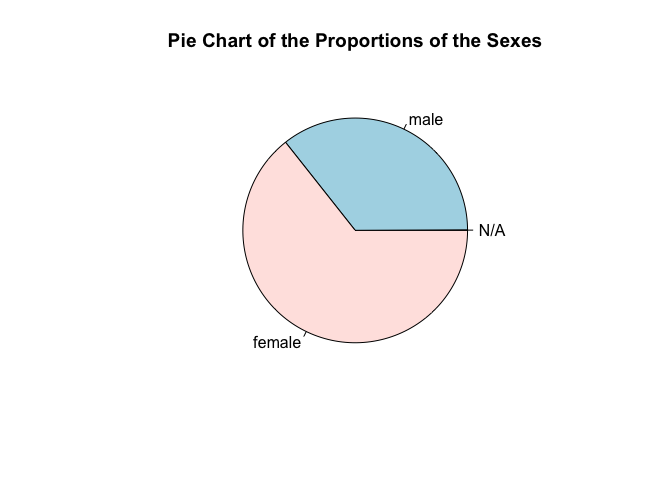<!-- -->

Bar plots are another way to visualize categorical variables.

We will use a bar plot to see the counts of people on the Titanic for our data set. Note that the far left column is for unidentified (N/A) sex. 


```r
barplot(sex.counts, xlab = "sex (N/A, female, or male)", ylab = "count", main = "Counts for the sexes for the Titanic data")
```

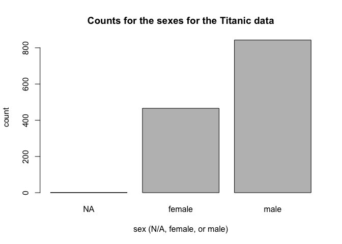<!-- -->

We can rearrange the bar plot from largest to smallest. We must first reorder the sex counts in decreasing order and then create the new bar plot.

```r
ordered.sex.counts <- sex.counts[order(sex.counts,decreasing = TRUE)] # reorder the sex counts in decreasing order
ordered.sex.counts
```

```
##   male female     NA 
##    843    466      1
```

```r
 barplot(ordered.sex.counts, xlab = "sex (N/A, female, or male)", ylab = "count", main = "Counts for the sexes for the Titanic data in decreasing order")
```

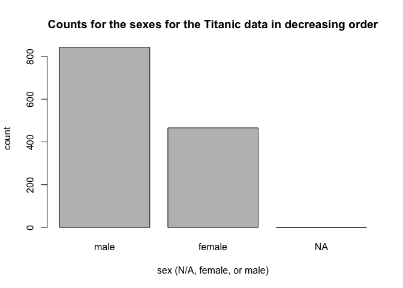<!-- -->

Now, I will create a table of the number of males and females and whether they survived or not. I will then use the addmargins() function to get the totals of the rows and columns. Note that 0 corresponds to died, while 1 corresponds to survived, according to the data set.


```r
mf.survival <- table(titanic$survive,titanic$sex) # First, we should create a table of the male and female survival.
mf.survival # show the output of the table 
```

```
##    
##      NA female male
##   0   0    127  682
##   1   0    339  161
```

```r
addmargins(mf.survival) # We can add margins to get the totals of the rows and columns.
```

```
##      
##         NA female male  Sum
##   0      0    127  682  809
##   1      0    339  161  500
##   Sum    0    466  843 1309
```

Here is a stacked bar plot of the male and female survival. Note that dark red was chosen for the survived, whereas blue was chosen for died. 

We can see in the stacked bar plot that the majority of females survived, while the majority of males perished.


```r
# stacked bar plot of N/A, female, and male survival
barplot(mf.survival, xlab = "sex", ylab = "count", main = "Stacked bar plot of N/A, female, and male survival", col = c("blue","darkred"))
```

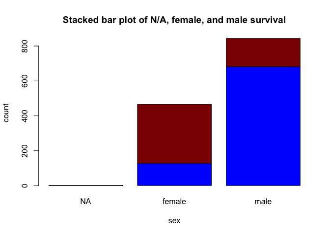<!-- -->

Below is a grouped bar plot to see survival as two different bars for each the males and females.


```r
# grouped bar plot of N/A, female, and male survival
barplot(mf.survival, xlab = "sex", ylab = "count", main = "Grouped bar plot of N/A, female, and male survival", col = c("blue","darkred"), beside = TRUE)
```

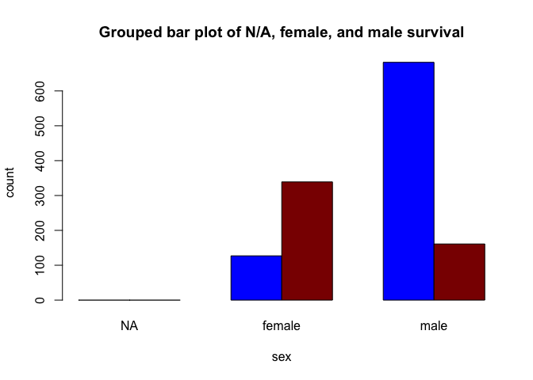<!-- -->

Similar to the stacked bar plot, we can clearly see from the grouped bar plot that the majority of females survived, while the majority of males perished.

### Quantitative variable exploration


```r
summary(titanic$age) # The summary command gives us the min., 1st quartile, median, 3rd quartile, and max. age.
```

```
##    Min. 1st Qu.  Median    Mean 3rd Qu.    Max.    NA's 
##  0.1667 21.0000 28.0000 29.8811 39.0000 80.0000     264
```

The summary function tells us that the mean is 29.8811 years, which is the average age of the passengers in this data set. The median, or middle value, from the data is 28.0000 years. 

It is clear from the summary function that the min. age is 0.1667 years old, while the max. age is 80.0000 years old. Hence, the range of years is 80.0000 - 0.1667 = 79.8333 years . From the range of the ages, we can ascertain that the possible values are age between 0.1667 and 80.0000 years old. Note that this does not mean that we are looking at all the ages between 0.1667 and 80.0000 years old, just the ages that appear in this data frame. 

Measures of spread include the rang (which was calculated above), quartiles, interquartile range, and standard deviation. For the years variable, the 1st quartile (Q1) is at 21.0000 years old, whereas the thrid quartile (Q3) is at 39.0000 years old. Hence the interquartile range (IQR) is IQR = Q3 - Q1 = 39.0000 - 21.0000 = 18.0000 years old. The standard deviation (sd) can be calculated using the simple sd() function.

Note that I will first exclude the NA cases when I calculate the standard deviation, as the sd() function does not do that automatically. If I don't do this, the sd(titanic$age) = NA. I will also confirm that the mean for the ages that is calculated when NA is omitted is the same as the mean from the summary function above.


```r
na.omit.age <- na.omit(titanic$age) # omit cases with NA as age
head(na.omit.age) # check head to make sure that age values of na.omit.age are being displayed as expected.
```

```
## [1] 29.0000  0.9167  2.0000 30.0000 25.0000 48.0000
```

```r
mean(na.omit.age) # check that mean is the same as summary function above.
```

```
## [1] 29.88113
```

```r
sd(na.omit.age) # standard deviation of ages
```

```
## [1] 14.4135
```
The mean is still 29.88113 years (as we got in the summary function above). Also, the standard deivation is found to be 14.4135 years. 
 
Now, I will calculate the typical age value by finding the mode of the ages. Unlike with the mean and standard deviation functions, there is no simple formula for the mode in R. Hence, I will use the function for the mode from (here)[https://www.tutorialspoint.com/r/r_mean_median_mode.htm]. Again, there I will not include the NA values in my analysis, so I will use the na.omit.age values to calculate the mode.


```r
# create functoin for the mode
getmode <- function(v) {
   uniqv <- unique(v)
   uniqv[which.max(tabulate(match(v, uniqv)))]
}
# find the mode of the ages for the Titanic passengers
getmode(na.omit.age)
```

```
## [1] 24
```
From the output, the mode (ie. the most frequently occuring value) is 24 years old.

Now, I will look at the distribution of the ages by examining a histogram of the ages.


```r
# create histogram of ages
hist.ages <- hist(na.omit.age, xlab="Age",ylab="Frequency", main="Frequency of the ages for the Titanic passengers")
```

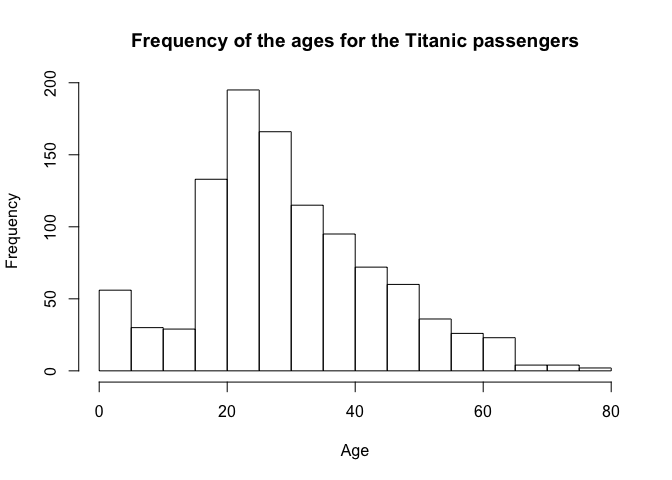<!-- -->

```r
hist.ages
```

```
## $breaks
##  [1]  0  5 10 15 20 25 30 35 40 45 50 55 60 65 70 75 80
## 
## $counts
##  [1]  56  30  29 133 195 166 115  95  72  60  36  26  23   4   4   2
## 
## $density
##  [1] 0.0107074570 0.0057361377 0.0055449331 0.0254302103 0.0372848948
##  [6] 0.0317399618 0.0219885277 0.0181644359 0.0137667304 0.0114722753
## [11] 0.0068833652 0.0049713193 0.0043977055 0.0007648184 0.0007648184
## [16] 0.0003824092
## 
## $mids
##  [1]  2.5  7.5 12.5 17.5 22.5 27.5 32.5 37.5 42.5 47.5 52.5 57.5 62.5 67.5
## [15] 72.5 77.5
## 
## $xname
## [1] "na.omit.age"
## 
## $equidist
## [1] TRUE
## 
## attr(,"class")
## [1] "histogram"
```

From the histogram, we can see that calculation for the mode is reasonable. We can clearly see that the highest bar is around age 20-25 years old (ie. the greatest number of passengers is in that bar). 

Additionally, from the age histogram, we can see that the distribution is unimodal (one mode), the skew is positive (because there is a longer right tail).


We can overlay the normal curve over the histogram to see if the distribution of ages is approximately normal. Note that I used the histogram of ages from the above R code. I tried to explain each step in the code block below. See (here)[https://www.statmethods.net/graphs/density.html] for the original code to overlay a normal curve over a histogram.


```r
# create the normal curve using xfit and yfit
xfit <- seq(min(na.omit.age), max(na.omit.age)) # the sequence of ages in na.omit.age 
yfit <- dnorm(xfit, mean = mean(na.omit.age), sd = sd(na.omit.age)) # fit the density of the normal distirbution to the age values in our data set with mean and standard deviaton of the ages in our data set
yfit <- yfit * diff(hist.ages$mids[1:2]) * length(na.omit.age) # our yfit is built from the density of the normal distibution multiplied by the size of the bins, which is diff(hist.ages$mids[1:2]), and multiplied by the number of ages from our data.

plot(hist.ages, xlab="Age",ylab="Frequency", main="Frequency of the ages for the Titanic passengers") # Plot histogram of ages from above R code.
lines(xfit, yfit, col = "black", lwd = 2) # normal curve in a black colour with line width (lwd) of 2.
```

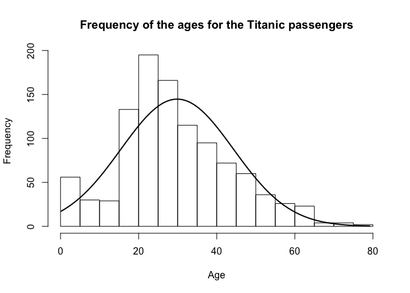<!-- -->

We can see from the histogram that the distribution is approximately normal. 

We can also see if the distribution is approximately normal by using the quantile-quantile, qqnorm() function. The qqnorm() function gives us a line that indicates the correlation between the normal distribution and our sample distribution. Basically, if the black line is roughly straight at a 45-degree angle, then we can say that our data is approximately normally distributed. I will draw a straight blue line at a 45-degrees using qqline() for our comparison.


```r
# QQ plot of the ages for the Titanic passengers
qqnorm(na.omit.age, main = "QQ plot of the ages for the Titanic passengers")
# Add straight blue line for our reference
qqline(na.omit.age, col = "blue", lwd = 2)
```

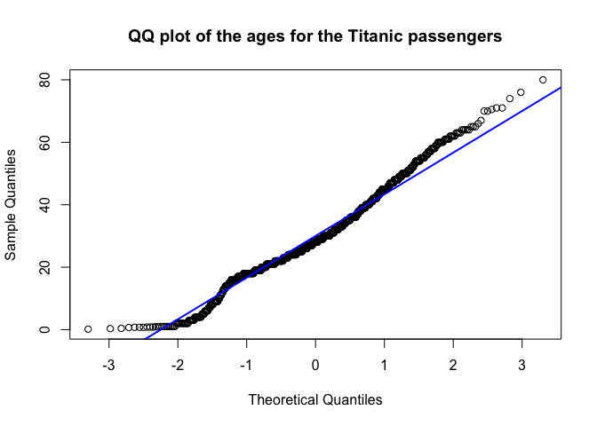<!-- -->

We can see that the tails of the black QQ plot curve and that the black line is not exactly straight. Yet, for our rough estimation, the line is pretty close to being straight. Hence, we can say that our age data is normally distributed.

## Explore various plot types

In our exploration of the categorical and quantitative variables, we have looked at a few plots including bar plots, histograms, and a QQ plot above. We shall expand on that in this section by introducing some more plots through other tools such as the ggplot2 package.

Note, I have assumed that you have already installed ggplot2 on your computer. If not, type install.packages("ggplot2") **before** library(ggplot2).


```r
library(ggplot2) # load ggplot2 package
```

### Quantitative variable plots

For the next couple of plots, I will primarily focus on quantitative variables. I will start off by looking at age versus fare. Then, I will look at age versus fare vs ticket price. Finally, I will look at a scatterplot of age versus fare vs ticket price coloured by class (which is a categorical variable). 

First, I will define ggplot function with x as age and y as fare and store it as age.fare.ggplot.


```r
age.fare.ggplot <- ggplot(titanic, aes(x=age, y=fare))  
```

Now, I have installed the hexbin package and will load it using the library package.


```r
library(hexbin) # load hexbin package
```

The geom_hex() function produces a scatterplot of hexagons. It also provides a 2D density plot showing the relationship between the two quantitative variables. Notice there is a legend to the right of the hex bin plot that shows how to interpret the gradient of colours (ie. what colour in the gradient corresponds to a higher count or density). As a side note, when we run the following code, notice that the rows containing missing or NA data values are automatically removed. So, the data that is being looked at is only the data in the data set that has **finite** values for age and fare. 


```r
# create hex bin plot of Titanic passenger age versus fare
age.fare.ggplot + geom_hex() +
  labs(title="Hex bin plot of Titanic passenger age versus fare") 
```

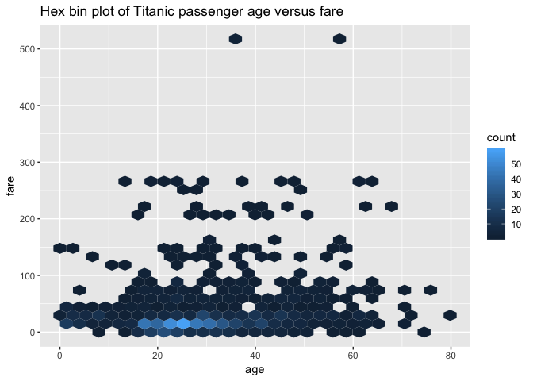<!-- -->

Next, we shall ilustrate the same passenger age versus fare data using a scatterplot. Again, note that the rows containing missing or NA data values are automatically removed.


```r
# create scatterplot of Titanic passenger age versus fare
ggplot(titanic, aes(x = age, y = fare)) + geom_point() +
  labs(title="Scatterplot of Titanic passenger age versus fare")
```

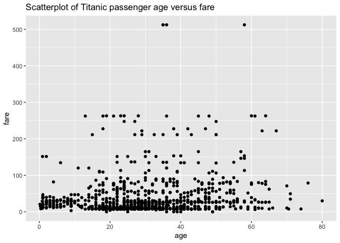<!-- -->

We can see there are three outliers with fares above 500 dollars. The majority of fares are concentrated under 100 dollars, which makes sense because there were more third-class passengers than first-class passengers, who paid more money for their ticket fare. Finally, there are more younger passengers than older passengers on the scatterplot. This means that we don't see many passengers over the age of 70 on the scatterplot.

Interestingly, we could do a 3D scatterplot by installing and loading the scatterplot3d package. Let's look at the relationship between three quantitative variables, age, fare, and ticket. I reffered to [this](https://stackoverflow.com/questions/14698866/r-3d-plot-with-categorical-colors) page to add a legend to this scatterplot.


```r
library(scatterplot3d) # make sure to install scatterplot3d package before using library(scatterplot3d) to load 

scatterplot3d(age, ticket, fare, pch = 20, main = "Relationship between age, ticket and fare for Titanic passengers") # note pch just indicates the shape of the points on the scatterplot
```

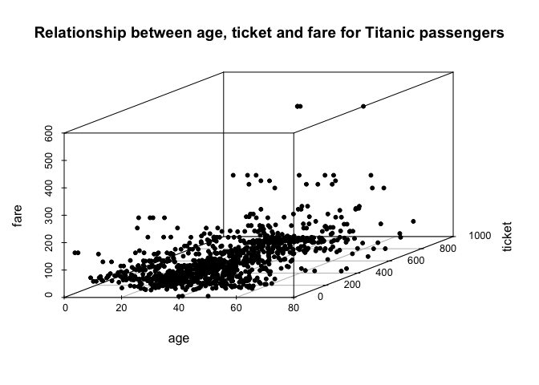<!-- -->

Now, I will add colour to the 3d scatterplot by colouring by the passenger class.


```r
library(scatterplot3d) # make sure to install scatterplot3d package before using library(scatterplot3d) to load 

class <- as.factor(titanic$pclass) # I first had to convert pclass to factor to get ggplot to fill by class

scatter.3d <- scatterplot3d(age, ticket, fare, color = rainbow(3)[class], pch = 20, main = "Relationship between age, ticket and fare for Titanic passengers")

# Now add a legend 
legend(scatter.3d$xyz.convert(0.2,0.2,0.2), pch = 20, yjust=0,
       legend = levels(class), col = rainbow(3))
```

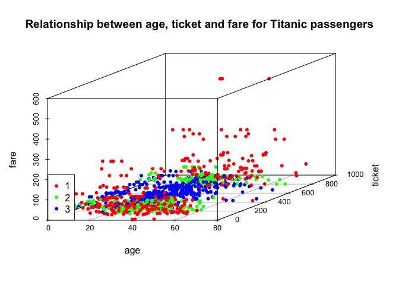<!-- -->

Now, the rgl package lets you interact with the 3d scatterplot. We will load that in the following code block.
Note that Mac users should have Xquartz installed onto their computer in order to view the interactive 3D scatterplot that we will make using the rgl package.


```r
library(rgl) # load rgl package
```

We shall again plot age, ticket, and fare. But, this time we will colour by the class. Note that I did not put a main title on this graph because, when you interact with the graph, the title overlaps over the data and it gets difficult to interpret the data.


```r
# Notice that I am using the factor version of pclass, class in the below plot3d code
plot3d(age, ticket, fare, col = rainbow(3)[class]) 

# Add legend to the top right corner for the colours corresponding to the classes
legend3d("topright", legend = levels(class), col = rainbow(3), pch = 20)
```

The interactive 3D plot from rgl will not show up in Github. After downloading, loading and attaching the Titanic data set, try the code block below to see the interactive 3D plot in action.

Here is a screenshot of the rgl 3D scatterplot:

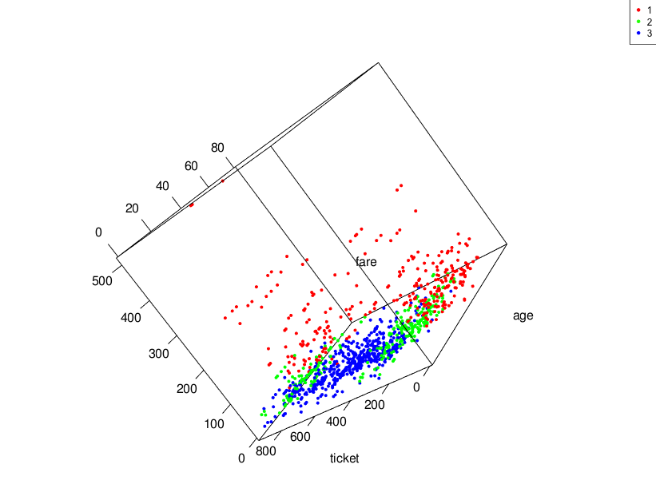

### One quantitative variable

Now, I will examine a plot of one quantitative variable, fares. I will first look at a histogram of the fares. This histogram will include a gradient colour scale, where blue = low count and red = high count for an enhanced viewing experience. 


```r
# Store ggplot of fare as variable ggplot.fare
ggplot.fare <- ggplot(titanic, aes(fare)) 

# histogram of Titanic passenger fares with a gradient colour scale 
ggplot.fare + geom_histogram(aes(fill = ..count..)) + labs(x = "fare", y = "frequency",title = "Histogram of Titanic passenger fares") + scale_fill_gradient(low ="blue", high = "red")
```

```
## `stat_bin()` using `bins = 30`. Pick better value with `binwidth`.
```

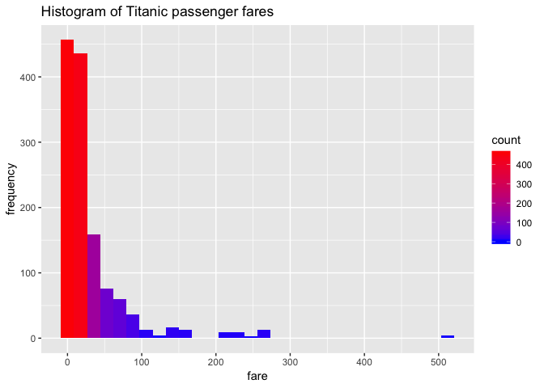<!-- -->

Wheras the histogram included the **counts** on the y-axis, I will nowlook at a densityplot of the fares of the Titanic passengers, which includes **frequency** on the y-axis.


```r
# Densityplot of Titanic passenger fares 
ggplot.fare + geom_density() + labs(x = "fare", y = "frequency",title = "Densityplot of Titanic passenger fares")
```

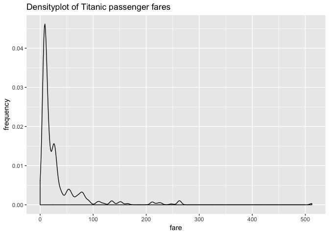<!-- -->

We can see from the densityplot that the highest frequency of passengers paid under $50 dollars for their tickets. 

### A quantitative variable separated by a categorical variable

I will now colour a density plot of passenger fares by class (ie. a quantitative variable by categorical variable). Note that I will first have to convert pclass to a factor because it is originally an integer (as indicated by typeof and class in the Smell test the data section). In order for ggplot to fill by class, the variable cannot be an integer.


```r
class <- as.factor(pclass) # I first had to convert pclass to factor to get ggplot to fill by class

ggplot.fare.class <- ggplot(titanic, aes(fare, group=class, fill=class)) # create variable ggplot.fare.class so we can use this base code for multiple plots

ggplot.fare.class.density <- ggplot.fare.class + geom_density(alpha=0.6) + labs(x = "fare", y = "frequency",title = "Densityplot of Titanic passenger fares by class") # densityplot of Titanic passenger fares by class

ggplot.fare.class.density
```

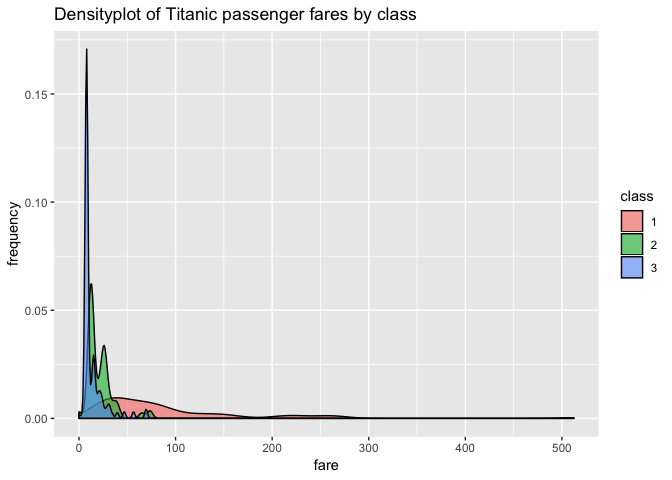<!-- -->

From this densityplot of fares by class, we can see that the majority of people who paid under fifty dollars for a ticket were from first class. This observation makes sense because we would expect that third class passengers paid less than first class passengers. Also, we can see that only the first class passengers had higher fares over 100 dollars.

However, it would be easier to see these observations when our data is side-by-side instead of overlayed as it is in the above densityplot. I will do side-by-side plots for each class below, using ggplot2(). Note the fourth plot for NA is for the NA passenger row in the data set.


```r
ggplot.fare.class.density + facet_grid(~ pclass) + scale_x_log10() # Note I scaled using log because otherwise the plots are very tiny and not easily readable
```

```
## Warning: Transformation introduced infinite values in continuous x-axis
```

```
## Warning: Removed 19 rows containing non-finite values (stat_density).
```

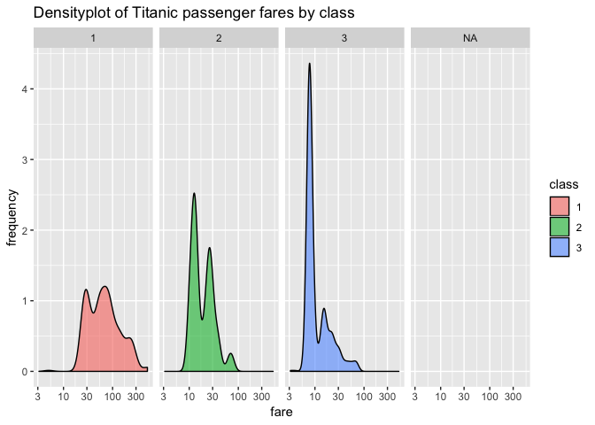<!-- -->


Next, we shall look at a histogram of the fares (quantitative variable), which are coloured by the class of the passengers (categorical variable because there are three classes). Note that the values that were listed as NA or that were just blank were automatically removed. There should be a caution sign to indicate this in R Studio.

Again, it would be easier to see these observations when we have the data side-by-side instead of overlayed as it is in the above boxplots. I will do three side-by-side plots for each class below, using ggplot2(). Again, note the fourth plot for NA is for the NA passenger row in the data set.


```r
ggplot.fare.class +
  geom_histogram(bins = 30) + 
  labs(title = "Bar plots of Titanic passenger fares by class")+
  facet_grid(~ pclass) +
  scale_x_log10() # Note I scaled using log because otherwise the plots are very tiny and not easily readable
```

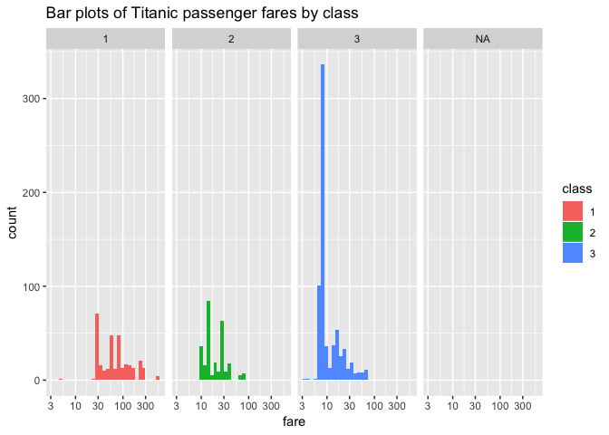<!-- -->

We can see that as first class passengers have the highest fares on average. This makes sense because first class passengers were required to pay a higher fare than third class passengers. The luxuries of first class ain't cheap.

Next, we can display the plot of Titanic passengers age by class using a jitterplot overlayed on top of a violin plot. As was the case for previous graphs, the missing or non-finite values were removed automatically.


```r
# jitterplot overlayed on top of a violin plot
ggplot(titanic, aes(class,age)) + 
  geom_violin(aes(fill = class)) + 
  geom_jitter(alpha = 0.2) + 
  labs(title = "Jitterplots overlayed over violin plots of Titanic passenger age by class")
```

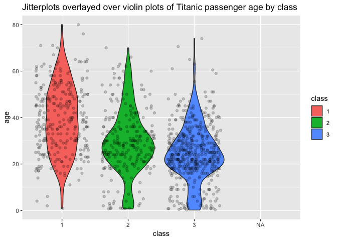<!-- -->

From the jitterplots overlayed over top of the violin plots, we can see that a higher concentration of passengers were in third class. Furthermore, the age of passengers in all the classes were concentrated between 20 - 40 years of age. First class appears to have the greatest range in age (ie. the ages are more dispersed than for the second and third classes). First class doesn't have the major concentration of people in the 20 to 40 year age range that second and third class do. 

## Use filter and select functions and piping

First I will filter data to first class and plot the survival of first class passengers coloured by sex.


```r
titanic %>% 
  filter(pclass == "1") %>% 
  ggplot(aes(survived, fill=sex)) + 
  geom_bar() + 
  labs(title = "Segmented barplot of survival of first class passengers coloured by sex", x = "Survival (0 = died, 1 = survived)", y = "Count")
```

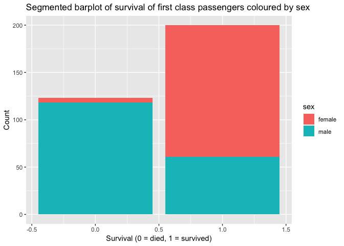<!-- -->

We can see from the segmented bar plot that the majority of first class females survived, whereas the majority of males died. That said, more males survived than for third class as we will see below...


```r
titanic %>% 
  filter(pclass == "3") %>% 
  ggplot(aes(survived, fill=sex)) + 
  geom_bar() + 
  labs(title = "Segmented barplot of survival of third class passengers coloured by sex", x = "Survival (0 = died, 1 = survived)", y = "Count")
```

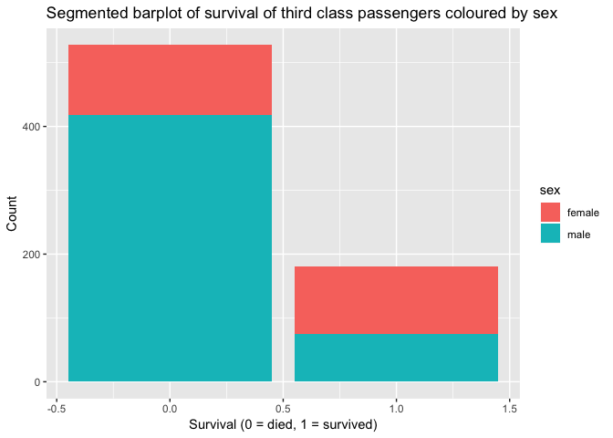<!-- -->

Quite a difference from the first class results, especially for the females! We can see that roughly half the females in third class died. For the males in first class, almost half of the males survived, whereas for third class the vast majority died.

Now, I will incorporate use of the select() function and use it to help make a few informative plots.

However, first... I don't like that survived is defined in binary as 0 for died and 1 for survived. So, I will add another column to the titanic data set where, instead of 1 and 0, I will have yes or no. The is similar to how I mutated the new proportion and percent columns in [this section](#categorical-variable-exploration) and again relies on the dplyr package. 

I will add the new column survived.yes.no, which is the factor version of survived, to the Titanic data frame. Then, I will change the factor levels of survived.yes.no to "no" and "yes".


```r
# add the new column survived.yes.no to Titanic data frame

titanic <- titanic %>% 
  mutate(survived.yes.no = as.factor(survived))  # use dplyr mutate function to add the new column

levels(titanic$survived.yes.no) <- c("no","yes") # change the factor levels to "no" and "yes"

head(titanic) # print first 6 rows to make sure the output of the new column is as expected
```

```
##   pclass survived                                            name    sex
## 1      1        1                   Allen, Miss. Elisabeth Walton female
## 2      1        1                  Allison, Master. Hudson Trevor   male
## 3      1        0                    Allison, Miss. Helen Loraine female
## 4      1        0            Allison, Mr. Hudson Joshua Creighton   male
## 5      1        0 Allison, Mrs. Hudson J C (Bessie Waldo Daniels) female
## 6      1        1                             Anderson, Mr. Harry   male
##       age sibsp parch ticket     fare   cabin embarked boat body
## 1 29.0000     0     0  24160 211.3375      B5        S    2   NA
## 2  0.9167     1     2 113781 151.5500 C22 C26        S   11   NA
## 3  2.0000     1     2 113781 151.5500 C22 C26        S        NA
## 4 30.0000     1     2 113781 151.5500 C22 C26        S       135
## 5 25.0000     1     2 113781 151.5500 C22 C26        S        NA
## 6 48.0000     0     0  19952  26.5500     E12        S    3   NA
##                         home.dest survived.yes.no
## 1                    St Louis, MO             yes
## 2 Montreal, PQ / Chesterville, ON             yes
## 3 Montreal, PQ / Chesterville, ON              no
## 4 Montreal, PQ / Chesterville, ON              no
## 5 Montreal, PQ / Chesterville, ON              no
## 6                    New York, NY             yes
```

Now, my data is ready and I will move on to using the select() function to create some plots. First, I will select only the age, sex, fare, pclass, and survived.yes.no columns, in that order. Next, I will filter by the first class passengers that survived. Finally, from those first class passengers that survived, I will plot age versus fare and colour the scatterplot by sex.

That seems kind of confusing. Hopefully, stating my objective will help to clear that up. My objective is to find if there is a relationship between age and fare by sex from the first class passengers that survived.


```r
titanic %>% 
  select(age, sex, pclass, fare, survived.yes.no) %>%  # select only age, pclass, fare and survived.yes.no columns, in that order.
  filter(pclass == "1" & survived.yes.no == "yes") %>% # filter by survived and first class rows.
  ggplot(aes(age, fare, colour = sex)) + 
  geom_point() +
  labs(title = "Scatterplot of fares of first class passengers who survived coloured by sex", x = "Age", y = "Fare")
```

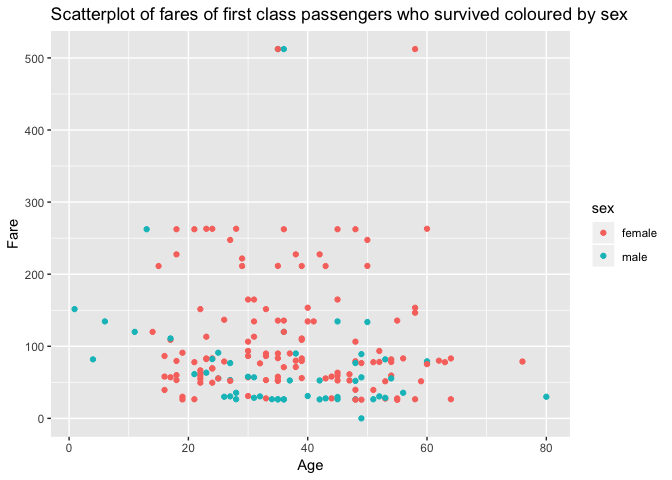<!-- -->
 
What do we see in the above scatterplot? 

We can see that the females, who were middle-aged (age ranging from approximately 20 - 60 years) and who paid a higher fare, survived. It looks like most of the males in first class who survived paid, on average, a lower fare than the females in first class who survived. What I mean is that there is a greater dispersion of fares for first class females than males who survived. Hence, the average fare for females is higher than for males. 

Also, there looks to be more females in first class that survived than males (which confirms our above segmented bar graph observations). 

For both males and females, the most frequent fare for first class passengers who survived is just under 100 dollars and the age is concentrated between 20 and 60 years of age.

In the above code for the scatterplot, we will only change that we filter by third class instead of the first (ie. the rest of the code is the same). What do we find?


```r
survival.class3.bysex <- titanic %>% 
  select(age, sex, pclass, fare, survived.yes.no) %>%  # select only age, pclass, fare and survived.yes.no columns, in that order.
  filter(pclass == "3" & survived.yes.no == "yes") %>% # filter by survived and third class rows.
  ggplot(aes(age, fare, colour = sex)) + 
  geom_point() + 
  labs(title = "Scatterplot of fares of third class passengers who survived coloured by sex", x = "Age", y = "Fare")

survival.class3.bysex 
```

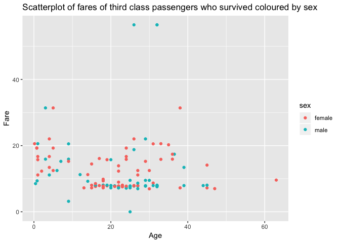<!-- -->


First, I will discuss some observations on the scatterplot of survival of third class passengers coloured by sex. It looks as though there are slightly more females than males who survived (which confirms our above segmented bar graph observations). However, both the males and females who survived are similarly dispersed. The major concentration of both males and females are within 0 - 40 years of age and paid 7 - 20 dollars for their fare. 

Next I will add arrows to the previouse scatterplot to point to whether the male and female outliers are located.


```r
survival.class3.bysex + geom_segment(aes(x = 55, y = 40, xend = 35, yend = 53), arrow = arrow(length = unit(0.5, "cm")), color="lightblue", size = 3) + # arrow pointing to male outlier
   geom_segment(aes(x = 58, y = 40, xend = 62, yend = 14), arrow = arrow(length = unit(0.5, "cm")), color="pink", size = 3) # arrow pointing to female outlier
```

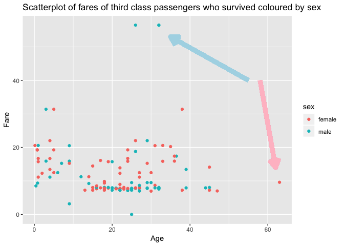<!-- -->

There are two male outliers in third class who paid a higher fare (near 60 dollars) who survived. Also, there is a female outlier after 60 years of age who paid about the average fare.

Now, I will discuss the differences between the first and third class scatterplots of passengers who survived. 

Overall, there appears to be a lower number of third class passengers that survived than first class because there are less points on the scatterplot for third class.

There are slightly more females than males who survived in third class than in first class. However, there are clearly many more females than males who surivived in first class.

Most of those in third class who survived had were between 0 and 40 years of age. On the other hand, most of those in first class who survived had were between 20 and 60 years of age. This means that, on average, most of the people who survived in first class were older than those in third class. 

The most frequent fare for those who survived in third class is lower than in first class. The most frequent fare for passengers who survived in third class is under 40 dollars, whereas for first class the average fare was under 100 dollars. This makes sense because third class passengers paid less for their tickets than first class passengers. 

Whew. Lots of analysis there.

Now, I will use filter(), select(), and %>% in a different way.

First, make sure the plyr package is installed and loaded. We want to do this so that the count of the factor home.dest will work in the next R code block.

Next, I want to find out what were the popular home/destinations for the adult passengers who died. I further want to see the difference in destinations for males and females. I will use a dotplot to investigate this. Note that I am using a count of the home.dest of **greater than 4**.


```r
titanic %>% 
  filter(survived.yes.no == "no" & ((age > 18) | (age < 60)) & (count(home.dest)$freq > 4)) %>% # filter by the passengers who died, who were adults (over the age of 18 and under the age of 60), and whose home and destination had a count of at least 4.
 select(sex, home.dest) %>% # select only the columns of sex and home.dest in that order
      ggplot(aes(home.dest, colour = sex)) + 
      geom_dotplot() + 
      labs(title = "Popular home/destinations for the adult passengers who died on Titanic", x =
           "Home / Destination", y = "Frequency") +
      theme(axis.text.x = element_text(angle = 90, hjust = 1)) # this rotates the x-axis home.dest labels to 90 degrees so that they are all clearly visible (othewise they would overlap if left unrotated)
```

```
## `stat_bindot()` using `bins = 30`. Pick better value with `binwidth`.
```

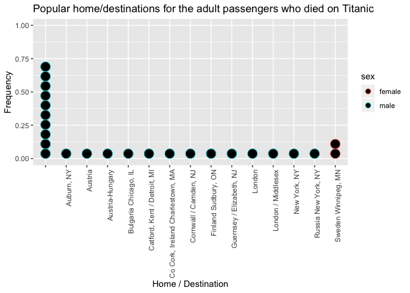<!-- -->

We can see from this dotplot that, aside from the passengers who did not list a home/destination (of which there were many), the greatest frequency of passengers who died were females who were heading from Sweden to Winnipeg, Manitoba. 

## Evaluation of the gapminder Rwanda and Afghanistan code block

First, I will load the library gapminder package. Note that you must install gapminder first before you use the library() function to load it.


```r
library(gapminder) # load gapminder package
```

Use the head function to peak at the gapminder data set before moving on to the problem.


```r
head(gapminder) # view top six rows of gapminder data set
```

```
## # A tibble: 6 x 6
##   country     continent  year lifeExp      pop gdpPercap
##   <fct>       <fct>     <int>   <dbl>    <int>     <dbl>
## 1 Afghanistan Asia       1952    28.8  8425333      779.
## 2 Afghanistan Asia       1957    30.3  9240934      821.
## 3 Afghanistan Asia       1962    32.0 10267083      853.
## 4 Afghanistan Asia       1967    34.0 11537966      836.
## 5 Afghanistan Asia       1972    36.1 13079460      740.
## 6 Afghanistan Asia       1977    38.4 14880372      786.
```

Next, I am supposed to evaluate the following code block and describe the result. 


```r
filter(gapminder, country == c("Rwanda","Afghanistan"))
```

```
## # A tibble: 12 x 6
##    country     continent  year lifeExp      pop gdpPercap
##    <fct>       <fct>     <int>   <dbl>    <int>     <dbl>
##  1 Afghanistan Asia       1957    30.3  9240934      821.
##  2 Afghanistan Asia       1967    34.0 11537966      836.
##  3 Afghanistan Asia       1977    38.4 14880372      786.
##  4 Afghanistan Asia       1987    40.8 13867957      852.
##  5 Afghanistan Asia       1997    41.8 22227415      635.
##  6 Afghanistan Asia       2007    43.8 31889923      975.
##  7 Rwanda      Africa     1952    40    2534927      493.
##  8 Rwanda      Africa     1962    43    3051242      597.
##  9 Rwanda      Africa     1972    44.6  3992121      591.
## 10 Rwanda      Africa     1982    46.2  5507565      882.
## 11 Rwanda      Africa     1992    23.6  7290203      737.
## 12 Rwanda      Africa     2002    43.4  7852401      786.
```

Did the analyst succeed at getting the data for Rwanda and Afghanistan?

It doesn't seem to be producing the correct output. 

Why? 

Well, if we filter each the Rwanda and Afghanistan rows separately, we can see what is going wrong.


```r
gapminder %>% 
  filter(country == "Afghanistan") # filter for Afghanistan rows only
```

```
## # A tibble: 12 x 6
##    country     continent  year lifeExp      pop gdpPercap
##    <fct>       <fct>     <int>   <dbl>    <int>     <dbl>
##  1 Afghanistan Asia       1952    28.8  8425333      779.
##  2 Afghanistan Asia       1957    30.3  9240934      821.
##  3 Afghanistan Asia       1962    32.0 10267083      853.
##  4 Afghanistan Asia       1967    34.0 11537966      836.
##  5 Afghanistan Asia       1972    36.1 13079460      740.
##  6 Afghanistan Asia       1977    38.4 14880372      786.
##  7 Afghanistan Asia       1982    39.9 12881816      978.
##  8 Afghanistan Asia       1987    40.8 13867957      852.
##  9 Afghanistan Asia       1992    41.7 16317921      649.
## 10 Afghanistan Asia       1997    41.8 22227415      635.
## 11 Afghanistan Asia       2002    42.1 25268405      727.
## 12 Afghanistan Asia       2007    43.8 31889923      975.
```

The output here is 12 rows for Afghanistan data **NOT 6**, which was the case for the original code block.


```r
gapminder %>% 
  filter(country == "Rwanda") # filter for Rwanda rows only
```

```
## # A tibble: 12 x 6
##    country continent  year lifeExp     pop gdpPercap
##    <fct>   <fct>     <int>   <dbl>   <int>     <dbl>
##  1 Rwanda  Africa     1952    40   2534927      493.
##  2 Rwanda  Africa     1957    41.5 2822082      540.
##  3 Rwanda  Africa     1962    43   3051242      597.
##  4 Rwanda  Africa     1967    44.1 3451079      511.
##  5 Rwanda  Africa     1972    44.6 3992121      591.
##  6 Rwanda  Africa     1977    45   4657072      670.
##  7 Rwanda  Africa     1982    46.2 5507565      882.
##  8 Rwanda  Africa     1987    44.0 6349365      848.
##  9 Rwanda  Africa     1992    23.6 7290203      737.
## 10 Rwanda  Africa     1997    36.1 7212583      590.
## 11 Rwanda  Africa     2002    43.4 7852401      786.
## 12 Rwanda  Africa     2007    46.2 8860588      863.
```
The output here is 12 rows for Rwanda  data **NOT 6**, which was the case for the original code block.

So, the problem is that there are 12 rows for each of Afghanistan and Rwanda, but only 6 of each are being printed from the analyst's original code. I suspect there is something amiss with the country == c("Rwanda", "Afghanistan") portion of the original code. I think that country == c("Rwanda", "Afghanistan") only works with one country. For example, country == c("Rwanda") prints ok, as we can see below. 


```r
gapminder %>% 
  filter(country == c("Rwanda")) # filter for Rwanda rows only
```

```
## # A tibble: 12 x 6
##    country continent  year lifeExp     pop gdpPercap
##    <fct>   <fct>     <int>   <dbl>   <int>     <dbl>
##  1 Rwanda  Africa     1952    40   2534927      493.
##  2 Rwanda  Africa     1957    41.5 2822082      540.
##  3 Rwanda  Africa     1962    43   3051242      597.
##  4 Rwanda  Africa     1967    44.1 3451079      511.
##  5 Rwanda  Africa     1972    44.6 3992121      591.
##  6 Rwanda  Africa     1977    45   4657072      670.
##  7 Rwanda  Africa     1982    46.2 5507565      882.
##  8 Rwanda  Africa     1987    44.0 6349365      848.
##  9 Rwanda  Africa     1992    23.6 7290203      737.
## 10 Rwanda  Africa     1997    36.1 7212583      590.
## 11 Rwanda  Africa     2002    43.4 7852401      786.
## 12 Rwanda  Africa     2007    46.2 8860588      863.
```

On the other hand, we need to specifify that we want to filter for multiple countries by using the the code %in% before the c("Rwanda", "Afghanistan"). 

Now, that we've broken down the original code block and found the problem, we can try to fix it using our proposed solution.


```r
filter(gapminder, country %in% c("Rwanda", "Afghanistan"))
```

```
## # A tibble: 24 x 6
##    country     continent  year lifeExp      pop gdpPercap
##    <fct>       <fct>     <int>   <dbl>    <int>     <dbl>
##  1 Afghanistan Asia       1952    28.8  8425333      779.
##  2 Afghanistan Asia       1957    30.3  9240934      821.
##  3 Afghanistan Asia       1962    32.0 10267083      853.
##  4 Afghanistan Asia       1967    34.0 11537966      836.
##  5 Afghanistan Asia       1972    36.1 13079460      740.
##  6 Afghanistan Asia       1977    38.4 14880372      786.
##  7 Afghanistan Asia       1982    39.9 12881816      978.
##  8 Afghanistan Asia       1987    40.8 13867957      852.
##  9 Afghanistan Asia       1992    41.7 16317921      649.
## 10 Afghanistan Asia       1997    41.8 22227415      635.
## # ... with 14 more rows
```

Now, the correct output is produced. We have a total of 24 rows, 12 of which are for Afghanistan and 12 are for Rwanda. Case closed. 

